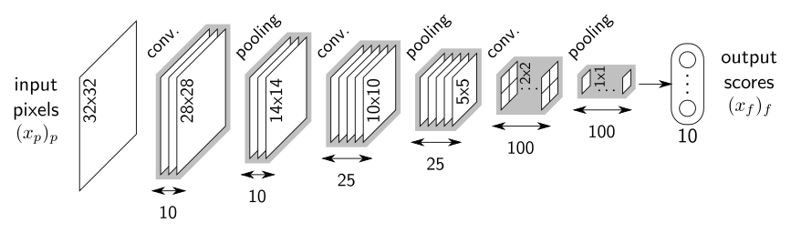
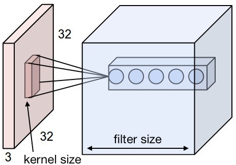
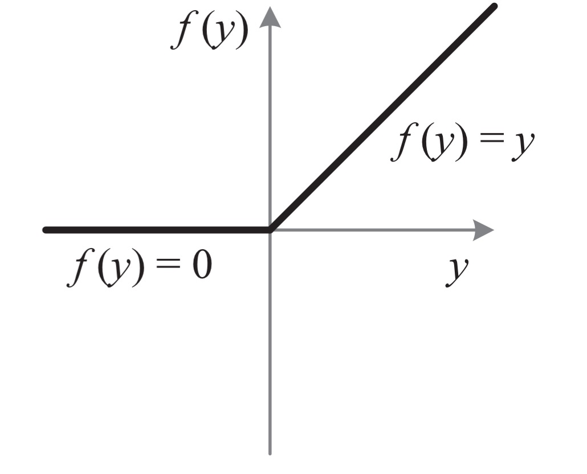
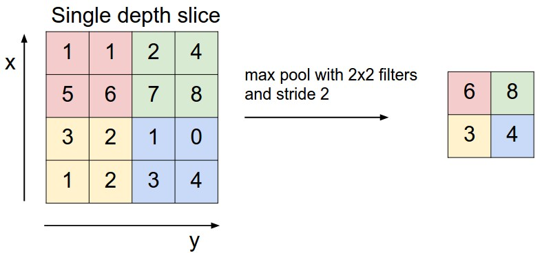

class: middle
background-image: url(img/brain.png)

# Hands on .red[deep learning]
#### \#2 Convolutional neural networks

.bottomlogo[]
.footnote[ Alexandre Boucaud  -  [@alxbcd][twitter]]

[twitter]: https://twitter.com/alxbcd
---
exclude: true
class: middle
background-image: url(img/brain.png)
.hidden[aa]
# Hands on .red[deep learning]
.small[with [Keras][keras] examples]
.footnote[Alexandre Boucaud  -  [@alxbcd][twitter]]


---
exclude: true
## Alexandre Boucaud 

Scientific software engineer at APC

<!-- [aboucaud @ apc.in2p3.fr][mail]   -->
<!-- [@alxbcd][twitter] on twitter -->

</br>
.medium[Interests:]
- cosmological survey data processing (LSST, Euclid, LISA)
- ML applications in astrophysics (galaxy morphology, deblending)
- development of the open source Python scientific ecosystem

Disclaimer: I am .red[not] a machine learning researcher  


[mail]: mailto:aboucaud@apc.in2p3.fr
[twitter]: https://twitter.com/alxbcd

---

## Outline

.medium[[Introduction](#intro)]

> history - deep learning today

.medium[[Convolutional Neural Networks (CNN)](#cnn)]

> kernels - strides - pooling - loss - training

.medium[[In practice](#practice)]

> step-by-step - monitoring your training

.medium[[Common optimizations](#optim)]

> data augmentation - dropout - batch normalisation

---
count: false
## Outline

.grey[
.medium[Introduction]

> history - deep learning today
]

.medium[[Convolutional Neural Networks (CNN)](#cnn)]

> kernels - strides - pooling - loss - training

.grey[
.medium[In practice]

> step-by-step - monitoring your training
]

.grey[
.medium[Common optimizations]

> data augmentation - dropout - batch normalisation
]

---
## Foreword

The following slides provide examples of neural network models written in _Python_, using the [Keras][keras] library and [TensorFlow][tf] tensor ordering convention*. 

Keras provides a high level API to create deep neural networks and train them using numerical tensor libraries (_backends_) such as [TensorFlow][tf], [CNTK][cntk] or [Theano][theano].


[keras]: https://keras.io/
[tf]: https://www.tensorflow.org/
[cntk]: https://docs.microsoft.com/fr-fr/cognitive-toolkit/
[theano]: http://www.deeplearning.net/software/theano/

.center[
  
]

.footnote[*channels last]

---
class: middle, center
name: cnn

# .red[Convolutional] Neural Networks

---

## Convolutional Neural Networks

- elegant way of passing .green[tensors] to a network
- perform convolutions with .green[3D kernels] 
- training optimizes kernels, not neuron weights

.center[
  
]

---
## Convolutional layers

.left-column[
```python
from keras.models import Sequential
from keras.layers import Conv2D

model = Sequential()
# First conv needs input_shape
# Shape order depends on backend
model.add(
    Conv2D(15,       # filter size 
           (3, 3),   # kernel size
           strides=1,       # default
           padding='valid', # default
           input_shape=(32, 32, 3))
)
# Next layers don't
model.add(Conv2D(16, (3, 3) strides=2))
model.add(Conv2D(32, (3, 3)))
```
]

.right-column[

] 

.reset-columns[
  <br/> <br/> <br/> <br/> <br/> <br/> <br/> <br/> <br/>  <br/> 
- **kernel properties**: .green[size] and number of .green[filters]
- **convolution properties**: .green[strides] and .green[padding]
- output shape depends on .red[**all**] these properties
]


---
## No strides, no padding

.left-column[
```python
from keras.models import Sequential
from keras.layers import Conv2D

model = Sequential()
model.add(
    Conv2D(1, (3, 3), 
           strides=1,        # default
           padding='valid',  # default
           input_shape=(7, 7, 1))
)
model.summary()
```

```
_________________________________________
Layer (type)            Output Shape     
=========================================
conv2d (Conv2D)         (None, 5, 5, 1)  
=========================================
Total params: 10
Trainable params: 10
Non-trainable params: 0
_________________________________________
```
] 
.right-column[

] 


.footnote[[arXiv:1603.07285](https://arxiv.org/abs/1603.07285)]
---
## Strides (2,2) + padding

.left-column[
```python
from keras.models import Sequential
from keras.layers import Conv2D

model = Sequential()
model.add(
    Conv2D(1, (3, 3), 
*          strides=2, 
           padding='same', 
           input_shape=(5, 5, 1))
)
model.summary()
```

```
_________________________________________
Layer (type)            Output Shape     
=========================================
conv2d (Conv2D)         (None, 3, 3, 1)  
=========================================
Total params: 10
Trainable params: 10
Non-trainable params: 0
_________________________________________
```
]
.right-column[ 

]

.footnote[[arXiv:1603.07285](https://arxiv.org/abs/1603.07285)]

---
## Activation

.left-column[
```python
from keras.models import Sequential
from keras.layers import Conv2D

model = Sequential()
model.add(
    Conv2D(1, (3, 3), 
*        activation='relu'
         input_shape=(5, 5, 1))
)
```
]

.right-column[ 

]

.reset-columns[
  </br>
  </br>
  </br>
  </br>
  </br>
  </br>
- safe choice*: .medium.red[use ReLU] for the convolutional layers
- select the activation of the last layer according to your problem
.small[e.g. sigmoid for binary classification]
]

.footnote[*not been proven (yet) but adopted empirically]
---
## Pooling layers

- reduces the spatial size of the representation (downsampling)<br/>
=> less parameters & less computation
- common method: **`MaxPooling`** or **`AvgPooling`**
- common strides: (2, 2)

.center[
  
]
.footnote[[cs231n.github.io](http://cs231n.github.io/)]

---
## Pooling layers

.left-column[
```python
from keras.models import Sequential
from keras.layers import Conv2D
from keras.layers import MaxPool2D

model = Sequential()
model.add(
    Conv2D(1, (3, 3), 
           strides=1, 
           padding='same', 
           input_shape=(8, 8, 1))
)
model.add(
    MaxPool2D((2, 2))
)
model.summary()
```

```
__________________________________________________
Layer (type)          Output Shape        Param #
==================================================
conv2d_1 (Conv2D)     (None, 8, 8, 1)     10
__________________________________________________
max_pooling2d_1 (MaxP (None, 4, 4, 1)     0
==================================================
Total params: 10
Trainable params: 10
Non-trainable params: 0
__________________________________________________
```
]
.right-column[ 
  
]

---
class: center, middle

# EXERCICE
.medium[write down .red[the model] for the following architecture ]


.medium[how many .red[free parameters] does this architecture have ?]

---
count: false
<!-- exclude: true -->
# SOLUTION

.left-column[

```python
# SEQUENTIAL API

from keras.models import Sequential
from keras.layers import Conv2D
from keras.layers import MaxPool2D
from keras.layers import Flatten
from keras.layers import Dense

```
]

.right-column[

]

---
count: false
<!-- exclude: true -->
# SOLUTION

.left-column[

```python
# SEQUENTIAL API

from keras.models import Sequential
from keras.layers import Conv2D
from keras.layers import MaxPool2D
from keras.layers import Flatten
from keras.layers import Dense

model = Sequential()

model.add(Conv2D(10, (5, 5), 
          input_shape=(32, 32, 1)))
model.add(MaxPool2D((2, 2)))
model.add(Conv2D(25, (5, 5)))
model.add(MaxPool2D((2, 2)))
model.add(Conv2D(100, (4, 4)))
model.add(MaxPool2D((2, 2)))
model.add(Flatten())
model.add(Dense(10))

```
]
---
count: false
<!-- exclude: true -->
# SOLUTION

.left-column[

```python
# SEQUENTIAL API

from keras.models import Sequential
from keras.layers import Conv2D
from keras.layers import MaxPool2D
from keras.layers import Flatten
from keras.layers import Dense

model = Sequential()

model.add(Conv2D(10, (5, 5), 
          input_shape=(32, 32, 1)))
model.add(MaxPool2D((2, 2)))
model.add(Conv2D(25, (5, 5)))
model.add(MaxPool2D((2, 2)))
model.add(Conv2D(100, (4, 4)))
model.add(MaxPool2D((2, 2)))
model.add(Flatten())
model.add(Dense(10))

model.summary()
```
]

.right-column[
```
 ___________________________________________
  Layer        Output Shape          Param #
 ===========================================
  Conv2D       (None, 28, 28, 10)    260
 ___________________________________________
  MaxPool2D    (None, 14, 14, 10)    0
 ___________________________________________
  Conv2D       (None, 10, 10, 25)    6275
 ___________________________________________
  MaxPool2D    (None, 5, 5, 25)      0
 ___________________________________________
  Conv2D       (None, 2, 2, 100)     40100
 ___________________________________________
  MaxPool2D    (None, 1, 1, 100)     0
 ___________________________________________
  Flatten      (None, 100)           0
 ___________________________________________
  Dense        (None, 10)            1010
 ===========================================
*  Total params: 47,645
  Trainable params: 47,645
  Non-trainable params: 0
 ___________________________________________
```
]

---
count: false
# ALTERNATE API SOLUTION

.left-column[
```python
# SEQUENTIAL API

from keras.models import Sequential
from keras.layers import Conv2D
from keras.layers import MaxPool2D
from keras.layers import Flatten
from keras.layers import Dense

model = Sequential()

model.add(Conv2D(10, (5, 5), 
          input_shape=(32, 32, 1)))
model.add(MaxPool2D((2, 2)))
model.add(Conv2D(25, (5, 5)))
model.add(MaxPool2D((2, 2)))
model.add(Conv2D(100, (4, 4)))
model.add(MaxPool2D((2, 2)))
model.add(Flatten())
model.add(Dense(10))

model.summary()
```
]

.right-column[
```python
# GENERIC API

from keras.models import Model
from keras.layers import Input
from keras.layers import Conv2D
from keras.layers import MaxPool2D
from keras.layers import Flatten
from keras.layers import Dense

input = Input((32, 32, 1))
x = Conv2D(10, (5, 5))(input)
x = MaxPool2D((2, 2))(x)
x = Conv2D(25, (5, 5))(x)
x = MaxPool2D((2, 2))(x)
x = Conv2D(100, (4, 4))(x)
x = MaxPool2D((2, 2))(x)
x = Flatten()(x)
output = Dense(10)(x)

model = Model(input, output)
model.summary()
```
]
---
## Loss and optimizer

Once your architecture (`model`) is ready, a [loss function](https://keras.io/losses/) and an [optimizer](https://keras.io/optimizers/) .red[must] be specified 
```python
model.compile(optimizer='adam', loss='binary_crossentropy')
```
or with better access to optimization parameters
```python
from keras.optimizers import Adam
from keras.losses import binary_crossentropy

model.compile(optimizer=Adam(lr=0.01, decay=0.1), 
              loss=binary_crossentropy)
```

Choose both according to the target output.

---
## Training

It's time to .green[train] your model on the data (`X_train`, `y_train`). 

```python
model.fit(X_train, y_train,
          batch_size=32,        
          epochs=50,  
          validation_split=0.3) # % of data being used for val_loss evaluation

```

- **`batch_size`**: .green[\# of images] used before updating the model<br/>
  32 is a very good compromise between precision and speed*
- **`epochs`**: .green[\# of times] the model is trained with the full dataset

After each epoch, the model will compute the loss on the validation set to produce the **`val_loss`**. 

.red[The closer the values of **`loss`** and **`val_loss`**, the better the training]. 

.footnote[*see [Masters et al. (2018)](https://arxiv.org/abs/1804.07612)]

---
## Callbacks

[Callbacks](https://keras.io/callbacks/) are methods that act on the model during training, e.g.

```python
from keras.callbacks import ModelCheckpoint
from keras.callbacks import EarlyStopping

# Save the weights of the model based on lowest val_loss value
chkpt = ModelCheckpoint('weights.h5', save_best_only=True)
# Stop the model before 50 epochs if stalling for 5 epochs
early = EarlyStopping(patience=5)

model.fit(X_train, y_train,
          epochs=50,
          callbacks=[chkpt, early])
```
--
- ModelCheckpoint saves the weights, which can be reloaded
  ```python
  model.load_weights('weights.h5')  # instead of model.fit()
  ```
- EarlyStopping saves the planet.

---
# References


---
class: center, middle

# Thank .red[you]
</br>
</br>
.medium[Contact info:]  
[aboucaud.github.io][website]  
@aboucaud on GitHub, GitLab  
[@alxbcd][twitter] on Twitter

[website]: https://aboucaud.github.io
</br>
</br>
</br>
</br>
.small[
  This presentation is licensed under a   
  [Creative Commons Attribution-ShareAlike 4.0 International License][cc]
]

[][cc]

[cc]: http://creativecommons.org/licenses/by-sa/4.0
