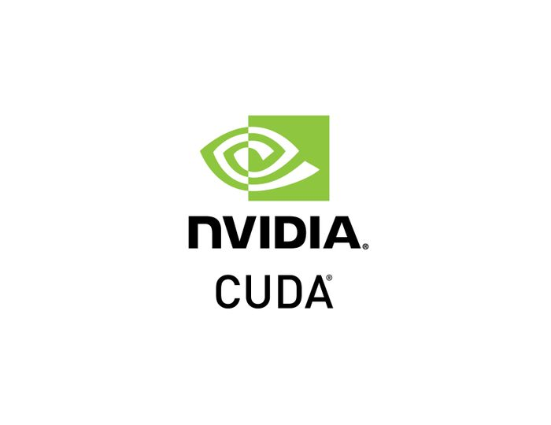
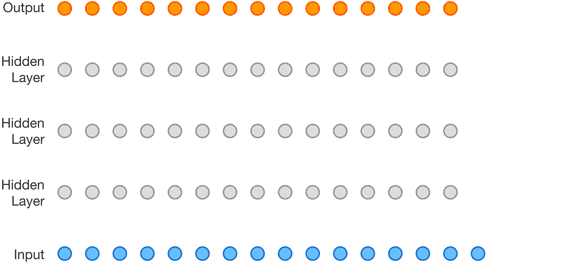

class: middle
background-image: url(img/brain.png)

# Hands on .red[deep learning]
#### \#1 Introduction

.bottomlogo[]
.footnote[ Alexandre Boucaud  -  [@alxbcd][twitter]]

[twitter]: https://twitter.com/alxbcd
---
exclude: true
class: middle
background-image: url(img/brain.png)
.hidden[aa]
# Hands on .red[deep learning]
.small[with [Keras][keras] examples]
.footnote[Alexandre Boucaud  -  [@alxbcd][twitter]]

---
exclude: true
## Alexandre Boucaud 

Scientific software engineer at APC

<!-- [aboucaud @ apc.in2p3.fr][mail]   -->
<!-- [@alxbcd][twitter] on twitter -->

 
.medium[Interests:]
- cosmological survey data processing (LSST, Euclid, LISA)
- ML applications in astrophysics (galaxy morphology, deblending)
- development of the open source Python scientific ecosystem

Disclaimer: I am .red[not] a machine learning researcher  

[mail]: mailto:aboucaud@apc.in2p3.fr
[twitter]: https://twitter.com/alxbcd

---

## Outline

.medium[[Introduction](#intro)]

> history - deep learning today

.medium[[Convolutional Neural Networks (CNN)](#cnn)]

> kernels - strides - pooling - loss - training

.medium[[In practice](#practice)]

> step-by-step - monitoring your training

.medium[[Common optimizations](#optim)]

> data augmentation - dropout - batch normalisation

---
count: false
## Outline

.medium[[Introduction](#intro)]

> history - deep learning today

.grey[
.medium[Convolutional Neural Networks (CNN)]

> kernels - strides - pooling - loss - training
]

.grey[
.medium[In practice]

> step-by-step - monitoring your training
]

.grey[
.medium[Common optimizations]

> data augmentation - dropout - batch normalisation
]

---
name: intro
background-image: url(img/news.png)

---
exclude: true
background-image: url(img/new_cool.png)

---
exclude: true
class: middle, center
background-image: url(img/xkcd_2135-m87.png)

.footnote[[XKCD](https://xkcd.com/2135/)]

---
exclude: true
class: middle, center

.center[<iframe width="640" height="360" src="https://www.youtube.com/embed/zUyH3XhpLTo" frameborder="0" allow="encrypted-media" allowfullscreen></iframe>]

.footnote[
  [CNRS news on the detection](https://news.cnrs.fr/articles/this-is-the-first-ever-image-of-a-black-hole)
]

---
<!-- class: center, middle -->
## deep learning vs. physics arXiv

---
## What does "deep" means ?

.center[

]

.footnote[more on these common net architectures [here][archi]]

[archi]: https://www.jeremyjordan.me/convnet-architectures/

---
## A bumpy 60-year history

--

--

---
## An unprecedented trend 

deep learning computation power .red[doubles every 3.5-month]

.center[
  
]

.footnote[[_AI and Compute_ blog post, Amodei & Hernandez, 16-05-2018](https://blog.openai.com/ai-and-compute/)]

---
exclude: true
class: center, middle

## QUESTION:

### Why this recent .red[trend] ?

---
## Why this recent trend ?

- .medium[specialized .blue[hardware]] .right[e.g. GPU, TPU, Intel Xeon Phi]

--
- .medium[.blue[data] availability] .right[_big data era_]

--
- .medium[.blue[algorithm] research] .right[e.g. adversarial or reinforcement learning]

--
- .medium[.blue[open source] tools] .right[huge ecosystem right now]

---
## Graphics Processing Unit (GPU)

- **< 2000** : "graphics cards" (video edition + game rendering)

.center[]

---
count: false
## Graphics Processing Unit (GPU)

- **< 2000** : "graphics cards" (video edition + game rendering)
- .hidden[< ]**1999** : Nvidia coins the term "GPU" for the first time

--
- .hidden[< ]**2001** : floating point support on graphics processors

--
- .hidden[< ]**2005** : programs start to be faster on GPU than on CPU

--
- .hidden[< ]**2007** : first release of the [CUDA](https://developer.nvidia.com/cuda-zone) framework

.center[]

---
count: false
## Graphics Processing Unit (GPU)

- **< 2000** : "graphics cards" (video edition + game rendering)
- .hidden[< ]**1999** : Nvidia coins the term "GPU" for the first time
- .hidden[< ]**2001** : floating point support on graphics processors
- .hidden[< ]**2005** : programs start to be faster on GPU than on CPU
- .hidden[< ]**2007** : first release of the [CUDA](https://developer.nvidia.com/cuda-zone) framework
- .hidden[< ]**2018** : GPUs are part of our lives (phones, computers, cars, etc..)

.center[]
.footnote[credit: Nvidia Tesla V100]

---
## Computational power 
GPU architectures are .blue[excellent] for the kind of computations required by the training of NN

.center[]

| year | hardware | computation (TFLOPS) | price (K$) |
|------|:------:|:-----------:|:----:|
| 2000 | IBM ASCI White | 12 | 100 000 K |
| 2005 | IBM Blue Gene/L | 135 | 40 000 K |
| 2018 | Nvidia Tesla V100 | > 100 | 10 K |
<!-- | 2017 | Nvidia Titan V | > 100 | 3 K | -->

<!-- .footnote[[Wikipedia: Nvidia GPUs](https://en.wikipedia.org/wiki/List_of_Nvidia_graphics_processing_units)] -->

---
## Deep learning software ecosystem

.center[
  
]

---
## Deep learning today

.left-column[
- translation
- image captioning
- speech synthesis
- style transfer
]

.right-column[
- cryptocurrency mining
- self-driving cars
- games 
- etc.
]

.reset-column[]
.center[
  
]

---
## Deep learning today

.center[
  
]

---
## DL today: speech synthesis

.center[

]

.footnote[[WaveNet][wavenet] - TTS with sound generation - DeepMind (2017)]

[wavenet]: https://deepmind.com/blog/high-fidelity-speech-synthesis-wavenet/

---
## DL today: image colorisation

.center[

]
.center[

]

.footnote[[Real-time image colorization][deepcolor] (2017)]

[deepcolor]: https://richzhang.github.io/ideepcolor/

---
## DL today: strategic game bots

.center[

]

.footnote[[AlphaStar][alphastar] - Starcraft II AI - DeepMind (2019)]

[alphastar]: https://deepmind.com/blog/alphastar-mastering-real-time-strategy-game-starcraft-ii/

---
## DL today: data science world

.center[
 
]

.center[

]

.footnote[[rapids.ai][rapids] - Nvidia (2019)]

[rapids]: https://rapids.ai

---
class: center, middle

## PLAY TIME

### Which sound is .red[generated] ?

1)  <audio controls><source src="img/lipstick_gen.wav"></audio>
  
2) <audio controls><source src="img/lipstick_gt.wav"></audio>

.footnote[[Tacotron 2][tacotron] - DeepMind (2017)]
[tacotron]: https://google.github.io/tacotron/publications/tacotron2/index.html

---
class: center, middle

## PLAY TIME

 ### Which face is .red[real] ?

.center[
  
]

.footnote[[whichfaceisreal.com][wfir] (2018)]

[wfir]: http://www.whichfaceisreal.com
---
class: center, middle

### The sucess of ML applications is blatant,

#### BUT

### we are still .red[far]* from "Artificial Intelligence".

.footnote[*see [nice post][mjordanmedium] by M. Jordan - Apr 2018]

[mjordanmedium]: https://medium.com/@mijordan3/artificial-intelligence-the-revolution-hasnt-happened-yet-5e1d5812e1e7 

---
exclude: true
class: center, middle

# For ML applications in astro see Emille's talk tomorrow.

---

# Outline

.medium[[Convolutional Neural Networks (CNN)](#cnn)]

> kernels - strides - pooling - loss - training

--
.medium[[In practice](#practice)]

> step-by-step - monitoring your training

--
.medium[[Common optimizations](#optim)]

> data augmentation - dropout - batch normalisation

---
class: center, middle

# Thank .red[you]
 
 
.medium[Contact info:]  
[aboucaud.github.io][website]  
@aboucaud on GitHub, GitLab  
[@alxbcd][twitter] on Twitter

[website]: https://aboucaud.github.io
 
 
 
 
.small[
  This presentation is licensed under a   
  [Creative Commons Attribution-ShareAlike 4.0 International License][cc]
]

[][cc]

[cc]: http://creativecommons.org/licenses/by-sa/4.0
