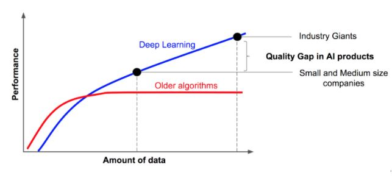
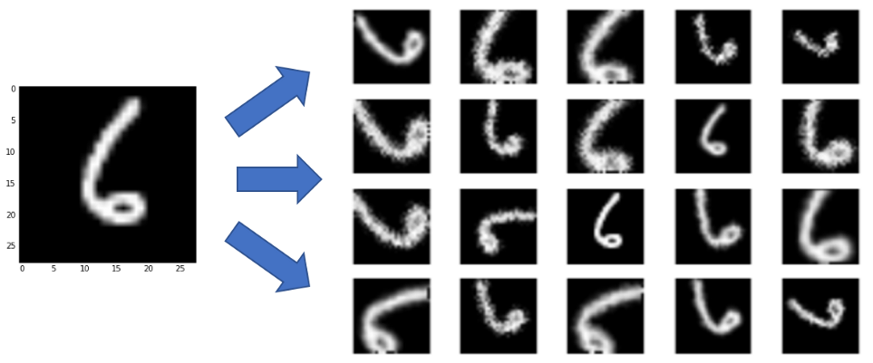

class: middle
background-image: url(img/brain.png)

# Hands on .red[deep learning]
#### \#4 Common optimisations

.bottomlogo[]
.footnote[ Alexandre Boucaud  -  [@alxbcd][twitter]]

[twitter]: https://twitter.com/alxbcd
---
exclude: true
class: middle
background-image: url(img/brain.png)
.hidden[aa]
# Hands on .red[deep learning]
.small[with [Keras][keras] examples]
.footnote[Alexandre Boucaud  -  [@alxbcd][twitter]]


---
exclude: true
## Alexandre Boucaud 

Scientific software engineer at APC

<!-- [aboucaud @ apc.in2p3.fr][mail]   -->
<!-- [@alxbcd][twitter] on twitter -->

</br>
.medium[Interests:]
- cosmological survey data processing (LSST, Euclid, LISA)
- ML applications in astrophysics (galaxy morphology, deblending)
- development of the open source Python scientific ecosystem

Disclaimer: I am .red[not] a machine learning researcher  


[mail]: mailto:aboucaud@apc.in2p3.fr
[twitter]: https://twitter.com/alxbcd

---

## Outline

.medium[[Introduction](#intro)]

> history - deep learning today

.medium[[Convolutional Neural Networks (CNN)](#cnn)]

> kernels - strides - pooling - loss - training

.medium[[In practice](#practice)]

> step-by-step - monitoring your training

.medium[[Common optimizations](#optim)]

> data augmentation - dropout - batch normalisation

---
count: false
## Outline

.grey[
.medium[Introduction]

> history - deep learning today
]

.grey[
.medium[Convolutional Neural Networks (CNN)]

> kernels - strides - pooling - loss - training
]

.grey[
.medium[In practice]

> step-by-step - monitoring your training
]

.medium[[Common optimizations](#optim)]

> data augmentation - dropout - batch normalisation

---
class: center, middle
name: optim
# Common optimizations

.medium["avoiding overfitting"]

---
## Data is key

Deep neural nets need .red[a lot of data] to achieve good performance.

.center[]

---
count: false
## Data is key

Deep neural nets need .red[a lot of data] to achieve good performance.

Use .red[data augmentation].

.center[]

---
count: false
## Data is key

Deep neural nets need .red[a lot of data] to achieve good performance.

Use .red[data augmentation].

Choose a training set .red[representative] of your data.


--
If you cannot get enough labeled data, use simulations or turn to [transfer learning](https://arxiv.org/abs/1411.1792) techniques.

---
## Dropout

A % of random neurons are .green[switched off] during training  
it mimics different architectures being trained at each step 

.center[]
.footnote[[Srivastava et al. (2014)](http://www.cs.toronto.edu/~rsalakhu/papers/srivastava14a.pdf)]

---
## Dropout

```python
...
from keras.layers import Dropout

dropout_rate = 0.25

model = Sequential()
model.add(Conv2D(2, (3, 3), input_shape=(9, 9, 1)))
*model.add(Dropout(dropout_rate))
model.add(Conv2D(4, (3, 3)))
*model.add(Dropout(dropout_rate))
...
```

- regularization technique extremely effective
- .green[prevents overfitting]

**Note:** dropout is .red[not used during evaluation], which accounts for a small gap between **`loss`** and **`val_loss`** during training.


.footnote[[Srivastava et al. (2014)](http://www.cs.toronto.edu/~rsalakhu/papers/srivastava14a.pdf)]

---
## Batch normalization

```python
...
from keras.layers import BatchNormalization
from keras.layers import Activation

model = Sequential()
model.add(Conv2D(..., activation=None))
*model.add(BatchNormalization())
model.add(Activation('relu'))
```

- technique that .green[adds robustness against bad initialization]
- forces activations layers to take on a unit gaussian distribution at the beginning of the training
- must be used .red[before] non-linearities

.footnote[[Ioffe & Szegedy (2015)](http://arxiv.org/abs/1502.03167)]

---
## to go further..

Here are some leads (random order) to explore if your model do not converge:
- [data normalization](https://www.jeremyjordan.me/batch-normalization/)
- [weight initialization](https://medium.com/usf-msds/deep-learning-best-practices-1-weight-initialization-14e5c0295b94)
- [choice of learning rate](http://www.bdhammel.com/learning-rates/)
- [gradient clipping](https://machinelearningmastery.com/exploding-gradients-in-neural-networks/)
- [various regularisation techniques](https://machinelearningmastery.com/how-to-reduce-overfitting-in-deep-learning-with-weight-regularization/)

---
## Next ?

.medium[ML developments are happening at a high pace,  
.red[stay tuned] !  

A .green[curated list] of inspirations for this presentation  
can be found [here][refs].
]

[refs]: https://github.com/aboucaud/slides/blob/master/2018/hands-on-deep-learning/references.md

---
class: center, middle

# Thank .red[you]
</br>
</br>
.medium[Contact info:]  
[aboucaud.github.io][website]  
@aboucaud on GitHub, GitLab  
[@alxbcd][twitter] on Twitter

[website]: https://aboucaud.github.io
</br>
</br>
</br>
</br>
.small[
  This presentation is licensed under a   
  [Creative Commons Attribution-ShareAlike 4.0 International License][cc]
]

[][cc]

[cc]: http://creativecommons.org/licenses/by-sa/4.0
