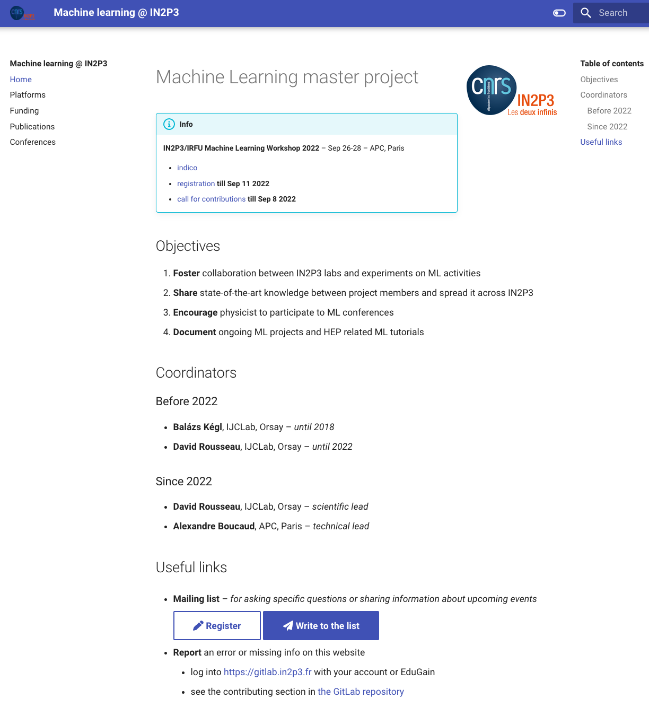
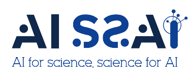

class: middle
background-image: url(img/brain.png)

# Machine learning

#### Séminaire Technique APC – 24 mars 2023
#### [Alexandre Boucaud][mail]

[mail]: mailto:aboucaud@apc.in2p3.fr

.footnote[
  
  ]

---

# Contexte

Master projet pour
  - favoriser le .blue[**développement du ML**] à l'IN2P3
  - encourager les .blue[**collaborations**] entre membres IN2P3 et avec des spécialistes du domaine + cotutelles
  - envoyer des scientifiques IN2P3 aux conférences de ML

**responsabilité** : David Rousseau (IJClab) & Alexandre Boucaud (APC)  
**budget 2023** : 13K€ fourni par le DAS calcul  
**site web** .red[(new)] : https://machine-learning.in2p3.fr  
**liste de diffusion** : [machine-learning-l@in2p3.fr][listeml] | inscription 👉 [ici][registerml]  
**workshop annuel** _ML @ IN2P3/IRFU_ : [.green[édition 2022]][workshop22] | [.green[webcast]][webcast22]

[listeml]: mailto:machine-learning-l@in2p3.fr
[registerml]: https://listserv.in2p3.fr/cgi-bin/wa?A0=MACHINE-LEARNING-L
[workshop21]: https://indico.in2p3.fr/event/22938/
[workshop22]: https://indico.in2p3.fr/event/27507/
[webcast22]: https://webcast.in2p3.fr/container/machine-learning-workshop-in2p3-irfu

---

# Points marquants de l'année écoulée

.green[**rebond**] post-confinement(s)
  - 2 écoles thématiques 
  - 1 workshop national (APC) + 2 workshops/conf. internationaux (APC + IJCLab)
  - envoi de 5 PhD/postdocs aux conférences ML
  - présentation au conseil scientifique calcul et données

--
  
.green[**intérêt**] sans cesse .green[**grandissant**]
  - inscrits liste de diffusion ↗️ 40% depuis oct. 2021

--

mise en place du .green[**site internet**] 

--

organisation du .green[**semestre thématique AISSAI**]

---

# Un site web tout neuf

.left-column[
  .center[
    
  ]
]

.right-column[
- .blue[**moyens de calcul**] et liens utiles vers manuels de démarrage

- recensement des .blue[**financements**] (ANR, ERC, ...) et des .blue[**thèses**] avec forte composante ML

- calendrier des .blue[**conférences/workshops**] avec dates clés et bientôt des .blue[**écoles**]

- listing des .blue[**publications**] ML avec contribution forte IN2P3
]

---

# Semestre thématique AISSAI

AISSAI est un [centre interdisciplinaire du CNRS][aissai] mis en place par la MITI en 2021 pour encourager les échanges entre les domaines scientifiques utilisant le machine learning.

Les moyens mis en place pour y parvenir sont principalement .green[des semestres thématiques] comprenant des écoles, ateliers, visites de professeurs/chercheurs.

L'IN2P3 a été désignée pour organiser le 3e semestre thématique .red[cette année]
  - organisation d'un hackathon couplé à l'école AstroInfo & une école à la rentrée
  - 3 workshops en préparation pour la fin de l'année 
    - incertitudes
    - données hétérogènes
    - détection d'anomalies

Annonces à venir bientôt..

.footnote[
   
]

[aissai]: https://www.cnrs.fr/fr/a-propos-du-centre-aissai
