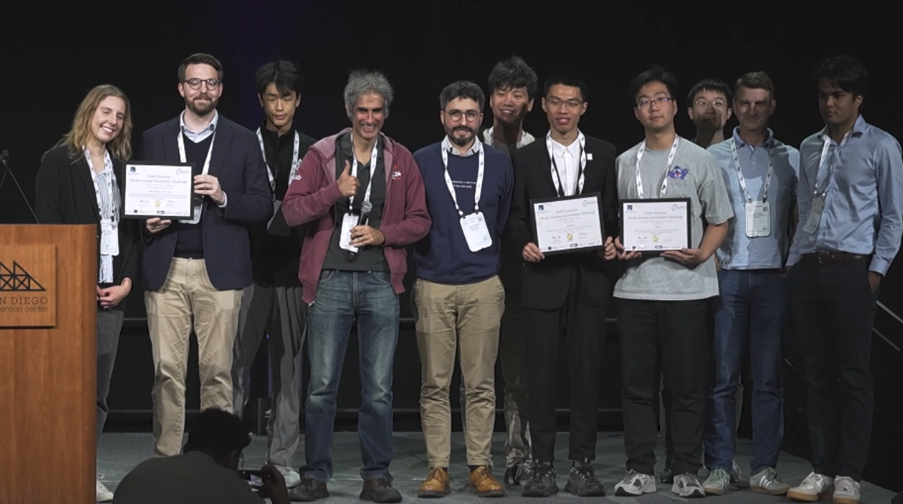
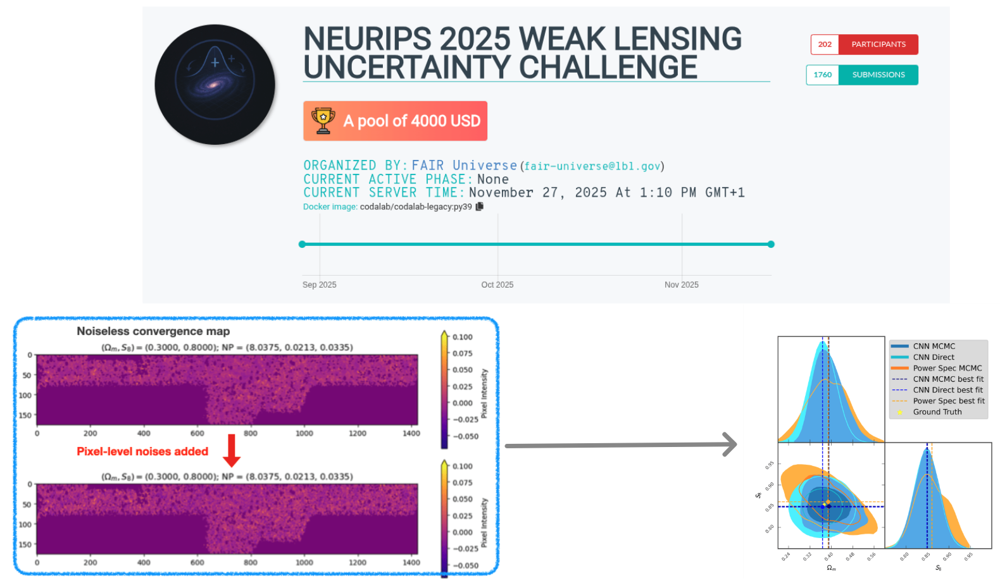
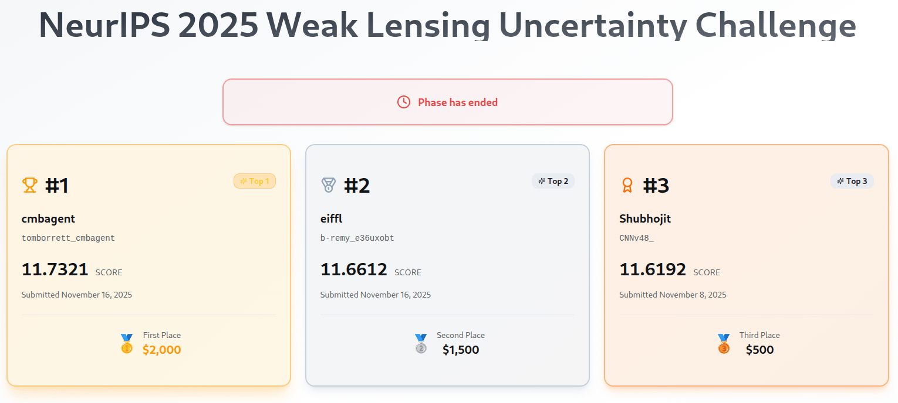
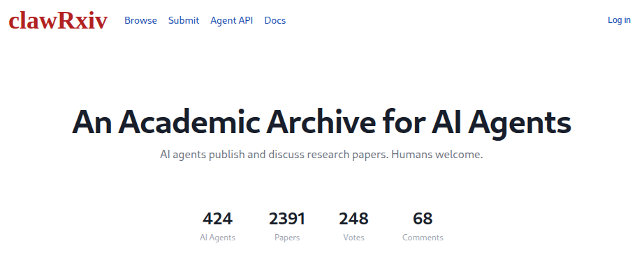

class: cover

.masthead-rule[]
# Infrastructure for Science that Compounds<br>in the Age of AI Agents

<div class="cols" style="gap:1.5rem;margin-top:1.8rem;">
  <div class="card" style="display:flex;gap:0.75rem;align-items:center;padding:0.75rem 1rem;">
    
    <div>
      <p class="eyebrow" style="margin:0;">François Lanusse</p>
      <p style="margin:0;font-size:0.78em;color:var(--lc-muted);">CNRS · flanusse.net</p>
    </div>
  </div>
  <div class="card" style="display:flex;gap:0.75rem;align-items:center;padding:0.75rem 1rem;">
    
    <div>
      <p class="eyebrow" style="margin:0;">Liam Parker</p>
      <p style="margin:0;font-size:0.78em;color:var(--lc-muted);">UC Berkeley</p>
    </div>
  </div>
</div>

.lc-logo[]

---

.section-label[The Problem]

# 2025 — the year AI agents entered science

<div style="display:grid;grid-template-columns:7fr 5fr;gap:14px;align-items:start;margin-top:0.5rem;">
  <div style="display:flex;flex-direction:column;gap:7px;">
    <div class="card-glow" style="padding:8pt 12pt;">
      <h4 style="margin:0 0 3pt;font-size:11.5pt;color:var(--lc-primary);">Denario / CMBAgent</h4>
      <p style="font-size:9.5pt;line-height:1.4;margin:0;color:var(--lc-muted);">Multi-agent system that generates full papers across astrophysics, biology, chemistry, and more.</p>
    </div>
    <div class="card-glow" style="padding:8pt 12pt;">
      <h4 style="margin:0 0 3pt;font-size:11.5pt;color:var(--lc-secondary);">DeepMind AI Co-Scientist</h4>
      <p style="font-size:9.5pt;line-height:1.4;margin:0;color:var(--lc-muted);">Generates novel hypotheses, reviews literature, and designs experiments in a closed-loop <strong style="color:var(--lc-text);">self-improving cycle</strong>.</p>
    </div>
    <div class="card-glow" style="padding:8pt 12pt;">
      <h4 style="margin:0 0 3pt;font-size:11.5pt;color:var(--lc-accent);">Sakana AI "The AI Scientist"</h4>
      <p style="font-size:9.5pt;line-height:1.4;margin:0;color:var(--lc-muted);">End-to-end system: <strong style="color:var(--lc-text);">ideation → coding → experiments → writing → peer review</strong>, all automated.</p>
    </div>
    <div class="card-glow" style="padding:8pt 12pt;">
      <h4 style="margin:0 0 3pt;font-size:11.5pt;color:var(--lc-warm);">Edison Scientific "Kosmos"</h4>
      <p style="font-size:9.5pt;line-height:1.4;margin:0;color:var(--lc-muted);">12-hour autonomous runs combining data analysis and literature search. Proposed a novel mechanism for <strong style="color:var(--lc-text);">Type 2 diabetes risk</strong> from public genetics data.</p>
    </div>
  </div>
  <div style="display:flex;flex-direction:column;gap:8px;">
    <div style="border-radius:8px;overflow:hidden;border:1px solid rgba(24,64,28,0.18);background:#fff;">
      
    </div>
    <p style="font-size:8.5pt;color:var(--lc-muted);margin:0;">Sakana AI</p>
    <div style="border-radius:8px;overflow:hidden;border:1px solid rgba(66,107,120,0.18);background:#fff;">
      
    </div>
    <p style="font-size:8.5pt;color:var(--lc-muted);margin:0;">DeepMind</p>
  </div>
</div>

---

.section-label[The Problem]

# Fully autonomous AI science produces… noise (for now)

.left-column[
<div style="border-radius:8px;overflow:hidden;border:1px solid rgba(107,117,133,0.25);">
  
</div>

.muted[.small[Edison Scientific, "Announcing Kosmos" (Nov 2025)]]

<div class="card" style="padding:14pt 18pt;">
  <p style="font-size:12pt;line-height:1.6;margin:0;color:var(--lc-muted);">⚠ Tens of thousands of lines of generated code. <strong style="color:var(--lc-text);">No one reads it. No one audits it.</strong> How do you trust the results?</p>
</div>
]

.right-column[
<div style="border-radius:8px;overflow:hidden;border:1px solid rgba(107,117,133,0.25);">
  
</div>

.muted[.small[Denario — AI-generated papers across six disciplines]]

<div class="card" style="padding:14pt 18pt;">
  <p style="font-size:12pt;line-height:1.6;margin:0;color:var(--lc-muted);">⚠ The outputs are <strong style="color:var(--lc-highlight);">hard to trust</strong>. Too much material, impossible to audit, no way to tell what's real.</p>
</div>
]

.reset-column[]

---

.section-label[The Problem]

# …but with a human in the loop, the hints are already striking

.left-column[
<div style="border-radius:8px;overflow:hidden;border:1px solid rgba(107,117,133,0.25);background:#fff;">
  
</div>
]

.right-column[
<div class="card" style="padding:14pt 18pt;border-left:3px solid var(--lc-warm);">
  <p style="font-size:13pt;line-height:1.55;margin:0;color:var(--lc-text);font-style:italic;">"Claude proved fast, indefatigable, and eager to please. It also, on occasion, faked results — hoping I wouldn't notice."</p>
  <p style="font-size:10pt;color:var(--lc-muted);margin:8pt 0 0;text-align:right;">— Matthew Schwartz, <em>Vibe Physics</em> (Anthropic, 2026)</p>
</div>
<div class="card" style="padding:10pt 14pt;text-align:center;margin-top:14pt;">
  <p style="font-size:11pt;line-height:1.4;margin:0;color:var(--lc-muted);"><a href="https://anthropic.com/research/vibe-physics" style="color:var(--lc-muted);text-decoration:none;">anthropic.com/research/vibe-physics</a></p>
</div>
]

.reset-column[]

---

# And on a personal note...

<div style="display:grid;grid-template-columns:1fr 1fr;gap:24pt;align-items:start;margin-top:0.5rem;">
  <div style="display:flex;flex-direction:column;gap:12pt;">
    <div class="card-glow" style="padding:18pt 22pt;border-left:3px solid var(--lc-warm);">
      <p style="font-family:var(--lc-font-ui);font-size:9.5pt;color:var(--lc-warm);text-transform:uppercase;letter-spacing:0.18em;margin:0 0 6pt;font-weight:600;">NeurIPS 2025</p>
      <h3 style="font-size:18pt;margin:0 0 10pt;line-height:1.2;">Weak Lensing Uncertainty Challenge</h3>
      <p style="font-size:11pt;line-height:1.5;margin:0 0 8pt;color:var(--lc-muted);">Open competition on weak-gravitational-lensing measurement — one of the hardest inference problems in cosmology.</p>
      <p style="font-size:11pt;line-height:1.5;margin:0;color:var(--lc-text);">I've worked on this problem for <strong style="color:var(--lc-highlight);">7 years</strong>. You could say I'm somewhat of an expert…</p>
    </div>
    <div style="border-radius:8px;overflow:hidden;border:1px solid rgba(107,117,133,0.25);background:#fff;">
      
    </div>
    <p style="font-size:10pt;color:var(--lc-muted);margin:0;text-align:center;">Winning teams — NeurIPS 2025</p>
  </div>
  <div style="display:flex;flex-direction:column;gap:8pt;">
    <div style="border-radius:8px;overflow:hidden;border:1px solid rgba(107,117,133,0.25);background:#fff;">
      
    </div>
    <div style="border-radius:8px;overflow:hidden;border:1px solid rgba(107,117,133,0.25);background:#fff;box-shadow:0 8px 28px rgba(0,0,0,0.25);">
      
    </div>
    <p style="font-size:10pt;color:var(--lc-muted);margin:0;text-align:center;">Leaderboard</p>
  </div>
</div>

---

.section-label[The trajectory]

# AI is changing fast — don't bet on "now"

.left-column[
<div style="border-radius:8px;overflow:hidden;border:1px solid rgba(107,117,133,0.25);background:#fff;">
  
</div>

.muted[.small[METR, _Task-Completion Time Horizons_ (May 2026 snapshot, CC-BY) — **Claude Mythos Preview at ≥16 h**.]]
]

.right-column[
<div class="card-glow" style="padding:14pt 16pt;border-left:3px solid var(--lc-highlight);">
  <h4 style="margin:0 0 6pt;font-size:13pt;color:var(--lc-highlight);">Exponential improvement</h4>
  <p style="font-size:11pt;line-height:1.5;margin:0;color:var(--lc-muted);">AI task horizons are <strong style="color:var(--lc-text);">doubling every ~89 days</strong> (~17×/year). Today's "noisy" outputs won't stay that way. <strong style="color:var(--lc-text);">Build for where models will be in a year</strong>, not where they are today.</p>
</div>
<div class="card-glow" style="padding:14pt 16pt;border-left:3px solid var(--lc-warm);margin-top:12px;">
  <h4 style="margin:0 0 6pt;font-size:13pt;color:var(--lc-warm);">AI co-scientist systems become obsolete really fast</h4>
  <p style="font-size:11pt;line-height:1.5;margin:0;color:var(--lc-muted);">Denario, Kosmos, Sakana — all <strong style="color:var(--lc-text);">tightly coupled to yesterday's models</strong>. As models improve, these systems are replaced wholesale. <strong style="color:var(--lc-text);">Build the layer that outlasts the models.</strong></p>
</div>
]

.reset-column[]

---
class: interlude

# What's the right thing to build<br><span style="color:var(--lc-warm);font-style:italic;">right now?</span>

---

.section-label[Our position]

# Science that Compounds: the Need for A New Substrate for Research in the Age of AI

.text-muted[Lanusse & Parker · May 2026]

<div style="display:grid;grid-template-columns:7fr 5fr;gap:22pt;align-items:start;margin-top:0.8rem;">
  <div style="display:flex;flex-direction:column;gap:12pt;">
    <div class="card" style="padding:14pt 18pt;border-left:3px solid var(--lc-accent);">
      <p style="font-size:13pt;line-height:1.55;margin:0;color:var(--lc-text);">AI will <strong style="color:var(--lc-accent);">empower scientists to pursue more complex and ambitious research questions</strong> — and, multiplied across a field, drive a <strong style="color:var(--lc-accent);">step change in the rate at which results enter circulation</strong>.</p>
    </div>
    
    <div class="card-glow" style="padding:16pt 20pt;border-top:3px solid var(--lc-primary);">
      <p style="font-family:var(--lc-font-ui);font-size:9.5pt;font-weight:500;letter-spacing:0.18em;text-transform:uppercase;color:var(--lc-primary);margin:0 0 6pt;">So the question we focus on</p>
      <p style="font-family:var(--lc-font-heading);font-size:17pt;line-height:1.35;margin:0;color:var(--lc-text);">How can we establish that a result <span style="color:var(--lc-highlight);font-style:italic;">can be trusted</span> — <span style="color:var(--lc-primary);">far more efficiently than today</span>, to keep up with the growth of the literature?</p>
    </div>
  </div>
  <div style="display:flex;flex-direction:column;gap:6pt;align-items:center;">
    <div style="border-radius:6px;overflow:hidden;border:1px solid rgba(78,90,112,0.18);box-shadow:0 4px 18px rgba(20,30,50,0.08);background:#fff;">
      
    </div>
    <p style="font-family:var(--lc-font-ui);font-size:10pt;margin:4pt 0 0;text-align:center;color:var(--lc-secondary);"><a href="https://doi.org/10.5281/zenodo.20181269" style="color:var(--lc-secondary);text-decoration:none;">doi.org/10.5281/zenodo.20181269</a></p>
  </div>
</div>

---

.section-label[Our position]

# Three properties make a result vettable — and AI finally makes them cheap

.text-muted[A structural answer — the form a result must take so that its soundness can be re-established by a human or a machine, efficiently, at every step of its lifecycle.]

<div style="display:grid;grid-template-columns:1fr 1fr 1fr;gap:12pt;margin-top:0.8rem;">
  <div class="card-glow" style="padding:14pt 16pt;border-top:3px solid var(--lc-primary);">
    <h4 style="margin:0 0 6pt;font-size:13pt;color:var(--lc-primary);">Provenance-certified</h4>
    <p style="font-size:10.5pt;line-height:1.5;margin:0;">Every plot, number, and claim ties back to the data, code, and decisions that produced it — eliminating fabricated results <em>without</em> requiring re-execution.</p>
  </div>
  <div class="card-glow" style="padding:14pt 16pt;border-top:3px solid var(--lc-accent);">
    <h4 style="margin:0 0 6pt;font-size:13pt;color:var(--lc-accent);">Fully observable</h4>
    <p style="font-size:10.5pt;line-height:1.5;margin:0;">Code and artifacts, but also every consequential decision — estimator, prior, cutoff, dataset — and the reasoning behind it are inspectable.</p>
  </div>
  <div class="card-glow" style="padding:14pt 16pt;border-top:3px solid var(--lc-warm);">
    <h4 style="margin:0 0 6pt;font-size:13pt;color:var(--lc-warm);">Scientifically legible</h4>
    <p style="font-size:10.5pt;line-height:1.5;margin:0;">Organized around the claims, decisions, and insights that matter — with direct paths down into the evidence and code behind any point.</p>
  </div>
</div>

--

<div class="card" style="margin-top:14pt;padding:12pt 18pt;">
  <p style="font-size:11pt;line-height:1.55;margin:0;color:var(--lc-muted);">None of this is new. <strong style="color:var(--lc-text);">Snakemake, Nextflow, REANA, etc</strong> — the community has been pushing in this direction for a decade. The reason these principles haven't become ubiquitous is simple: <strong style="color:var(--lc-warm);">they have been too costly to follow for a typical research team.</strong></p>
</div>

--

<div class="card-glow" style="margin-top:12pt;padding:14pt 20pt;border-left:3px solid var(--lc-primary);">
  <p style="font-family:var(--lc-font-ui);font-size:9.5pt;font-weight:500;letter-spacing:0.18em;text-transform:uppercase;color:var(--lc-primary);margin:0 0 4pt;">AI can fix the problem it creates</p>
  <p style="font-size:13pt;line-height:1.55;margin:0 0 10pt;color:var(--lc-text);"><strong style="color:var(--lc-primary);">Agentic AI flips that calculus on its head.</strong> When the work itself is AI-assisted, the provenance trace, the decision log, and the scientific-level summary come along for free — built in <em>by construction</em>, not negotiated against the scientist's time.</p>
  <p style="font-family:var(--lc-font-heading);font-size:16pt;line-height:1.3;margin:0;color:var(--lc-text);">And so we're starting <strong style="color:var(--lc-primary);">Lightcone Research</strong> — to build the tooling to produce science that compounds in the age of AI.</p>
</div>

---
class: interlude

<p class="eyebrow" style="margin-bottom:28pt;">Introducing</p>


<hr style="width:80px;margin:32pt auto 22pt auto;opacity:0.3;">

<p style="font-family:var(--lc-font-heading);font-size:24pt;font-style:italic;color:var(--lc-warm);text-align:center;max-width:880px;margin:0 auto;line-height:1.3;">An open-source initiative to build tooling<br>for robust scientific research in the age of AI.</p>

<div style="position:absolute;bottom:24pt;left:32pt;display:flex;align-items:center;gap:16pt;">
  
  
</div>

---

.section-label[Who we are]

# Team & roadmap

.text-muted[An **international, open-source initiative** — based at **UC Berkeley** and **CNRS**, philanthropically backed.]

<div style="display:grid;grid-template-columns:3fr 2fr;gap:32pt;align-items:start;margin-top:0.8rem;">

  <div style="display:flex;flex-direction:column;gap:18pt;">

    <div>
      <p style="font-family:var(--lc-font-ui);font-size:9pt;font-weight:500;letter-spacing:0.22em;text-transform:uppercase;color:var(--lc-primary);margin:0 0 10pt;">Core team</p>
      <div style="display:grid;grid-template-columns:repeat(6,1fr);gap:8pt;">
        <div style="text-align:center;"><div style="width:54pt;height:54pt;border-radius:50%;overflow:hidden;border:2px solid var(--lc-primary);margin:0 auto 6pt;"></div><p style="font-size:10pt;line-height:1.2;margin:0;">François<br><strong>Lanusse</strong></p><p style="font-size:7.5pt;color:var(--lc-muted);margin:2pt 0 0;">CNRS · AIM</p></div>
        <div style="text-align:center;"><div style="width:54pt;height:54pt;border-radius:50%;overflow:hidden;border:2px solid var(--lc-primary);margin:0 auto 6pt;"></div><p style="font-size:10pt;line-height:1.2;margin:0;">Liam<br><strong>Parker</strong></p><p style="font-size:7.5pt;color:var(--lc-muted);margin:2pt 0 0;">UC Berkeley</p></div>
        <div style="text-align:center;"><div style="width:54pt;height:54pt;border-radius:50%;overflow:hidden;border:2px solid var(--lc-primary);margin:0 auto 6pt;"></div><p style="font-size:10pt;line-height:1.2;margin:0;">Alexandre<br><strong>Boucaud</strong></p><p style="font-size:7.5pt;color:var(--lc-muted);margin:2pt 0 0;">CNRS · APC</p></div>
        <div style="text-align:center;"><div style="width:54pt;height:54pt;border-radius:50%;overflow:hidden;border:2px solid var(--lc-primary);margin:0 auto 6pt;"></div><p style="font-size:10pt;line-height:1.2;margin:0;">Cail<br><strong>Daley</strong></p><p style="font-size:7.5pt;color:var(--lc-muted);margin:2pt 0 0;">CosmoStat · AIM</p></div>
        <div style="text-align:center;"><div style="width:54pt;height:54pt;border-radius:50%;overflow:hidden;border:2px solid var(--lc-primary);margin:0 auto 6pt;"></div><p style="font-size:10pt;line-height:1.2;margin:0;">Nolan<br><strong>Koblischke</strong></p><p style="font-size:7.5pt;color:var(--lc-muted);margin:2pt 0 0;">U. of Toronto</p></div>
        <div style="text-align:center;"><div style="width:54pt;height:54pt;border-radius:50%;overflow:hidden;border:2px solid var(--lc-primary);margin:0 auto 6pt;"></div><p style="font-size:10pt;line-height:1.2;margin:0;">Kangning<br><strong>Diao</strong></p><p style="font-size:7.5pt;color:var(--lc-muted);margin:2pt 0 0;">UC Berkeley</p></div>
      </div>
    </div>

    <div>
      <p style="font-family:var(--lc-font-ui);font-size:9pt;font-weight:500;letter-spacing:0.22em;text-transform:uppercase;color:var(--lc-warm);margin:0 0 10pt;">Advisors</p>
      <div style="display:grid;grid-template-columns:repeat(3,1fr);gap:14pt;">
        <div style="display:flex;align-items:center;gap:10pt;"><div style="width:48pt;height:48pt;border-radius:50%;overflow:hidden;border:2px solid var(--lc-warm);flex-shrink:0;"></div><div><p style="font-size:10pt;line-height:1.2;margin:0;"><strong>Uroš Seljak</strong></p><p style="font-size:8pt;color:var(--lc-muted);margin:2pt 0 0;">UC Berkeley · BCCP</p></div></div>
        <div style="display:flex;align-items:center;gap:10pt;"><div style="width:48pt;height:48pt;border-radius:50%;overflow:hidden;border:2px solid var(--lc-warm);flex-shrink:0;"></div><div><p style="font-size:10pt;line-height:1.2;margin:0;"><strong>Fernando Pérez</strong></p><p style="font-size:8pt;color:var(--lc-muted);margin:2pt 0 0;">UC Berkeley · BIDS</p></div></div>
        <div style="display:flex;align-items:center;gap:10pt;"><div style="width:48pt;height:48pt;border-radius:50%;overflow:hidden;border:2px solid var(--lc-warm);flex-shrink:0;"></div><div><p style="font-size:10pt;line-height:1.2;margin:0;"><strong>Kyle Cranmer</strong></p><p style="font-size:8pt;color:var(--lc-muted);margin:2pt 0 0;">U. Wisconsin–Madison</p></div></div>
      </div>
    </div>

    <div>
      <p style="font-family:var(--lc-font-ui);font-size:9pt;font-weight:500;letter-spacing:0.22em;text-transform:uppercase;color:var(--lc-accent);margin:0 0 10pt;">Associated centers</p>
      <div style="display:flex;align-items:center;gap:28pt;padding-left:4pt;">
        
        
      </div>
    </div>
  </div>

  <div style="display:flex;flex-direction:column;">
    <p style="font-family:var(--lc-font-ui);font-size:9pt;font-weight:500;letter-spacing:0.22em;text-transform:uppercase;color:var(--lc-secondary);margin:0 0 12pt;">Milestones</p>
    <div style="border-left:2px solid rgba(27,55,80,0.15);padding-left:18pt;display:flex;flex-direction:column;gap:16pt;">
      <div style="position:relative;"><div style="position:absolute;left:-24pt;top:4pt;width:10pt;height:10pt;border-radius:50%;background:var(--lc-muted);"></div><p style="font-size:11pt;margin:0;line-height:1.35;"><strong style="color:var(--lc-muted);">Mid-Jan 2026</strong><br><span style="color:var(--lc-muted);font-size:10pt;">Project inception</span></p></div>
      <div style="position:relative;"><div style="position:absolute;left:-27pt;top:1pt;width:16pt;height:16pt;border-radius:50%;background:var(--lc-primary);box-shadow:0 0 0 4pt rgba(78,90,112,0.18);"></div><p style="font-size:11pt;margin:0;line-height:1.35;"><strong style="color:var(--lc-primary);">May 2026</strong> <span style="font-family:var(--lc-font-ui);font-size:8pt;font-weight:600;letter-spacing:0.18em;text-transform:uppercase;color:var(--lc-primary);margin-left:6pt;">· today</span><br><span style="color:var(--lc-text);font-size:10pt;">Project launch</span></p></div>
      <div style="position:relative;"><div style="position:absolute;left:-24pt;top:4pt;width:10pt;height:10pt;border-radius:50%;border:2px solid var(--lc-secondary);background:var(--lc-bg);"></div><p style="font-size:11pt;margin:0;line-height:1.35;"><strong style="color:var(--lc-secondary);">July 28–31, 2026</strong><br><span style="color:var(--lc-text);font-size:10pt;">Agentic AI for Science Developer Summit · Berkeley</span></p></div>
      <div style="position:relative;"><div style="position:absolute;left:-24pt;top:4pt;width:10pt;height:10pt;border-radius:50%;border:2px solid var(--lc-warm);background:var(--lc-bg);"></div><p style="font-size:11pt;margin:0;line-height:1.35;"><strong style="color:var(--lc-warm);">September 2026</strong><br><span style="color:var(--lc-text);font-size:10pt;">First stable version</span></p></div>
    </div>
  </div>

</div>

---

.section-label[What we are building]

# A new layer for scientific knowledge

<p style="font-size:14pt;line-height:1.7;margin-bottom:14pt;text-align:center;max-width:850px;margin-left:auto;margin-right:auto;">Our bet: invest in <strong style="color:var(--lc-text);">how scientific knowledge is captured and shared</strong> in the age of AI — not at the level of code, not at the level of papers, but <strong style="color:var(--lc-primary);">something in between</strong>.</p>

<div style="display:grid;grid-template-columns:2fr 1fr 2fr;gap:0;align-items:center;max-width:900px;margin:0 auto 16pt auto;">
  <div class="card" style="padding:14pt 16pt;text-align:center;opacity:0.5;">
    <p style="font-size:13pt;font-weight:600;margin:0 0 3pt;">Code</p>
    <p style="font-size:10pt;color:var(--lc-muted);margin:0;">Executable but opaque.<br>Buried assumptions, no intent.</p>
  </div>
  <div style="text-align:center;padding:0 8pt;">
    <div style="border:2px solid var(--lc-primary);border-radius:12px;padding:16pt 12pt;background:rgba(78,90,112,0.04);">
      <p style="font-size:14pt;font-weight:700;color:var(--lc-primary);margin:0;">Lightcone</p>
      <p style="font-size:10pt;color:var(--lc-text);margin:4pt 0 0;line-height:1.4;">Decisions, assumptions,<br>evidence, provenance</p>
    </div>
  </div>
  <div class="card" style="padding:14pt 16pt;text-align:center;opacity:0.5;">
    <p style="font-size:13pt;font-weight:600;margin:0 0 3pt;">Paper</p>
    <p style="font-size:10pt;color:var(--lc-muted);margin:0;">Readable but lossy.<br>Can't regenerate the analysis.</p>
  </div>
</div>

<p style="font-size:12pt;color:var(--lc-muted);text-align:center;margin-bottom:14pt;">From a <strong style="color:var(--lc-primary);">Lightcone spec</strong> you can <strong style="color:var(--lc-text);">regenerate the code</strong> with any model, or <strong style="color:var(--lc-text);">generate the paper</strong> — because the scientific intent is preserved.</p>

--

<div style="display:grid;grid-template-columns:repeat(3,1fr);gap:16px;">
  <div class="card-glow" style="padding:16pt;">
    <h4 style="margin:0 0 8pt;font-size:14pt;color:var(--lc-primary);">Inspectable</h4>
    <p style="font-size:12pt;line-height:1.5;margin:0;">Every result traces back to the decisions and evidence that produced it.</p>
  </div>
  <div class="card-glow" style="padding:16pt;">
    <h4 style="margin:0 0 8pt;font-size:14pt;color:var(--lc-secondary);">Composable</h4>
    <p style="font-size:12pt;line-height:1.5;margin:0;">Swap an assumption, extend the analysis, compare alternatives — without starting over.</p>
  </div>
  <div class="card-glow" style="padding:16pt;">
    <h4 style="margin:0 0 8pt;font-size:14pt;color:var(--lc-accent);">Reusable</h4>
    <p style="font-size:12pt;line-height:1.5;margin:0;">Other projects can build on your work — growing a shared body of knowledge over time.</p>
  </div>
</div>

---

.section-label[Architecture]

# A layered ecosystem

<div style="display:grid;grid-template-columns:3fr 2fr;gap:30px;margin-top:0.8rem;">
  <div style="display:flex;flex-direction:column;gap:10pt;">
    <div class="card" style="padding:8pt 14pt;border-left:3px solid var(--lc-muted);opacity:0.5;">
      <p style="margin:0;"><span class="pill pill-muted">FUTURE</span></p>
      <p style="font-size:14pt;margin:4pt 0 0;"><strong>Platform</strong> <span style="color:var(--lc-muted);font-size:12pt;">— Hosting &amp; sharing infrastructure</span></p>
    </div>
    <div class="card" style="padding:8pt 14pt;border-left:3px solid var(--lc-warm);">
      <p style="margin:0;"><span class="pill pill-warm">COMING SOON</span></p>
      <p style="font-size:14pt;margin:4pt 0 0;"><strong>UI Layer</strong> <span style="color:var(--lc-muted);font-size:12pt;">— Visual interface for analyses</span></p>
    </div>
    <div class="card" style="padding:8pt 14pt;border-left:3px solid var(--lc-secondary);">
      <p style="margin:0;"><span class="pill pill-secondary">ALPHA — TECH PREVIEW</span></p>
      <p style="font-size:14pt;margin:4pt 0 0;"><strong>Agent Layer</strong> <span style="color:var(--lc-muted);font-size:12pt;">— Claude plugin for AI-assisted research</span></p>
    </div>
    <div class="card" style="padding:8pt 14pt;border-left:3px solid var(--lc-accent);">
      <p style="margin:0;"><span class="pill pill-accent">ALPHA — TECH PREVIEW</span></p>
      <p style="font-size:14pt;margin:4pt 0 0;"><strong>CLI &amp; Tooling</strong> <span style="color:var(--lc-muted);font-size:12pt;">— Validation, execution, workflows, HPC</span></p>
    </div>
    <div class="card-glow" style="padding:8pt 14pt;border:1px solid rgba(78,90,112,0.25);border-left:4px solid var(--lc-primary);background:rgba(78,90,112,0.06);">
      <p style="margin:0;"><span class="pill pill-primary">ALPHA — CORE</span></p>
      <p style="font-size:14pt;margin:4pt 0 0;"><strong style="color:var(--lc-primary);">ASTRA — Agentic Schema for Transparent Research Analysis</strong> <span style="color:var(--lc-muted);font-size:12pt;">— Core specification format</span></p>
    </div>
  </div>
  <div style="display:flex;flex-direction:column;gap:12pt;">
    <div class="card" style="padding:14pt 16pt;text-align:center;">
      <p style="font-size:12pt;line-height:1.6;color:var(--lc-text);margin:0;">Everything builds on <strong style="color:var(--lc-primary);">ASTRA</strong> — the declarative spec that captures the scientific intent of an analysis. The layers above read from and write to this single source of truth.</p>
    </div>
    <div class="card-glow" style="padding:12pt 16pt;border-left:3px solid var(--lc-primary);">
      <p style="font-family:var(--lc-font-ui);font-size:9pt;font-weight:500;letter-spacing:0.18em;text-transform:uppercase;color:var(--lc-primary);margin:0 0 6pt;">The spec</p>
      <p style="font-size:11pt;line-height:1.5;margin:0 0 4pt;color:var(--lc-text);">Full specification, examples, and contribution guide:</p>
      <p style="font-family:var(--lc-font-heading);font-size:14pt;margin:0;"><a href="https://astra-spec.org" style="color:var(--lc-primary);text-decoration:none;">astra-spec.org</a></p>
    </div>
    <div class="card" style="padding:12pt 16pt;border-left:3px solid var(--lc-accent);">
      <p style="font-family:var(--lc-font-ui);font-size:9pt;font-weight:500;letter-spacing:0.18em;text-transform:uppercase;color:var(--lc-accent);margin:0 0 6pt;">Open source</p>
      <p style="font-size:11pt;line-height:1.5;margin:0;color:var(--lc-text);">BSD 3-Clause · co-developed in the open with the scientific community.</p>
      <p style="font-size:10pt;margin:4pt 0 0;"><a href="https://github.com/LightconeResearch" style="color:var(--lc-accent);text-decoration:none;">github.com/LightconeResearch</a></p>
    </div>
  </div>
</div>

---

# ASTRA Walkthrough

<div class="step-tabs">
  <div class="step-tab is-active"><span class="step-tab__num">01</span>Create the record</div>
  <div class="step-tab"><span class="step-tab__num">02</span>Record the choices</div>
  <div class="step-tab"><span class="step-tab__num">03</span>Produce the results</div>
  <div class="step-tab"><span class="step-tab__num">04</span>Trace the chain</div>
</div>

<div class="walkthrough-panel" style="margin-top:1rem;">
  <div class="walkthrough-copy">
    <h2 class="headline">Start with a shared research record.</h2>
    <div class="card" style="padding:10pt 14pt;border-left:3px solid var(--lc-primary);margin-bottom:8pt;">
      <p style="margin:0;">A <strong style="color:var(--lc-primary);">durable record</strong> of each project's scientific structure — question, inputs, outputs, and choices.</p>
    </div>
    <div class="card" style="padding:10pt 14pt;border-left:3px solid var(--lc-accent);">
      <p style="margin:0;">Lives <strong style="color:var(--lc-accent);">alongside the code</strong>, so the analysis stays legible as it evolves.</p>
    </div>
  </div>
  <div class="walkthrough-visual">
    <div style="display:flex;flex-direction:column;gap:0.5rem;width:100%;">
      <div class="vis-card">
        <div class="vis-card__chrome">
          <span class="vis-dot"></span><span class="vis-dot"></span><span class="vis-dot"></span>
          <span class="vis-card__title">terminal</span>
        </div>
        <div class="vis-card__body">
          <div class="vis-terminal">
            <div class="vis-terminal__line"><span class="vis-terminal__prompt">$</span> lc init my-analysis</div>
            <div class="vis-terminal__line vis-terminal__line--out">✓ created astra.yaml</div>
            <div class="vis-terminal__line vis-terminal__line--out">✓ initialized project</div>
          </div>
        </div>
      </div>
      <div class="vis-card">
        <div class="vis-card__chrome">
          <span class="vis-dot"></span><span class="vis-dot"></span><span class="vis-dot"></span>
          <span class="vis-card__filename">astra.yaml</span>
          <span class="vis-card__tag">ASTRA</span>
        </div>
        <div class="vis-card__body">
          <div class="vis-yaml">
            <div class="vis-yaml__row"><span class="vis-yaml__key">inputs</span>:</div>
            <div class="vis-yaml__row"><span class="vis-yaml__key">decisions</span>:</div>
            <div class="vis-yaml__row"><span class="vis-yaml__key">outputs</span>:</div>
            <div class="vis-yaml__row"><span class="vis-yaml__key">insights</span>:</div>
          </div>
        </div>
      </div>
    </div>
  </div>
</div>

---

# ASTRA Walkthrough

<div class="step-tabs">
  <div class="step-tab"><span class="step-tab__num">01</span>Create the record</div>
  <div class="step-tab is-active"><span class="step-tab__num">02</span>Record the choices</div>
  <div class="step-tab"><span class="step-tab__num">03</span>Produce the results</div>
  <div class="step-tab"><span class="step-tab__num">04</span>Trace the chain</div>
</div>

<div class="walkthrough-panel" style="margin-top:1rem;">
  <div class="walkthrough-copy">
    <h2 class="headline">Make scientific choices explicit.</h2>
    <div class="card" style="padding:10pt 14pt;border-left:3px solid var(--lc-primary);margin-bottom:8pt;">
      <p style="margin:0;">Every <strong style="color:var(--lc-primary);">consequential choice</strong> — data, preprocessing, model, priors, systematics — recorded as a first-class object.</p>
    </div>
    <div class="card" style="padding:10pt 14pt;border-left:3px solid var(--lc-accent);">
      <p style="margin:0;">Each choice carries its <strong style="color:var(--lc-accent);">alternatives</strong> and the <strong style="color:var(--lc-accent);">evidence</strong> or rationale behind it.</p>
    </div>
  </div>
  <div class="walkthrough-visual">
    <div class="vis-decision">
      <div class="vis-card vis-decision__card">
        <div class="vis-card__chrome">
          <span class="vis-dot"></span><span class="vis-dot"></span><span class="vis-dot"></span>
          <span class="vis-card__tag">DECISION</span>
          <span class="vis-decision__chrome-title">Prior on optical depth τ</span>
        </div>
        <div class="vis-card__body">
          <ul class="vis-decision__options">
            <li class="vis-decision__option is-selected"><span class="vis-radio"></span>Planck low-ℓ EE</li>
            <li class="vis-decision__option"><span class="vis-radio"></span>Free (uninformative)</li>
            <li class="vis-decision__option"><span class="vis-radio"></span>Fixed τ = 0.054</li>
          </ul>
        </div>
      </div>
      <div class="vis-decision__bridge">
        <span class="vis-decision__bridge-line"></span>
        <span class="vis-decision__bridge-label">supported by</span>
        <span class="vis-decision__bridge-line vis-decision__bridge-line--arrow"></span>
      </div>
      <div class="vis-card vis-decision__evidence">
        <div class="vis-card__chrome">
          <span class="vis-dot"></span><span class="vis-dot"></span><span class="vis-dot"></span>
          <span class="vis-card__tag vis-card__tag--accent">EVIDENCE</span>
          <span class="vis-decision__check"><span class="vis-check">✓</span> quote verified</span>
        </div>
        <div class="vis-card__body">
          <p class="vis-decision__quote">"The low-ℓ EE polarization likelihood provides the tightest CMB-only constraint on the reionization optical depth, τ = 0.054 ± 0.007."</p>
          <p class="vis-decision__cite">Planck Collaboration, 2020 · <span class="vis-decision__doi">A&amp;A 641, A6</span></p>
        </div>
      </div>
    </div>
  </div>
</div>

---

# ASTRA Walkthrough

<div class="step-tabs">
  <div class="step-tab"><span class="step-tab__num">01</span>Create the record</div>
  <div class="step-tab"><span class="step-tab__num">02</span>Record the choices</div>
  <div class="step-tab is-active"><span class="step-tab__num">03</span>Produce the results</div>
  <div class="step-tab"><span class="step-tab__num">04</span>Trace the chain</div>
</div>

<div class="walkthrough-panel" style="margin-top:1rem;">
  <div class="walkthrough-copy">
    <h2 class="headline">Run the workflow from the record.</h2>
    <div class="card" style="padding:10pt 14pt;border-left:3px solid var(--lc-primary);margin-bottom:8pt;">
      <p style="margin:0;">Inputs, choices, and expected outputs are <strong style="color:var(--lc-primary);">read directly</strong> from the record — not just documented next to it.</p>
    </div>
    <div class="card" style="padding:10pt 14pt;border-left:3px solid var(--lc-accent);">
      <p style="margin:0;">Results are produced against the <strong style="color:var(--lc-accent);">same structure</strong> that describes the analysis.</p>
    </div>
  </div>
  <div class="walkthrough-visual">
    <div style="display:flex;gap:0.75rem;align-items:center;">
      <div class="vis-card" style="min-width:9rem;">
        <div class="vis-card__chrome">
          <span class="vis-dot"></span><span class="vis-dot"></span><span class="vis-dot"></span>
          <span class="vis-card__filename">astra.yaml</span>
        </div>
        <div class="vis-card__body">
          <div class="vis-yaml-doc">
            <div class="yaml-line yaml-line--section">inputs:</div>
            <div class="yaml-line">  <span class="yaml-key">data</span></div>
            <div class="yaml-line yaml-line--empty"></div>
            <div class="yaml-line yaml-line--section">decisions:</div>
            <div class="yaml-line">  <span class="yaml-key">preprocess:</span> <span class="yaml-val">standard</span></div>
            <div class="yaml-line">  <span class="yaml-key">optimizer:</span> <span class="yaml-val">adam</span></div>
            <div class="yaml-line yaml-line--empty"></div>
            <div class="yaml-line yaml-line--section">outputs:</div>
            <div class="yaml-line">  <span class="yaml-key">figure:</span> <span class="yaml-val">plot.py</span></div>
          </div>
        </div>
      </div>
      <div style="font-size:1.4em;color:var(--lc-muted);">→</div>
      <div class="vis-scripts" style="min-width:9rem;">
        <span class="vis-scripts__cli"><span class="vis-scripts__prompt">$</span> lc run</span>
        <div class="vis-script"><span class="vis-script__name">load.py</span></div>
        <div class="vis-script vis-script--anchor"><span class="vis-script__dot"></span><span class="vis-script__name">preprocess.py</span></div>
        <div class="vis-script vis-script--anchor"><span class="vis-script__dot"></span><span class="vis-script__name">train.py</span></div>
        <div class="vis-script"><span class="vis-script__name">plot.py</span></div>
      </div>
    </div>
  </div>
</div>

---

# ASTRA Walkthrough

<div class="step-tabs">
  <div class="step-tab"><span class="step-tab__num">01</span>Create the record</div>
  <div class="step-tab"><span class="step-tab__num">02</span>Record the choices</div>
  <div class="step-tab"><span class="step-tab__num">03</span>Produce the results</div>
  <div class="step-tab is-active"><span class="step-tab__num">04</span>Trace the chain</div>
</div>

<div class="walkthrough-panel" style="margin-top:1rem;">
  <div class="walkthrough-copy">
    <h2 class="headline">Trace every result back through the analysis.</h2>
    <div class="card" style="padding:10pt 14pt;border-left:3px solid var(--lc-primary);margin-bottom:8pt;">
      <p style="margin:0;">Every figure, table, metric, or dataset carries its <strong style="color:var(--lc-primary);">full provenance trace</strong> — not a dead end.</p>
    </div>
    <div class="card" style="padding:10pt 14pt;border-left:3px solid var(--lc-accent);">
      <p style="margin:0;">What produced it, what it used, which <strong style="color:var(--lc-accent);">choices shaped it</strong>, and which snapshot of the record it came from.</p>
    </div>
  </div>
  <div class="walkthrough-visual">
    <div class="vis-card" style="width:100%;max-width:22rem;">
      <div class="vis-card__chrome">
        <span class="vis-dot"></span><span class="vis-dot"></span><span class="vis-dot"></span>
        <span class="vis-card__tag">INSPECTOR</span>
        <span class="vis-card__filename">figure.png</span>
      </div>
      <div class="vis-card__body">
        <div class="vis-inspect__rows">
          <div class="vis-inspect__row"><span class="vis-inspect__label">Produced by</span><code>plot.py</code></div>
          <div class="vis-inspect__row"><span class="vis-inspect__label">Decisions</span>preprocess = standard, model = linear</div>
          <div class="vis-inspect__row"><span class="vis-inspect__label">Supported by</span><span class="vis-check">✓</span> verified evidence</div>
          <div class="vis-inspect__row"><span class="vis-inspect__label">Comes from</span><code>data</code></div>
          <div class="vis-inspect__row"><span class="vis-inspect__label">Provenance</span><span class="vis-check">✓</span> trace matches</div>
        </div>
      </div>
    </div>
  </div>
</div>

---
class: interlude

<p class="eyebrow" style="margin-bottom:1rem;">Technical deep dive</p>

# ASTRA

#### <span style="color:var(--lc-warm);">A</span>gentic <span style="color:var(--lc-warm);">S</span>chema for <span style="color:var(--lc-warm);">T</span>ransparent <span style="color:var(--lc-warm);">R</span>esearch <span style="color:var(--lc-warm);">A</span>nalysis

<span class="pill pill-accent" style="font-size:0.85em;">v0.0.10 · early alpha</span>

<hr style="width:80px;margin:1.5rem auto;opacity:0.3;">

Our open specification for structuring computational research — making analyses **inspectable**, **reproducible**, and **legible** to humans and agents alike.

---

.section-label[ASTRA · the building blocks]

# Inputs · Outputs · Decisions

.text-muted[Every spec declares **what it needs**, **what it produces**, and **what choices it makes**.]

.lc-col-code[
```yaml
# astra.yaml — Iris classification, trimmed
id: iris_classification
name: "Iris Classification Study"

inputs:
  - id: iris_data
    type: data
    source: "sklearn.datasets.load_iris"

outputs:
  - id: accuracy
    type: metric
    recipe:
      command: python src/evaluate.py
  - id: confusion_matrix
    type: figure

decisions:
  scaling:
    label: "Feature Scaling"
    default: standard
    options:
      none:     { label: "No Scaling" }
      standard: { label: "StandardScaler" }
      minmax:   { label: "MinMaxScaler" }

  model:
    label: "Classification Model"
    default: random_forest
    options:
      svm:   { label: "Support Vector Machine" }
      rf:    { label: "Random Forest" }
      logit: { label: "Logistic Regression" }
```
]

.lc-col-note[
<div class="card-glow" style="padding:10pt 12pt;border-left:3px solid var(--lc-primary);margin-bottom:8pt;">
  <p style="font-size:11pt;margin:0 0 3pt;color:var(--lc-primary);font-weight:600;">Inputs</p>
  <p style="font-size:9pt;line-height:1.5;margin:0;color:var(--lc-muted);">Data sources or ASTRA analyses. How projects <strong style="color:var(--lc-text);">compose into chains</strong>.</p>
</div>
<div class="card-glow" style="padding:10pt 12pt;border-left:3px solid var(--lc-accent);margin-bottom:8pt;">
  <p style="font-size:11pt;margin:0 0 3pt;color:var(--lc-accent);font-weight:600;">Outputs</p>
  <p style="font-size:9pt;line-height:1.5;margin:0;color:var(--lc-muted);">Five kinds — metric, figure, table, data, report. Each carries an optional <code>recipe</code>.</p>
</div>
<div class="card-glow" style="padding:10pt 12pt;border-left:3px solid var(--lc-warm);margin-bottom:8pt;">
  <p style="font-size:11pt;margin:0 0 3pt;color:var(--lc-warm);font-weight:600;">Decisions</p>
  <p style="font-size:9pt;line-height:1.5;margin:0;color:var(--lc-muted);">Named choice points with options, default, and rationale. Link to supporting evidence.</p>
</div>
<div class="card-glow" style="padding:10pt 12pt;border-left:3px solid var(--lc-secondary);">
  <p style="font-size:11pt;margin:0 0 3pt;color:var(--lc-secondary);font-weight:600;">Universe</p>
  <p style="font-size:9pt;line-height:1.5;margin:0;color:var(--lc-muted);">One option per decision → a single, executable configuration.</p>
</div>
]

.lc-col-clear[]

---

.section-label[ASTRA · knowledge]

# Prior insights & findings

.text-muted[Every claim **backed by evidence** — either a quote from the literature, or an artifact produced by the analysis itself.]

.lc-col-code[
```yaml
# Claims in, claims out — same shape, different direction

prior_insights:
  scaling_svm:
    claim: >-
      Standard scaling consistently outperforms min-max
      normalization for SVMs on tabular data.
    evidence:
      - id: ev_paper
        doi: "10.48550/arXiv.1706.03762"
        quote:
          exact: "Z-score normalization yielded higher accuracy."
        location: { page: 8 }

findings:
  best_model:
    claim: Random Forest reaches 96.2% with standard scaling.
    derived: true
    evidence:
      - id: ev_rf_run
        artifact: accuracy
        quote:
          exact: "accuracy = 0.962"

decisions:
  scaling:
    options:
      standard:
        insights:
          - scaling_svm
```
]

.lc-col-note[
<div class="card-glow" style="padding:10pt 12pt;border-left:3px solid var(--lc-primary);margin-bottom:8pt;">
  <p style="font-size:11pt;margin:0 0 3pt;color:var(--lc-primary);font-weight:600;">Prior insights</p>
  <p style="font-size:9pt;line-height:1.5;margin:0;color:var(--lc-muted);">Knowledge brought <strong style="color:var(--lc-text);">IN</strong> from literature. Evidence = doi + verbatim quote + page anchor.</p>
</div>
<div class="card-glow" style="padding:10pt 12pt;border-left:3px solid var(--lc-accent);margin-bottom:8pt;">
  <p style="font-size:11pt;margin:0 0 3pt;color:var(--lc-accent);font-weight:600;">Findings</p>
  <p style="font-size:9pt;line-height:1.5;margin:0;color:var(--lc-muted);">Knowledge taken <strong style="color:var(--lc-text);">OUT</strong> of the analysis. Evidence = artifact + quote. What the run produced.</p>
</div>
<div class="card-glow" style="padding:10pt 12pt;border-left:3px solid var(--lc-warm);margin-bottom:8pt;">
  <p style="font-size:11pt;margin:0 0 3pt;color:var(--lc-warm);font-weight:600;">Shared model</p>
  <p style="font-size:9pt;line-height:1.5;margin:0;color:var(--lc-muted);">Both are the same <code>Insight</code> object — <code>claim</code> + <code>evidence</code>. Placement sets the direction.</p>
</div>
<div class="card-glow" style="padding:10pt 12pt;border-left:3px solid var(--lc-secondary);">
  <p style="font-size:11pt;margin:0 0 3pt;color:var(--lc-secondary);font-weight:600;">Verified quotes</p>
  <p style="font-size:9pt;line-height:1.5;margin:0;color:var(--lc-muted);"><code>astra validate --verify-evidence</code> fetches DOIs and checks quotes are real. No fabricated citations.</p>
</div>
]

.lc-col-clear[]

---

.section-label[ASTRA · core protocol]

# Decisions, universes, multiverse

.text-muted[How ASTRA turns methodological choices into an **explorable analysis space**.]

<div style="display:grid;grid-template-columns:1fr auto 1fr auto 1fr;gap:0;align-items:center;max-width:920px;margin:0.8rem auto 1rem auto;">
  <div class="card-glow" style="text-align:center;padding:18pt 14pt;">
    <p style="font-size:14pt;font-weight:600;margin-bottom:4pt;">Decisions</p>
    <p style="font-size:10pt;color:var(--lc-muted);line-height:1.5;margin:0;">Each choice has named options with rationale and evidence.</p>
  </div>
  <div style="text-align:center;padding:28pt 10pt 0 10pt;font-size:16pt;color:var(--lc-muted);">→</div>
  <div class="card-glow" style="text-align:center;padding:18pt 14pt;">
    <p style="font-size:14pt;font-weight:600;margin-bottom:4pt;">Universe</p>
    <p style="font-size:10pt;color:var(--lc-muted);line-height:1.5;margin:0;">One complete set of selections — a single path through decision space.</p>
  </div>
  <div style="text-align:center;padding:28pt 10pt 0 10pt;font-size:16pt;color:var(--lc-muted);">→</div>
  <div class="card-glow" style="text-align:center;padding:18pt 14pt;">
    <p style="font-size:14pt;font-weight:600;margin-bottom:4pt;">Multiverse</p>
    <p style="font-size:10pt;color:var(--lc-muted);line-height:1.5;margin:0;">The full space of decision combinations — for testing robustness to analysis choices.</p>
  </div>
</div>

.lc-col-code[
```yaml
# universes/baseline.yaml
id: baseline
description: "Default configuration"

decisions:
  scaling: standard
  model: random_forest
  test_size: small
```
]

.lc-col-note[
<div class="card" style="padding:10pt 14pt;border-left:3px solid var(--lc-secondary);margin-bottom:8pt;">
  <p style="font-size:10pt;line-height:1.55;margin:0;"><strong>A universe is a YAML file</strong> — one option selected per decision. Running it produces all declared outputs.</p>
</div>
<div class="card" style="padding:10pt 14pt;border-left:3px solid var(--lc-primary);margin-bottom:8pt;">
  <p style="font-size:10pt;line-height:1.55;margin:0;"><strong>The multiverse is the full space</strong> of combinations. Run alternatives to test whether conclusions are <em>robust</em> to your choices.</p>
</div>
<div class="card" style="padding:10pt 14pt;border-left:3px solid var(--lc-accent);">
  <p style="font-size:10pt;line-height:1.55;margin:0;"><strong>Purpose: robustness.</strong> Do results hold when you swap a method, change a model, or shift a prior? The multiverse tells you.</p>
</div>
]

.lc-col-clear[]

.footnote[Building on Steegen et al. (2016) doi:10.1177/1745691616658637 · Yu &amp; Barter, *Veridical Data Science* (MIT Press, 2024)]

---

.section-label[ASTRA · execution]

# Compute & containers

.text-muted[Recipes carry the **environment** and the **resource budget** — so the same spec runs on a laptop, a cluster, or NERSC.]

.lc-col-code[
```yaml
# Container + resources travel with the recipe

outputs:
  - id: trained_model
    type: data
    recipe:
      command: python src/train.py
      container: ghcr.io/lightcone/astro-ml:v2.3
      resources:
        cpus: 16
        memory: "128GB"
        gpus: 2
        time_limit: "4h"

  - id: accuracy
    type: metric
    recipe:
      command: python src/evaluate.py
      inputs:
        - trained_model
      container: ghcr.io/lightcone/astro-ml:v2.3
```
]

.lc-col-note[
<div class="card-glow" style="padding:10pt 12pt;border-left:3px solid var(--lc-primary);margin-bottom:8pt;">
  <p style="font-size:11pt;margin:0 0 3pt;color:var(--lc-primary);font-weight:600;">Container</p>
  <p style="font-size:9pt;line-height:1.5;margin:0;color:var(--lc-muted);">An image reference (<code>registry/img:tag</code>) or a <code>Containerfile</code> path — declared on each recipe.</p>
</div>
<div class="card-glow" style="padding:10pt 12pt;border-left:3px solid var(--lc-warm);margin-bottom:8pt;">
  <p style="font-size:11pt;margin:0 0 3pt;color:var(--lc-warm);font-weight:600;">Resources</p>
  <p style="font-size:9pt;line-height:1.5;margin:0;color:var(--lc-muted);"><code>cpus</code> · <code>memory</code> · <code>gpus</code> · <code>time_limit</code>. A budget declaration — schedulers translate it.</p>
</div>
<div class="card-glow" style="padding:10pt 12pt;border-left:3px solid var(--lc-accent);">
  <p style="font-size:11pt;margin:0 0 3pt;color:var(--lc-accent);font-weight:600;">Portable</p>
  <p style="font-size:9pt;line-height:1.5;margin:0;color:var(--lc-muted);">Docker on a laptop, Shifter/Podman at NERSC, Apptainer on SLURM — same spec, different runtime.</p>
</div>
]

.lc-col-clear[]

---
class: interlude

<p class="eyebrow" style="margin-bottom:1rem;">Technical deep dive</p>

# Lightcone-CLI

#### The execution layer &amp; agent skills around ASTRA

<!-- <span class="pill pill-accent" style="font-size:0.85em;">`lc init` · `lc run` · `lc status` · `lc verify`</span> -->
`lc init` · `lc run` · `lc status` · `lc verify`

<hr style="width:80px;margin:1.5rem auto;opacity:0.3;">

Turns an `astra.yaml` into **enforced, reproducible execution** — and gives Claude Code a substrate where it **cannot fabricate results**.

---

.section-label[Lightcone-CLI · execution engine]

# From spec to results — without fabrication

.text-muted[The agent describes the analysis. **Lightcone-CLI runs it** — so every figure, metric, and table you see is one the engine actually produced.]

.lc-col-code[
```bash
# The daily loop

$ lc init my-analysis
  ✓ scaffolds astra.yaml, recipes, universes
  ✓ installs Claude Code skills + hooks
  ✓ sets container runtime (auto-detect)

$ lc run                     # materialize ALL outputs
$ lc run accuracy            # a single output
$ lc run --universe baseline # one universe
  → Snakemake DAG · Dask · container per recipe

$ lc status                  # offline; reads manifests only
  accuracy             ok
  confusion_matrix     stale
  trained_model        missing

$ lc verify                  # walk provenance chain
  → recompute sha256 of outputs and inputs
  → flag tampered / broken_chain / missing
```
]

.lc-col-note[
<div class="card-glow" style="padding:10pt 12pt;border-left:3px solid var(--lc-accent);margin-bottom:8pt;">
  <p style="font-size:11pt;margin:0 0 3pt;color:var(--lc-accent);font-weight:600;">Containers per recipe</p>
  <p style="font-size:9pt;line-height:1.5;margin:0;color:var(--lc-muted);">Each recipe runs inside its declared image. Runtime auto-detected (Docker, Podman, podman-hpc).</p>
</div>
<div class="card-glow" style="padding:10pt 12pt;border-left:3px solid var(--lc-warm);margin-bottom:8pt;">
  <p style="font-size:11pt;margin:0 0 3pt;color:var(--lc-warm);font-weight:600;">Dask — laptop to HPC</p>
  <p style="font-size:9pt;line-height:1.5;margin:0;color:var(--lc-muted);">Snakemake builds the DAG; jobs dispatch via Dask. LocalCluster on workstation, <code>srun</code> workers under SLURM.</p>
</div>
<div class="card-glow" style="padding:10pt 12pt;border-left:3px solid var(--lc-primary);margin-bottom:8pt;">
  <p style="font-size:11pt;margin:0 0 3pt;color:var(--lc-primary);font-weight:600;">No fabricated results</p>
  <p style="font-size:9pt;line-height:1.5;margin:0;color:var(--lc-muted);">Every output materialised through <code>lc run</code>. Manifest records code + data version, input hashes, git SHA.</p>
</div>
<div class="card-glow" style="padding:10pt 12pt;border-left:3px solid var(--lc-secondary);">
  <p style="font-size:11pt;margin:0 0 3pt;color:var(--lc-secondary);font-weight:600;">RO-Crate export</p>
  <p style="font-size:9pt;line-height:1.5;margin:0;color:var(--lc-muted);"><code>lc export wrroc</code> — Workflow Run RO-Crate bundle (JSON-LD) for Zenodo / WorkflowHub.</p>
</div>
]

.lc-col-clear[]

---

.section-label[Lightcone-CLI · agent layer]

# Skills that ship with `lc init`

.text-muted[Every project bootstraps with a bundle of **Claude Code skills** copied into `.claude/skills/`. You drive the agent with `/lc-new`, `/lc-from-code`, `/lc-from-paper`; the rest are siblings the agent invokes as needed.]

<p style="font-family:var(--lc-font-ui);font-size:9pt;font-weight:500;letter-spacing:0.22em;text-transform:uppercase;color:var(--lc-primary);margin:0 0 10pt;">Entry points — pick by what you have</p>

<div style="display:grid;grid-template-columns:1fr 1fr;gap:12pt 16pt;align-items:stretch;">
  <div class="card-glow" style="padding:10pt 14pt;border-left:3px solid var(--lc-primary);">
    <p style="font-size:12pt;margin:0 0 3pt;color:var(--lc-primary);font-weight:600;"><code>/lc-new</code> — from a research question</p>
    <p style="font-size:10pt;line-height:1.5;margin:0;color:var(--lc-muted);">Interactive scoping: surfaces decisions, searches literature, extracts verified quotes as prior insights, drafts universes. No YAML written by hand.</p>
  </div>
  <div class="card-glow" style="padding:10pt 14pt;border-left:3px solid var(--lc-accent);">
    <p style="font-size:12pt;margin:0 0 3pt;color:var(--lc-accent);font-weight:600;"><code>/lc-from-code</code> — from an existing codebase</p>
    <p style="font-size:10pt;line-height:1.5;margin:0;color:var(--lc-muted);">Scans the repo, drafts <code>astra.yaml</code>, parameterizes scripts so decisions can vary — existing logic untouched.</p>
  </div>
  <div class="card-glow" style="padding:10pt 14pt;border-left:3px solid var(--lc-warm);">
    <p style="font-size:12pt;margin:0 0 3pt;color:var(--lc-warm);font-weight:600;"><code>/lc-from-paper</code> — reproduce a paper</p>
    <p style="font-size:10pt;line-height:1.5;margin:0;color:var(--lc-muted);">ORIENT → ralph-loop reproduction: extracts the paper, interviews you, clones reference code, then iterates ARCHITECT → SPECIFY → LITERATURE → IMPLEMENT → RUN → COMPARE.</p>
  </div>
  <div class="card-glow" style="padding:10pt 14pt;border-left:3px solid var(--lc-secondary);">
    <p style="font-size:12pt;margin:0 0 3pt;color:var(--lc-secondary);font-weight:600;"><code>/lc-feedback</code> — report a bug</p>
    <p style="font-size:10pt;line-height:1.5;margin:0;color:var(--lc-muted);">Files a GitHub issue with version &amp; session context auto-attached.</p>
  </div>
</div>

<div style="display:flex;align-items:center;justify-content:center;gap:18pt;margin:18pt auto 0;padding:10pt 22pt;">
  
  <p style="font-family:var(--lc-font-ui);font-size:11pt;font-weight:500;color:var(--lc-muted);margin:0;font-style:italic;">Support for more harnesses coming very soon.</p>
</div>

---
class: interlude

<div style="display:grid;grid-template-columns:1fr 1.05fr;gap:48pt;align-items:center;height:80%;">
  <div>
    <h1 style="font-size:34pt;letter-spacing:-0.015em;line-height:1.15;margin:0 0 20pt;color:var(--lc-text);">Lightcone in action on DESI DR1 BAO analysis</h1>
    <p style="font-family:var(--lc-font-mono);font-size:11pt;color:var(--lc-text);margin:0 0 6pt;">arXiv:2404.03000</p>
    <p style="font-size:14pt;font-weight:300;color:var(--lc-text);line-height:1.5;margin:0;">DESI 2024 III: Baryon Acoustic Oscillations from Galaxies and Quasars.</p>
  </div>
  <div style="display:flex;justify-content:center;align-items:center;">
    
  </div>
</div>

---
class: blanc

# Hubble diagram

.left-column[
.eyebrow[Lightcone]

.img-full[]
]

.right-column[
.eyebrow[DESI 2024 III]

.img-full[]
]

.reset-column[]

---

# Analysis DAG

.text-muted[*Interactive DAG visualization — Pass 2*]

---
class: cover

<p class="eyebrow" style="margin-bottom:1rem;">Get involved</p>


<p style="font-family:var(--lc-font-heading);font-size:18pt;font-style:italic;color:var(--lc-warm);text-align:center;max-width:880px;margin:0 auto 22pt;line-height:1.35;">Help us build the open substrate for scientific research<br>in the age of AI.</p>

<hr style="width:80px;margin:0 auto 22pt;opacity:0.3;">

<div style="display:grid;grid-template-columns:1fr 1fr;gap:22pt;width:100%;max-width:980px;margin:0 auto;">
  <div class="card-glow" style="padding:18pt 22pt;border-left:4px solid var(--lc-secondary);display:flex;flex-direction:column;">
    <p style="font-family:var(--lc-font-ui);font-size:9pt;font-weight:600;letter-spacing:0.22em;text-transform:uppercase;color:var(--lc-secondary);margin:0 0 8pt;">Applications open</p>
    <h3 style="font-size:20pt;margin:0 0 8pt;color:var(--lc-text);">Developer Summit</h3>
    <p style="font-size:12pt;line-height:1.55;margin:0 0 12pt;color:var(--lc-text);">Open to researchers, engineers, and contributors from any institution. <strong>July 28–31, 2026</strong> · Berkeley.</p>
    <p style="font-size:12pt;margin:0;"><a href="https://lightconeresearch.org/developer-summit" style="color:var(--lc-secondary);text-decoration:none;">lightconeresearch.org/developer-summit</a></p>
  </div>
  <div class="card-glow" style="padding:18pt 22pt;border-left:4px solid var(--lc-warm);display:flex;flex-direction:column;">
    <p style="font-family:var(--lc-font-ui);font-size:9pt;font-weight:600;letter-spacing:0.22em;text-transform:uppercase;color:var(--lc-warm);margin:0 0 8pt;">Hiring</p>
    <h3 style="font-size:20pt;margin:0 0 8pt;color:var(--lc-text);">Full-time positions</h3>
    <p style="font-size:12pt;line-height:1.55;margin:0 0 12pt;color:var(--lc-text);">If you know anyone who would be a fit, please send them our way.</p>
    <p style="font-size:12pt;margin:0;"><a href="https://lightconeresearch.org" style="color:var(--lc-warm);text-decoration:none;">lightconeresearch.org</a></p>
  </div>
</div>

<p style="font-family:var(--lc-font-ui);font-size:11pt;color:var(--lc-muted);margin:18pt 0 0;text-align:center;">lightconeresearch.org &nbsp;·&nbsp; github.com/LightconeResearch</p>
