class: cover

<hr style="width: 500px; margin: 24pt auto;">

# Towards an Open Ecosystem for Reproducible and Composable Science in the Age of Agentic AI

<hr style="width: 80px; margin: 18pt auto;">

## JDEV 2026 - Montpellier, France - June 24th 2026

<hr style="width: 80px; margin: 18pt auto;">

<div style="display: flex; align-items: center; gap: 28pt; margin-bottom: 16pt;">
  <div style="display: flex; align-items: center; gap: 8pt;">
    
    <div style="text-align: left;">
      <p style="font-size: 12pt; color: var(--lc-text); margin: 0; font-weight: 500; line-height: 1.2;">Alexandre Boucaud</p>
      <p style="font-size: 9pt; color: var(--lc-muted); margin: 2pt 0 0 0; line-height: 1.2;">
        APC - CNRS / IN2P3 &middot;
        <a href="https://aboucaud.github.io" target="_blank" style="color: var(--lc-secondary); text-decoration: none; border: none;"><i class="fa-solid fa-globe"></i></a>
      </p>
    </div>
  </div>
</div>

<!-- <div style="display:flex;align-items:center;gap:28pt;padding-left:4pt;">
  
  
</div> -->

---

.section-label[The Problem]

# 2025 — the year AI agents entered science

<div style="display:grid;grid-template-columns:7fr 5fr;gap:14px;align-items:start;margin-top:0.5rem;">
  <div style="display:flex;flex-direction:column;gap:7px;">
    <div class="card-glow" style="padding:8pt 12pt;">
      <h4 style="margin:0 0 3pt;font-size:11.5pt;color:var(--lc-primary);">Denario / CMBAgent</h4>
      <p style="font-size:9.5pt;line-height:1.4;margin:0;color:var(--lc-muted);">Multi-agent system that generates full papers across astrophysics, biology, chemistry, and more.</p>
    </div>
    <div class="card-glow" style="padding:8pt 12pt;">
      <h4 style="margin:0 0 3pt;font-size:11.5pt;color:var(--lc-secondary);">DeepMind AI Co-Scientist</h4>
      <p style="font-size:9.5pt;line-height:1.4;margin:0;color:var(--lc-muted);">Generates novel hypotheses, reviews literature, and designs experiments in a closed-loop <strong style="color:var(--lc-text);">self-improving cycle</strong>.</p>
    </div>
    <div class="card-glow" style="padding:8pt 12pt;">
      <h4 style="margin:0 0 3pt;font-size:11.5pt;color:var(--lc-accent);">Sakana AI "The AI Scientist"</h4>
      <p style="font-size:9.5pt;line-height:1.4;margin:0;color:var(--lc-muted);">End-to-end system: <strong style="color:var(--lc-text);">ideation → coding → experiments → writing → peer review</strong>, all automated.</p>
    </div>
    <div class="card-glow" style="padding:8pt 12pt;">
      <h4 style="margin:0 0 3pt;font-size:11.5pt;color:var(--lc-warm);">Edison Scientific "Kosmos"</h4>
      <p style="font-size:9.5pt;line-height:1.4;margin:0;color:var(--lc-muted);">12-hour autonomous runs combining data analysis and literature search. Proposed a novel mechanism for <strong style="color:var(--lc-text);">Type 2 diabetes risk</strong> from public genetics data.</p>
    </div>
  </div>
  <div style="display:flex;flex-direction:column;gap:8px;">
    <div style="border-radius:8px;overflow:hidden;border:1px solid rgba(24,64,28,0.18);background:#fff;">
      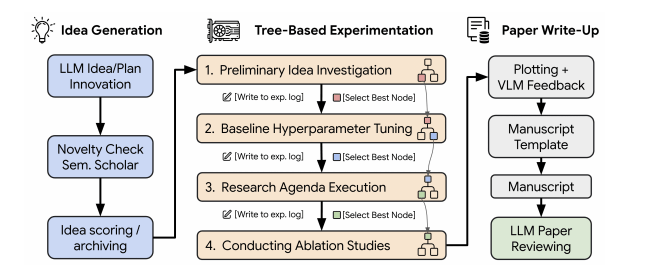
    </div>
    <p style="font-size:8.5pt;color:var(--lc-muted);margin:0;">Sakana AI</p>
    <div style="border-radius:8px;overflow:hidden;border:1px solid rgba(66,107,120,0.18);background:#fff;">
      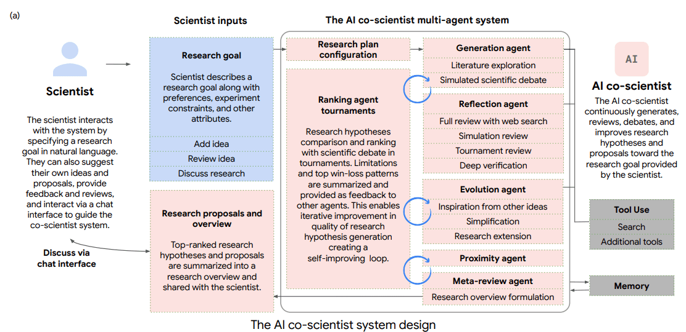
    </div>
    <p style="font-size:8.5pt;color:var(--lc-muted);margin:0;">DeepMind</p>
  </div>
</div>

---

.section-label[The Problem]

# Fully autonomous AI science produces… noise (for now)

.left-column[
<div style="border-radius:8px;overflow:hidden;border:1px solid rgba(107,117,133,0.25);">
  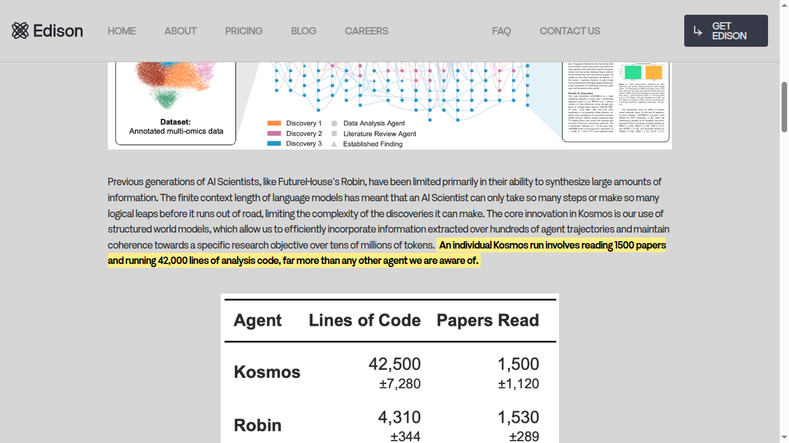
</div>

.muted[.small[Edison Scientific, "Announcing Kosmos" (Nov 2025)]]

<div class="card" style="padding:14pt 18pt;">
  <p style="font-size:12pt;line-height:1.6;margin:0;color:var(--lc-muted);">⚠ Tens of thousands of lines of generated code. <strong style="color:var(--lc-text);">No one reads it. No one audits it.</strong> How do you trust the results?</p>
</div>
]

.right-column[

]

.reset-column[]

---
count: false
.section-label[The Problem]

# Fully autonomous AI science produces… noise (for now)

.left-column[
<div style="border-radius:8px;overflow:hidden;border:1px solid rgba(107,117,133,0.25);">
  
</div>

.muted[.small[Edison Scientific, "Announcing Kosmos" (Nov 2025)]]

<div class="card" style="padding:14pt 18pt;">
  <p style="font-size:12pt;line-height:1.6;margin:0;color:var(--lc-muted);">⚠ Tens of thousands of lines of generated code. <strong style="color:var(--lc-text);">No one reads it. No one audits it.</strong> How do you trust the results?</p>
</div>
]

.right-column[
<div style="border-radius:8px;overflow:hidden;border:1px solid rgba(107,117,133,0.25);">
  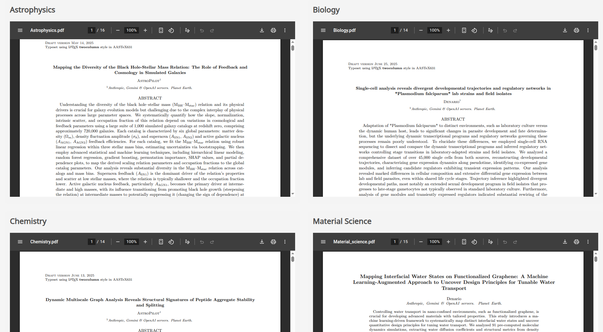
</div>

.muted[.small[Denario — AI-generated papers across six disciplines]]

<div class="card" style="padding:14pt 18pt;">
  <p style="font-size:12pt;line-height:1.6;margin:0;color:var(--lc-muted);">⚠ The outputs are <strong style="color:var(--lc-highlight);">hard to trust</strong>. Too much material, impossible to audit, no way to tell what's real.</p>
</div>
]

.reset-column[]

---

.section-label[The Problem]

# …but with a human in the loop, the hints are already striking

.left-column[
<div style="border-radius:8px;overflow:hidden;border:1px solid rgba(107,117,133,0.25);background:#fff;">
  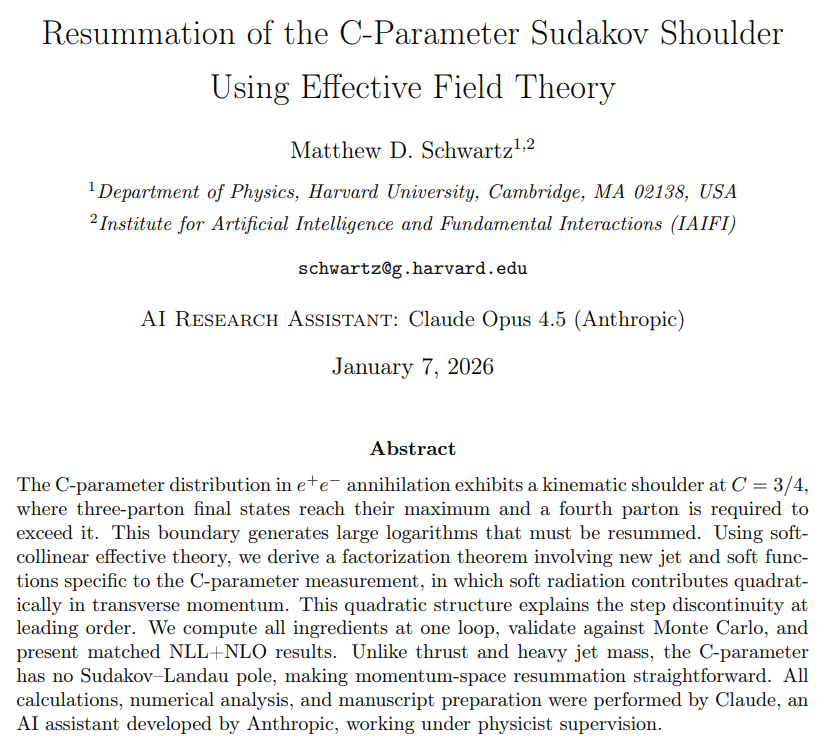
</div>
]

.right-column[
<div class="card" style="padding:14pt 18pt;border-left:3px solid var(--lc-warm);">
  <p style="font-size:13pt;line-height:1.55;margin:0;color:var(--lc-text);font-style:italic;">"Claude proved fast, indefatigable, and eager to please. It also, on occasion, faked results — hoping I wouldn't notice."</p>
  <p style="font-size:10pt;color:var(--lc-muted);margin:8pt 0 0;text-align:right;">— Matthew Schwartz, <em>Vibe Physics</em> (Anthropic, 2026)</p>
</div>
<div class="card" style="padding:10pt 14pt;text-align:center;margin-top:14pt;">
<i class="fa-solid fa-link" style="color: var(--lc-warm); margin-right: 4pt;"></i>
  <p style="font-size:11pt;line-height:1.4;margin:0;color:var(--lc-muted);"><a href="https://anthropic.com/research/vibe-physics" style="color:var(--lc-muted);text-decoration:none;">anthropic.com/research/vibe-physics</a></p>
</div>
]

.reset-column[]

---

.section-label[The trajectory]

# AI is changing fast — don't bet on "now"

.left-column[
<div style="border-radius:8px;overflow:hidden;border:1px solid rgba(107,117,133,0.25);background:#fff;">
  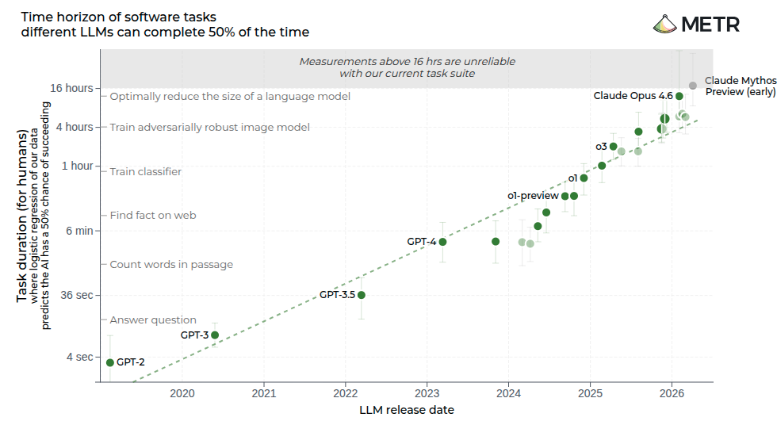
</div>

.center.muted[.small[METR, _Task-Completion Time Horizons_ (May 2026 snapshot, CC-BY)]]
]

.right-column[.center[
<div class="card-glow" style="padding:14pt 16pt;border-left:3px solid var(--lc-highlight);">
  <h4 style="margin:0 0 6pt;font-size:13pt;color:var(--lc-highlight);"><i class="fa-solid fa-chart-line" style="margin-right: 4pt;"></i> Exponential improvement</h4>
  <p style="font-size:11pt;line-height:1.5;margin:0;color:var(--lc-muted);">AI task horizons are <strong style="color:var(--lc-text);">doubling every ~89 days</strong> (~17×/year). Today's "noisy" outputs won't stay that way. <strong style="color:var(--lc-text);">Build for where models will be in a year</strong>, not where they are today.</p>
</div>
]]

.reset-column[]

---
count: false

.section-label[The trajectory]

# AI is changing fast — don't bet on "now"

.left-column[
<div style="border-radius:8px;overflow:hidden;border:1px solid rgba(107,117,133,0.25);background:#fff;">
  
</div>

.center.muted[.small[METR, _Task-Completion Time Horizons_ (May 2026 snapshot, CC-BY)]]
]

.right-column[.center[
<div class="card-glow" style="padding:14pt 16pt;border-left:3px solid var(--lc-highlight);">
  <h4 style="margin:0 0 6pt;font-size:13pt;color:var(--lc-highlight);"><i class="fa-solid fa-chart-line" style="margin-right: 4pt;"></i> Exponential improvement</h4>
  <p style="font-size:11pt;line-height:1.5;margin:0;color:var(--lc-muted);">AI task horizons are <strong style="color:var(--lc-text);">doubling every ~89 days</strong> (~17×/year). Today's "noisy" outputs won't stay that way. <strong style="color:var(--lc-text);">Build for where models will be in a year</strong>, not where they are today.</p>
</div>
<div class="card-glow" style="padding:14pt 16pt;border-left:3px solid var(--lc-warm);margin-top:12px;">
  <h4 style="margin:0 0 6pt;font-size:13pt;color:var(--lc-warm);"><i class="fa-solid fa-recycle" style="margin-right: 4pt;"></i> AI co-scientist systems become obsolete really fast</h4>
  <p style="font-size:11pt;line-height:1.5;margin:0;color:var(--lc-muted);">Denario, Kosmos, Sakana — all <strong style="color:var(--lc-text);">tightly coupled to yesterday's models</strong>. As models improve, these systems are replaced wholesale. <strong style="color:var(--lc-text);">Build the layer that outlasts the models.</strong></p>
</div>

]]

.reset-column[]

---
class: interlude

.eyebrow[The question]

# What's the right thing</br>to build <span style="color:var(--lc-warm);font-style:italic;">right now?</span>

---

.section-label[Our position]

# Need for A New Substrate for Research in the Age of AI

.center.text-muted[Lanusse & Parker · May 2026]

<div style="display:grid;grid-template-columns:7fr 5fr;gap:22pt;align-items:start;margin-top:0.8rem;">
  <div style="display:flex;flex-direction:column;gap:12pt;">
    <div class="card" style="padding:14pt 18pt;border-left:3px solid var(--lc-accent);">
      <p style="font-size:13pt;line-height:1.55;margin:0;color:var(--lc-text);">AI will <strong style="color:var(--lc-accent);">empower scientists to pursue more complex and ambitious research questions</strong> — and, multiplied across a field, drive a <strong style="color:var(--lc-accent);">step change in the rate at which results enter circulation</strong>.</p>
    </div>
  </div>
  <div style="display:flex;flex-direction:column;gap:6pt;align-items:center;">
    <div style="border-radius:6px;overflow:hidden;border:1px solid rgba(78,90,112,0.18);box-shadow:0 4px 18px rgba(20,30,50,0.08);background:#fff;">
      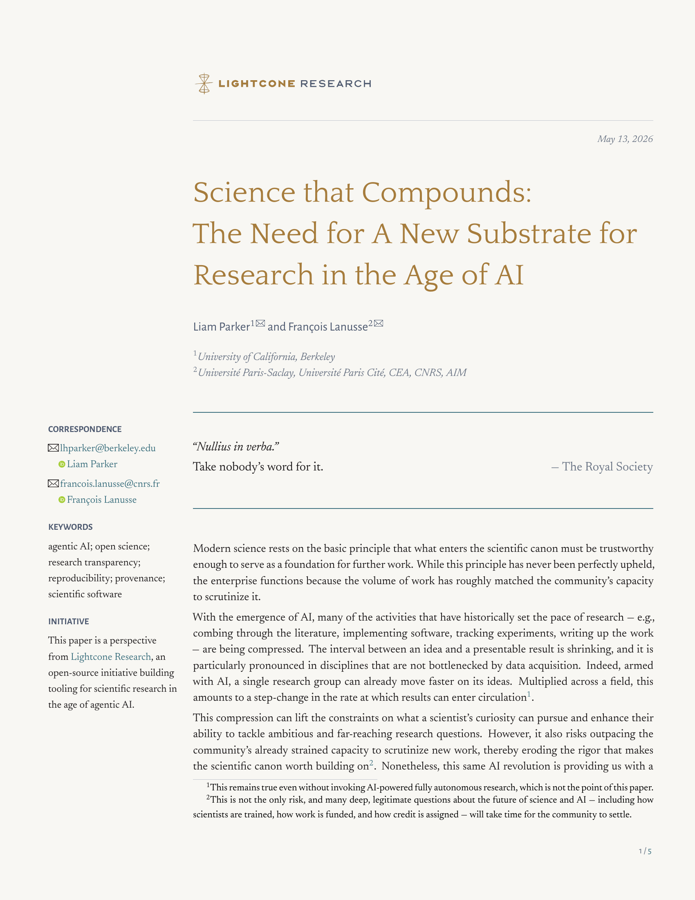
    </div>
    <p style="font-family:var(--lc-font-ui);font-size:10pt;margin:4pt 0 0;text-align:center;color:var(--lc-secondary);"><a href="https://doi.org/10.5281/zenodo.20181269" style="color:var(--lc-secondary);text-decoration:none;">doi.org/10.5281/zenodo.20181269</a></p>
  </div>
</div>

---
count:false

.section-label[Our position]

# Need for A New Substrate for Research in the Age of AI

.center.text-muted[Lanusse & Parker · May 2026]

<div style="display:grid;grid-template-columns:7fr 5fr;gap:22pt;align-items:start;margin-top:0.8rem;">
  <div style="display:flex;flex-direction:column;gap:12pt;">
    <div class="card" style="padding:14pt 18pt;border-left:3px solid var(--lc-accent);">
      <p style="font-size:13pt;line-height:1.55;margin:0;color:var(--lc-text);">AI will <strong style="color:var(--lc-accent);">empower scientists to pursue more complex and ambitious research questions</strong> — and, multiplied across a field, drive a <strong style="color:var(--lc-accent);">step change in the rate at which results enter circulation</strong>.</p>
    </div>
    <div class="card-glow" style="padding:16pt 20pt;border-top:3px solid var(--lc-primary);">
      <p style="font-family:var(--lc-font-ui);font-size:9.5pt;font-weight:500;letter-spacing:0.18em;text-transform:uppercase;color:var(--lc-primary);margin:0 0 6pt;">So the question we focus on</p>
      <p style="font-family:var(--lc-font-heading);font-size:16pt;line-height:1.35;margin:0;color:var(--lc-text);">How can we establish that a result <span style="color:var(--lc-highlight);font-style:italic;">can be trusted</span> — <span style="color:var(--lc-primary);">far more efficiently than today</span>, to keep up with the growth of the literature?</p>
    </div>
  </div>
  <div style="display:flex;flex-direction:column;gap:6pt;align-items:center;">
    <div style="border-radius:6px;overflow:hidden;border:1px solid rgba(78,90,112,0.18);box-shadow:0 4px 18px rgba(20,30,50,0.08);background:#fff;">
      
    </div>
    <p style="font-family:var(--lc-font-ui);font-size:10pt;margin:4pt 0 0;text-align:center;color:var(--lc-secondary);"><a href="https://doi.org/10.5281/zenodo.20181269" style="color:var(--lc-secondary);text-decoration:none;">doi.org/10.5281/zenodo.20181269</a></p>
  </div>
</div>

---

.section-label[Our position]

# Three properties make a result vettable — and AI finally makes them cheap

.center.muted[What form a result must take so that its soundness can be re-established by a human or a machine, efficiently, at every step of its lifecycle?]

<div style="display:grid;grid-template-columns:1fr 1fr 1fr;gap:12pt;margin-top:0.8rem;">
  <div class="card-glow" style="padding:14pt 16pt;border-top:3px solid var(--lc-primary);">
    <h4 style="margin:0 0 6pt;font-size:13pt;color:var(--lc-primary);">Provenance-certified</h4>
    <p style="font-size:10.5pt;line-height:1.5;margin:0;">Every plot, number, and claim ties back to the data, code, and decisions that produced it — eliminating fabricated results <em>without</em> requiring re-execution.</p>
  </div>
</div>

---
count: false

.section-label[Our position]

# Three properties make a result vettable — and AI finally makes them cheap

.center.muted[What form a result must take so that its soundness can be re-established by a human or a machine, efficiently, at every step of its lifecycle?]

<div style="display:grid;grid-template-columns:1fr 1fr 1fr;gap:12pt;margin-top:0.8rem;">
  <div class="card-glow" style="padding:14pt 16pt;border-top:3px solid var(--lc-primary);">
    <h4 style="margin:0 0 6pt;font-size:13pt;color:var(--lc-primary);">Provenance-certified</h4>
    <p style="font-size:10.5pt;line-height:1.5;margin:0;">Every plot, number, and claim ties back to the data, code, and decisions that produced it — eliminating fabricated results <em>without</em> requiring re-execution.</p>
  </div>
  <div class="card-glow" style="padding:14pt 16pt;border-top:3px solid var(--lc-accent);">
    <h4 style="margin:0 0 6pt;font-size:13pt;color:var(--lc-accent);">Fully observable</h4>
    <p style="font-size:10.5pt;line-height:1.5;margin:0;">Code and artifacts, but also every consequential decision — estimator, prior, cutoff, dataset — and the reasoning behind it are inspectable.</p>
  </div>
</div>

---
count: false

.section-label[Our position]

# Three properties make a result vettable — and AI finally makes them cheap

.center.muted[What form a result must take so that its soundness can be re-established by a human or a machine, efficiently, at every step of its lifecycle?]

<div style="display:grid;grid-template-columns:1fr 1fr 1fr;gap:12pt;margin-top:0.8rem;">
  <div class="card-glow" style="padding:14pt 16pt;border-top:3px solid var(--lc-primary);">
    <h4 style="margin:0 0 6pt;font-size:13pt;color:var(--lc-primary);">Provenance-certified</h4>
    <p style="font-size:10.5pt;line-height:1.5;margin:0;">Every plot, number, and claim ties back to the data, code, and decisions that produced it — eliminating fabricated results <em>without</em> requiring re-execution.</p>
  </div>
  <div class="card-glow" style="padding:14pt 16pt;border-top:3px solid var(--lc-accent);">
    <h4 style="margin:0 0 6pt;font-size:13pt;color:var(--lc-accent);">Fully observable</h4>
    <p style="font-size:10.5pt;line-height:1.5;margin:0;">Code and artifacts, but also every consequential decision — estimator, prior, cutoff, dataset — and the reasoning behind it are inspectable.</p>
  </div>
  <div class="card-glow" style="padding:14pt 16pt;border-top:3px solid var(--lc-warm);">
    <h4 style="margin:0 0 6pt;font-size:13pt;color:var(--lc-warm);">Scientifically legible</h4>
    <p style="font-size:10.5pt;line-height:1.5;margin:0;">Organized around the claims, decisions, and insights that matter — with direct paths down into the evidence and code behind any point.</p>
  </div>
</div>

--

<div class="card" style="margin-top:14pt;padding:12pt 18pt;">
  <p style="font-size:11pt;line-height:1.55;margin:0;color:var(--lc-muted);"><strong style="color:var(--lc-text);">None of this is new.</strong> The community has been pushing in this direction for a decade.</br>The reason these principles haven't become ubiquitous is simple: <strong style="color:var(--lc-warm);">they have been too costly to follow for a typical research team.</strong></p>
</div>

--

<div class="card-glow" style="margin-top:12pt;padding:14pt 20pt;border-left:3px solid var(--lc-primary);">
  <p style="font-family:var(--lc-font-ui);font-size:9.5pt;font-weight:500;letter-spacing:0.18em;text-transform:uppercase;color:var(--lc-primary);margin:0 0 4pt;">AI can fix the problem it creates</p>
  <p style="font-size:13pt;line-height:1.55;margin:0 0 10pt;color:var(--lc-text);"><strong style="color:var(--lc-primary);">Agentic AI flips that calculus on its head.</strong> When the work itself is AI-assisted, the provenance trace, the decision log, and the scientific-level summary come along for free — built in <em>by construction</em>, not negotiated against the scientist's time.</p>
</div>

--

## And so we started Lightcone Research

---
class: interlude

.eyebrow[Introducing]


<hr style="width: 80px; margin: 32pt auto 22pt auto;">

<p style="font-family:var(--lc-font-heading);font-size:24pt;font-style:italic;color:var(--lc-warm);text-align:center;max-width:880px;margin:0 auto;line-height:1.3;">An open-source initiative to build tooling</br>for robust scientific research in the age of AI.</p>

<!-- <div style="position:absolute;bottom:24pt;left:32pt;display:flex;align-items:center;gap:16pt;"> -->
<div style="position:absolute;bottom:24pt;left:380pt;display:flex;align-items:center;gap:16pt">
  
  <span style="display: inline-block; width: 1px; height: 60pt; background: rgba(var(--lc-primary-rgb), 0.25);"></span>
  
</div>

---

.section-label[Who we are]

# Team & roadmap

.text-muted[An **international, open-source initiative** — based at **UC Berkeley** and **CNRS**, philanthropically backed.]

<div style="display:grid;grid-template-columns:3fr 2fr;gap:32pt;align-items:start;margin-top:0.8rem;">

<div style="display:flex;flex-direction:column;gap:18pt;">

  <div>
    <p style="font-family:var(--lc-font-ui);font-size:9pt;font-weight:500;letter-spacing:0.22em;text-transform:uppercase;color:var(--lc-primary);margin:0 0 10pt;">Core team</p>
    <div style="display:grid;grid-template-columns:repeat(4,2fr);gap:8pt;">
      <div style="text-align:center;"><div style="width:54pt;height:54pt;border-radius:50%;overflow:hidden;border:2px solid var(--lc-primary);margin:0 auto 6pt;"></div><p style="font-size:10pt;line-height:1.2;margin:0;">François<br><strong>Lanusse</strong></p><p style="font-size:7.5pt;color:var(--lc-muted);margin:2pt 0 0;">CNRS · AIM</p></div>
      <div style="text-align:center;"><div style="width:54pt;height:54pt;border-radius:50%;overflow:hidden;border:2px solid var(--lc-primary);margin:0 auto 6pt;"></div><p style="font-size:10pt;line-height:1.2;margin:0;">Liam<br><strong>Parker</strong></p><p style="font-size:7.5pt;color:var(--lc-muted);margin:2pt 0 0;">UC Berkeley</p></div>
      <div style="text-align:center;"><div style="width:54pt;height:54pt;border-radius:50%;overflow:hidden;border:2px solid var(--lc-primary);margin:0 auto 6pt;"></div><p style="font-size:10pt;line-height:1.2;margin:0;">Alexandre<br><strong>Boucaud</strong></p><p style="font-size:7.5pt;color:var(--lc-muted);margin:2pt 0 0;">CNRS · APC</p></div>
      <div style="text-align:center;"><div style="width:54pt;height:54pt;border-radius:50%;overflow:hidden;border:2px solid var(--lc-primary);margin:0 auto 6pt;"></div><p style="font-size:10pt;line-height:1.2;margin:0;">Kirstie<br><strong>Whitaker</strong></p><p style="font-size:7.5pt;color:var(--lc-muted);margin:2pt 0 0;">UC Berkeley · BIDS</p></div>
      <div style="text-align:center;"><div style="width:54pt;height:54pt;border-radius:50%;overflow:hidden;border:2px solid var(--lc-primary);margin:0 auto 6pt;"></div><p style="font-size:10pt;line-height:1.2;margin:0;">Cail<br><strong>Daley</strong></p><p style="font-size:7.5pt;color:var(--lc-muted);margin:2pt 0 0;">CosmoStat · AIM</p></div>
      <div style="text-align:center;"><div style="width:54pt;height:54pt;border-radius:50%;overflow:hidden;border:2px solid var(--lc-primary);margin:0 auto 6pt;"></div><p style="font-size:10pt;line-height:1.2;margin:0;">Nolan<br><strong>Koblischke</strong></p><p style="font-size:7.5pt;color:var(--lc-muted);margin:2pt 0 0;">U. of Toronto</p></div>
      <div style="text-align:center;"><div style="width:54pt;height:54pt;border-radius:50%;overflow:hidden;border:2px solid var(--lc-primary);margin:0 auto 6pt;"></div><p style="font-size:10pt;line-height:1.2;margin:0;">Kangning<br><strong>Diao</strong></p><p style="font-size:7.5pt;color:var(--lc-muted);margin:2pt 0 0;">UC Berkeley</p></div>
    </div>
  </div>

  <div>
    <p style="font-family:var(--lc-font-ui);font-size:9pt;font-weight:500;letter-spacing:0.22em;text-transform:uppercase;color:var(--lc-warm);margin:0 0 10pt;">Advisors</p>
    <div style="display:grid;grid-template-columns:repeat(3,1fr);gap:14pt;">
      <div style="display:flex;align-items:center;gap:10pt;"><div style="width:48pt;height:48pt;border-radius:50%;overflow:hidden;border:2px solid var(--lc-warm);flex-shrink:0;"></div><div><p style="font-size:10pt;line-height:1.2;margin:0;"><strong>Uroš Seljak</strong></p><p style="font-size:8pt;color:var(--lc-muted);margin:2pt 0 0;">UC Berkeley · BCCP</p></div></div>
      <div style="display:flex;align-items:center;gap:10pt;"><div style="width:48pt;height:48pt;border-radius:50%;overflow:hidden;border:2px solid var(--lc-warm);flex-shrink:0;"></div><div><p style="font-size:10pt;line-height:1.2;margin:0;"><strong>Fernando Pérez</strong></p><p style="font-size:8pt;color:var(--lc-muted);margin:2pt 0 0;">UC Berkeley · BIDS</p></div></div>
      <div style="display:flex;align-items:center;gap:10pt;"><div style="width:48pt;height:48pt;border-radius:50%;overflow:hidden;border:2px solid var(--lc-warm);flex-shrink:0;"></div><div><p style="font-size:10pt;line-height:1.2;margin:0;"><strong>Kyle Cranmer</strong></p><p style="font-size:8pt;color:var(--lc-muted);margin:2pt 0 0;">U. Wisconsin–Madison</p></div></div>
    </div>
  </div>
  </div>
  <div style="display:flex;flex-direction:column;">
    <p style="font-family:var(--lc-font-ui);font-size:9pt;font-weight:500;letter-spacing:0.22em;text-transform:uppercase;color:var(--lc-secondary);margin:0 0 12pt;">Milestones</p>
    <div style="border-left:2px solid rgba(27,55,80,0.15);padding-left:18pt;display:flex;flex-direction:column;gap:16pt;">
      <div style="position:relative;"><div style="position:absolute;left:-24pt;top:4pt;width:10pt;height:10pt;border-radius:50%;background:var(--lc-muted);"></div><p style="font-size:11pt;margin:0;line-height:1.35;"><strong style="color:var(--lc-muted);">Mid-Jan 2026</strong><br><span style="color:var(--lc-muted);font-size:10pt;">Project inception</span></p></div>
      <div style="position:relative;"><div style="position:absolute;left:-24pt;top:4pt;width:10pt;height:10pt;border-radius:50%;background:var(--lc-muted);"></div><p style="font-size:11pt;margin:0;line-height:1.35;"><strong style="color:var(--lc-primary);">May 2026</strong><br><span style="color:var(--lc-text);font-size:10pt;">Project launch</span></p></div>
      <div style="position:relative;"><div style="position:absolute;left:-27pt;top:1pt;width:16pt;height:16pt;border-radius:50%;background:var(--lc-primary);box-shadow:0 0 0 4pt rgba(78,90,112,0.18);"></div><p style="font-size:11pt;margin:0;line-height:1.35;"><strong style="color:var(--lc-primary);">June 2026</strong><span style="font-family:var(--lc-font-ui);font-size:8pt;font-weight:600;letter-spacing:0.18em;text-transform:uppercase;color:var(--lc-primary);margin-left:6pt;">· today</span><br><span style="color:var(--lc-text);font-size:10pt;">JDEV conf</span></p></div>
      <div style="position:relative;"><div style="position:absolute;left:-24pt;top:4pt;width:10pt;height:10pt;border-radius:50%;border:2px solid var(--lc-secondary);background:var(--lc-bg);"></div><p style="font-size:11pt;margin:0;line-height:1.35;"><strong style="color:var(--lc-secondary);">July 28–31, 2026</strong><br><span style="color:var(--lc-text);font-size:10pt;">Agentic AI for Science Developer Summit · Berkeley</span></p></div>
      <div style="position:relative;"><div style="position:absolute;left:-24pt;top:4pt;width:10pt;height:10pt;border-radius:50%;border:2px solid var(--lc-warm);background:var(--lc-bg);"></div><p style="font-size:11pt;margin:0;line-height:1.35;"><strong style="color:var(--lc-warm);">September 2026</strong><br><span style="color:var(--lc-text);font-size:10pt;">First stable version</span></p></div>
      <br>
    </div>
    <div>
    <p style="font-family:var(--lc-font-ui);font-size:9pt;font-weight:500;letter-spacing:0.22em;text-transform:uppercase;color:var(--lc-accent);margin:0 0 10pt;">Associated centers</p>
    <div style="display:flex;align-items:center;gap:28pt;padding-left:4pt;">
      
      
    </div>
  </div>
  </div>
  </div>

</div>

---

.section-label[What we are building]

# A new layer for scientific knowledge

<p style="font-size:14pt;line-height:1.7;margin-bottom:14pt;text-align:center;max-width:850px;margin-left:auto;margin-right:auto;">Our bet: invest in <strong style="color:var(--lc-text);">how scientific knowledge is captured and shared</strong> in the age of AI — not at the level of code, not at the level of papers, but <strong style="color:var(--lc-primary);">something in between</strong>.</p>

<div style="display: grid; grid-template-columns: 2fr 1fr 2fr; gap: 0; align-items: center; max-width: 900px; margin: 0 auto 16pt auto;">
  <!-- Code -->
  <div class="card" style="padding: 14pt 16pt; text-align: center; opacity: 0.5;">
      <i class="fa-solid fa-code" style="font-size: 20pt; color: var(--lc-muted); margin-bottom: 6pt;"></i>
      <p style="font-size: 13pt; font-weight: 600; margin: 0;">Code</p>
      <p style="font-size: 10pt; color: var(--lc-muted); margin: 3pt 0 0 0;">Executable but opaque.<br>Buried assumptions, no intent.</p>
  </div>
  <!-- Middle: Lightcone -->
  <div style="text-align: center; padding: 0 8pt;">
      <div style="border: 2px solid var(--lc-primary); border-radius: 12px; padding: 16pt 12pt; background: rgba(var(--lc-primary-rgb), 0.04); position: relative;">
          <i class="fa-solid fa-arrows-left-right" style="font-size: 10pt; color: var(--lc-muted); position: absolute; left: -14pt; top: 50%; transform: translateY(-50%);"></i>
          <i class="fa-solid fa-arrows-left-right" style="font-size: 10pt; color: var(--lc-muted); position: absolute; right: -14pt; top: 50%; transform: translateY(-50%);"></i>
          <p style="font-size: 14pt; font-weight: 700; color: var(--lc-primary); margin: 0;">Lightcone</p>
          <p style="font-size: 10pt; color: var(--lc-text); margin: 4pt 0 0 0; line-height: 1.4;">
              Decisions, assumptions,<br>evidence, provenance
          </p>
      </div>
  </div>
  <!-- Paper -->
  <div class="card" style="padding: 14pt 16pt; text-align: center; opacity: 0.5;">
      <i class="fa-solid fa-file-lines" style="font-size: 20pt; color: var(--lc-muted); margin-bottom: 6pt;"></i>
      <p style="font-size: 13pt; font-weight: 600; margin: 0;">Paper</p>
      <p style="font-size: 10pt; color: var(--lc-muted); margin: 3pt 0 0 0;">Readable but lossy.<br>Can&rsquo;t regenerate the analysis.</p>
  </div>
  </div>
  <p style="font-size: 12pt; color: var(--lc-muted); text-align: center; margin-bottom: 14pt;">
  From a <strong style="color: var(--lc-primary);">Lightcone spec</strong> you can <strong style="color: var(--lc-text);">regenerate the code</strong> with any model,
  or <strong style="color: var(--lc-text);">generate the paper</strong> &mdash; because the scientific intent is preserved.
  </p>

--

<div style="display: grid; grid-template-columns: repeat(3, 1fr); gap: 16px;">
<div class="fragment fade-up card-glow" style="padding: 16pt 16pt;">
    <div style="display: flex; align-items: center; gap: 8pt; margin-bottom: 8pt;">
        <div style="width: 32pt; height: 32pt; border-radius: 8px; background: rgba(var(--lc-primary-rgb), 0.12); display: flex; align-items: center; justify-content: center;">
            <i class="fa-solid fa-magnifying-glass" style="font-size: 14pt; color: var(--lc-primary);"></i>
        </div>
        <h4 style="margin: 0; font-size: 14pt; color: var(--lc-primary);">Inspectable</h4>
    </div>
    <p style="font-size: 12pt; line-height: 1.5; margin-bottom: 0;">Every result traces back to the decisions and evidence that produced it.</p>
</div>
<div class="fragment fade-up card-glow" style="padding: 16pt 16pt;">
    <div style="display: flex; align-items: center; gap: 8pt; margin-bottom: 8pt;">
        <div style="width: 32pt; height: 32pt; border-radius: 8px; background: rgba(var(--lc-secondary-rgb), 0.12); display: flex; align-items: center; justify-content: center;">
            <i class="fa-solid fa-cubes" style="font-size: 14pt; color: var(--lc-secondary);"></i>
        </div>
        <h4 style="margin: 0; font-size: 14pt; color: var(--lc-secondary);">Composable</h4>
    </div>
    <p style="font-size: 12pt; line-height: 1.5; margin-bottom: 0;">Swap an assumption, extend the analysis, compare alternatives &mdash; without starting over.</p>
</div>
<div class="fragment fade-up card-glow" style="padding: 16pt 16pt;">
    <div style="display: flex; align-items: center; gap: 8pt; margin-bottom: 8pt;">
        <div style="width: 32pt; height: 32pt; border-radius: 8px; background: rgba(var(--lc-accent-rgb), 0.12); display: flex; align-items: center; justify-content: center;">
            <i class="fa-solid fa-link" style="font-size: 14pt; color: var(--lc-accent);"></i>
        </div>
        <h4 style="margin: 0; font-size: 14pt; color: var(--lc-accent);">Reusable</h4>
    </div>
    <p style="font-size: 12pt; line-height: 1.5; margin-bottom: 0;">Other projects can build on your work &mdash; growing a shared body of knowledge over time.</p>
</div>
</div>

---

.section-label[Architecture]

# A layered ecosystem

<div class="content">
  <div style="display: grid; grid-template-columns: 3fr 2fr; gap: 30px; margin-top: 6pt;">
      <div style="display: flex; flex-direction: column; gap: 10pt;">
          <div class="arch-layer" style="border-left: 3px solid var(--lc-muted); opacity: 0.5;">
              <p style="margin: 0;"><span class="pill pill-muted" style="background: var(--lc-muted); color: var(--lc-bg);">FUTURE</span></p>
              <p style="font-size: 14pt; margin: 4pt 0 0 0;"><strong>Platform</strong> <span style="color: var(--lc-muted); font-size: 12pt;">&mdash; Hosting &amp; sharing infrastructure</span></p>
          </div>
          <div class="arch-layer" style="border-left: 3px solid var(--lc-warm);">
              <p style="margin: 0;"><span class="pill pill-warm">COMING SOON</span></p>
              <p style="font-size: 14pt; margin: 4pt 0 0 0;"><strong>UI Layer</strong> <span style="color: var(--lc-muted); font-size: 12pt;">&mdash; Visual interface for analyses</span></p>
          </div>
          <div class="arch-layer" style="border-left: 3px solid var(--lc-secondary);">
              <p style="margin: 0;"><span class="pill pill-secondary">ALPHA &mdash; TECH PREVIEW</span></p>
              <p style="font-size: 14pt; margin: 4pt 0 0 0;"><strong>Agent Layer</strong> <span style="color: var(--lc-muted); font-size: 12pt;">&mdash; Claude plugin for AI-assisted research</span></p>
          </div>
          <div class="arch-layer" style="border-left: 3px solid var(--lc-accent);">
              <p style="margin: 0;"><span class="pill pill-accent">ALPHA &mdash; TECH PREVIEW</span></p>
              <p style="font-size: 14pt; margin: 4pt 0 0 0;"><strong>CLI &amp; Tooling</strong> <span style="color: var(--lc-muted); font-size: 12pt;">&mdash; Validation, execution, workflows, HPC</span></p>
          </div>
          <div class="arch-layer" style="background: rgba(var(--lc-primary-rgb), 0.08); box-shadow: 0 0 20px rgba(var(--lc-primary-rgb), 0.12), inset 0 0 20px rgba(var(--lc-primary-rgb), 0.04); border: 1px solid rgba(var(--lc-primary-rgb), 0.25); border-left: 4px solid var(--lc-primary);">
              <p style="margin: 0;"><span class="pill pill-primary">ALPHA &mdash; CORE</span></p>
              <p style="font-size: 14pt; margin: 4pt 0 0 0;"><strong style="color: var(--lc-primary);">ASTRA &mdash; Agentic Schema for Transparent Research Analysis</strong> <span style="color: var(--lc-muted); font-size: 12pt;">&mdash; Core specification format</span></p>
          </div>
      </div>
      <div style="display: flex; flex-direction: column; gap: 12pt; align-self: stretch;">
          <div class="card" style="display: flex; flex-direction: column; align-items: center; justify-content: center; text-align: center; padding: 14pt 16pt;">
              <i class="fa-solid fa-layer-group" style="font-size: 24pt; color: var(--lc-primary); margin-bottom: 8pt;"></i>
              <p style="font-size: 12pt; line-height: 1.6; color: var(--lc-text); margin: 0;">
                  Everything builds on <strong style="color: var(--lc-primary);">ASTRA</strong> &mdash; the declarative spec that captures the scientific intent of an analysis. The layers above read from and write to this single source of truth.
              </p>
          </div>
          <div class="card-glow" style="padding: 12pt 16pt; border-left: 3px solid var(--lc-primary);">
              <p style="font-family: var(--lc-font-ui); font-size: 9pt; font-weight: 500; letter-spacing: 0.18em; text-transform: uppercase; color: var(--lc-primary); margin: 0 0 6pt 0;">
                  <i class="fa-solid fa-book" style="margin-right: 5pt;"></i>The spec
              </p>
              <p style="font-size: 11pt; line-height: 1.5; margin: 0 0 4pt 0; color: var(--lc-text);">
                  Full specification, examples, and contribution guide:
              </p>
              <p style="font-family: var(--lc-font-heading); font-size: 14pt; margin: 0;">
                  <a href="https://astra-spec.org" style="color: var(--lc-primary); text-decoration: none;">astra&#8209;spec.org</a>
              </p>
          </div>
          <div class="card" style="padding: 12pt 16pt; border-left: 3px solid var(--lc-accent);">
              <p style="font-family: var(--lc-font-ui); font-size: 9pt; font-weight: 500; letter-spacing: 0.18em; text-transform: uppercase; color: var(--lc-accent); margin: 0 0 6pt 0;">
                  <i class="fa-brands fa-github" style="margin-right: 5pt;"></i>Open source
              </p>
              <p style="font-size: 11pt; line-height: 1.5; margin: 0; color: var(--lc-text);">
                  BSD 3-Clause &middot; co-developed in the open with the scientific community.
              </p>
              <p style="font-size: 10pt; margin: 4pt 0 0 0;">
                  <i class="fa-solid fa-link" style="color: var(--lc-warm); margin-right: 4pt;"></i>
                  <a href="https://github.com/LightconeResearch" style="color: var(--lc-accent); text-decoration: none;">github.com/LightconeResearch</a>
              </p>
          </div>
      </div>
  </div>
</div>

---

# Experience Walkthrough

<div class="step-tabs">
  <div class="step-tab is-active"><span class="step-tab__num">01</span>Create the record</div>
  <div class="step-tab"><span class="step-tab__num">02</span>Record the choices</div>
  <div class="step-tab"><span class="step-tab__num">03</span>Produce the results</div>
  <div class="step-tab"><span class="step-tab__num">04</span>Trace the chain</div>
</div>

<div class="walkthrough-panel" style="margin-top:1rem;">
  <div class="walkthrough-copy">
    <h2 class="headline">Start with a shared research record.</h2>
    <div class="card" style="padding:10pt 14pt;border-left:3px solid var(--lc-primary);margin-bottom:8pt;">
      <p style="margin:0;">A <strong style="color:var(--lc-primary);">durable record</strong> of each project's scientific structure — question, inputs, outputs, and choices.</p>
    </div>
    <div class="card" style="padding:10pt 14pt;border-left:3px solid var(--lc-accent);">
      <p style="margin:0;">Lives <strong style="color:var(--lc-accent);">alongside the code</strong>, so the analysis stays legible as it evolves.</p>
    </div>
  </div>
  <div class="walkthrough-visual">
    <div style="display:flex;flex-direction:column;gap:0.5rem;width:100%;">
      <div class="vis-card">
        <div class="vis-card__chrome">
          <span class="vis-dot"></span><span class="vis-dot"></span><span class="vis-dot"></span>
          <span class="vis-card__title">terminal</span>
        </div>
        <div class="vis-card__body">
          <div class="vis-terminal">
            <div class="vis-terminal__line"><span class="vis-terminal__prompt">$</span> lc init my-analysis</div>
            <div class="vis-terminal__line vis-terminal__line--out">✓ created astra.yaml</div>
            <div class="vis-terminal__line vis-terminal__line--out">✓ initialized project</div>
          </div>
        </div>
      </div>
      <div class="vis-card">
        <div class="vis-card__chrome">
          <span class="vis-dot"></span><span class="vis-dot"></span><span class="vis-dot"></span>
          <span class="vis-card__filename">astra.yaml</span>
          <span class="vis-card__tag">ASTRA</span>
        </div>
        <div class="vis-card__body">
          <div class="vis-yaml">
            <div class="vis-yaml__row"><span class="vis-yaml__key">inputs</span>:</div>
            <div class="vis-yaml__row"><span class="vis-yaml__key">decisions</span>:</div>
            <div class="vis-yaml__row"><span class="vis-yaml__key">outputs</span>:</div>
            <div class="vis-yaml__row"><span class="vis-yaml__key">insights</span>:</div>
          </div>
        </div>
      </div>
    </div>
  </div>
</div>

---

# Experience Walkthrough

<div class="step-tabs">
  <div class="step-tab"><span class="step-tab__num">01</span>Create the record</div>
  <div class="step-tab is-active"><span class="step-tab__num">02</span>Record the choices</div>
  <div class="step-tab"><span class="step-tab__num">03</span>Produce the results</div>
  <div class="step-tab"><span class="step-tab__num">04</span>Trace the chain</div>
</div>

<div class="walkthrough-panel" style="margin-top:1rem;">
  <div class="walkthrough-copy">
    <h2 class="headline">Make scientific choices explicit.</h2>
    <div class="card" style="padding:10pt 14pt;border-left:3px solid var(--lc-primary);margin-bottom:8pt;">
      <p style="margin:0;">Every <strong style="color:var(--lc-primary);">consequential choice</strong> — data, preprocessing, model, priors, systematics — recorded as a first-class object.</p>
    </div>
    <div class="card" style="padding:10pt 14pt;border-left:3px solid var(--lc-accent);">
      <p style="margin:0;">Each choice carries its <strong style="color:var(--lc-accent);">alternatives</strong> and the <strong style="color:var(--lc-accent);">evidence</strong> or rationale behind it.</p>
    </div>
  </div>
  <div class="walkthrough-visual">
    <div class="vis-decision">
      <div class="vis-card vis-decision__card">
        <div class="vis-card__chrome">
          <span class="vis-dot"></span><span class="vis-dot"></span><span class="vis-dot"></span>
          <span class="vis-card__tag">DECISION</span>
          <span class="vis-decision__chrome-title">Prior on optical depth τ</span>
        </div>
        <div class="vis-card__body">
          <ul class="vis-decision__options">
            <li class="vis-decision__option is-selected"><span class="vis-radio"></span>Planck low-ℓ EE</li>
            <li class="vis-decision__option"><span class="vis-radio"></span>Free (uninformative)</li>
            <li class="vis-decision__option"><span class="vis-radio"></span>Fixed τ = 0.054</li>
          </ul>
        </div>
      </div>
      <div class="vis-decision__bridge">
        <span class="vis-decision__bridge-line"></span>
        <span class="vis-decision__bridge-label">supported by</span>
        <span class="vis-decision__bridge-line vis-decision__bridge-line--arrow"></span>
      </div>
      <div class="vis-card vis-decision__evidence">
        <div class="vis-card__chrome">
          <span class="vis-dot"></span><span class="vis-dot"></span><span class="vis-dot"></span>
          <span class="vis-card__tag vis-card__tag--accent">EVIDENCE</span>
          <span class="vis-decision__check"><span class="vis-check">✓</span> quote verified</span>
        </div>
        <div class="vis-card__body">
          <p class="vis-decision__quote">"The low-ℓ EE polarization likelihood provides the tightest CMB-only constraint on the reionization optical depth, τ = 0.054 ± 0.007."</p>
          <p class="vis-decision__cite">Planck Collaboration, 2020 · <span class="vis-decision__doi">A&amp;A 641, A6</span></p>
        </div>
      </div>
    </div>
  </div>
</div>

---

# Experience Walkthrough

<div class="step-tabs">
  <div class="step-tab"><span class="step-tab__num">01</span>Create the record</div>
  <div class="step-tab"><span class="step-tab__num">02</span>Record the choices</div>
  <div class="step-tab is-active"><span class="step-tab__num">03</span>Produce the results</div>
  <div class="step-tab"><span class="step-tab__num">04</span>Trace the chain</div>
</div>

<div class="walkthrough-panel" style="margin-top:1rem;">
  <div class="walkthrough-copy">
    <h2 class="headline">Run the workflow from the record.</h2>
    <div class="card" style="padding:10pt 14pt;border-left:3px solid var(--lc-primary);margin-bottom:8pt;">
      <p style="margin:0;">Inputs, choices, and expected outputs are <strong style="color:var(--lc-primary);">read directly</strong> from the record — not just documented next to it.</p>
    </div>
    <div class="card" style="padding:10pt 14pt;border-left:3px solid var(--lc-accent);">
      <p style="margin:0;">Results are produced against the <strong style="color:var(--lc-accent);">same structure</strong> that describes the analysis.</p>
    </div>
  </div>
  <div class="walkthrough-visual">
    <div style="display:flex;gap:0.75rem;align-items:center;">
      <div class="vis-card" style="min-width:9rem;">
        <div class="vis-card__chrome">
          <span class="vis-dot"></span><span class="vis-dot"></span><span class="vis-dot"></span>
          <span class="vis-card__filename">astra.yaml</span>
        </div>
        <div class="vis-card__body">
          <div class="vis-yaml-doc">
            <div class="yaml-line yaml-line--section">inputs:</div>
            <div class="yaml-line">  <span class="yaml-key">data</span></div>
            <div class="yaml-line yaml-line--empty"></div>
            <div class="yaml-line yaml-line--section">decisions:</div>
            <div class="yaml-line">  <span class="yaml-key">preprocess:</span> <span class="yaml-val">standard</span></div>
            <div class="yaml-line">  <span class="yaml-key">optimizer:</span> <span class="yaml-val">adam</span></div>
            <div class="yaml-line yaml-line--empty"></div>
            <div class="yaml-line yaml-line--section">outputs:</div>
            <div class="yaml-line">  <span class="yaml-key">figure:</span> <span class="yaml-val">plot.py</span></div>
          </div>
        </div>
      </div>
      <div style="font-size:1.4em;color:var(--lc-muted);">→</div>
      <div class="vis-scripts" style="min-width:9rem;">
        <span class="vis-scripts__cli"><span class="vis-scripts__prompt">$</span> lc run</span>
        <div class="vis-script"><span class="vis-script__name">load.py</span></div>
        <div class="vis-script vis-script--anchor"><span class="vis-script__dot"></span><span class="vis-script__name">preprocess.py</span></div>
        <div class="vis-script vis-script--anchor"><span class="vis-script__dot"></span><span class="vis-script__name">train.py</span></div>
        <div class="vis-script"><span class="vis-script__name">plot.py</span></div>
      </div>
    </div>
  </div>
</div>

---

# Experience Walkthrough

<div class="step-tabs">
  <div class="step-tab"><span class="step-tab__num">01</span>Create the record</div>
  <div class="step-tab"><span class="step-tab__num">02</span>Record the choices</div>
  <div class="step-tab"><span class="step-tab__num">03</span>Produce the results</div>
  <div class="step-tab is-active"><span class="step-tab__num">04</span>Trace the chain</div>
</div>

<div class="walkthrough-panel" style="margin-top:1rem;">
  <div class="walkthrough-copy">
    <h2 class="headline">Trace every result back through the analysis.</h2>
    <div class="card" style="padding:10pt 14pt;border-left:3px solid var(--lc-primary);margin-bottom:8pt;">
      <p style="margin:0;">Every figure, table, metric, or dataset carries its <strong style="color:var(--lc-primary);">full provenance trace</strong> — not a dead end.</p>
    </div>
    <div class="card" style="padding:10pt 14pt;border-left:3px solid var(--lc-accent);">
      <p style="margin:0;">What produced it, what it used, which <strong style="color:var(--lc-accent);">choices shaped it</strong>, and which snapshot of the record it came from.</p>
    </div>
  </div>
  <div class="walkthrough-visual">
    <div class="vis-card" style="width:100%;max-width:22rem;">
      <div class="vis-card__chrome">
        <span class="vis-dot"></span><span class="vis-dot"></span><span class="vis-dot"></span>
        <span class="vis-card__tag">INSPECTOR</span>
        <span class="vis-card__filename">figure.png</span>
      </div>
      <div class="vis-card__body">
        <div class="vis-inspect__rows">
          <div class="vis-inspect__row"><span class="vis-inspect__label">Produced by</span><code>plot.py</code></div>
          <div class="vis-inspect__row"><span class="vis-inspect__label">Decisions</span>preprocess = standard, model = linear</div>
          <div class="vis-inspect__row"><span class="vis-inspect__label">Supported by</span><span class="vis-check">✓</span> verified evidence</div>
          <div class="vis-inspect__row"><span class="vis-inspect__label">Comes from</span><code>data</code></div>
          <div class="vis-inspect__row"><span class="vis-inspect__label">Provenance</span><span class="vis-check">✓</span> trace matches</div>
        </div>
      </div>
    </div>
  </div>
</div>

---
class: interlude

.eyebrow[Technical deep dive]

# ASTRA

### <span style="color:var(--lc-warm);">A</span>gentic <span style="color:var(--lc-warm);">S</span>chema for <span style="color:var(--lc-warm);">T</span>ransparent <span style="color:var(--lc-warm);">R</span>esearch <span style="color:var(--lc-warm);">A</span>nalysis

<span class="pill pill-accent" style="font-size:0.85em;">v0.0.10 · early alpha</span>

<hr style="width:80px;margin:1.5rem auto;opacity:0.3;">

Our open specification for structuring computational research — making analyses **inspectable**, **reproducible**, and **legible** to humans and agents alike.

---

.section-label[ASTRA · the building blocks]

# Inputs · Outputs · Decisions

.center.text-muted[Every spec declares **what it needs**, **what it produces**, and **what choices it makes**.]

.lc-col-code[
<pre style="margin: 0;"><code><span style="color: var(--lc-muted); font-style: italic;"># astra.yaml &mdash; Iris classification, trimmed</span>
<span style="color: var(--lc-muted);">id:</span> <span style="color: var(--lc-warm);">iris_classification</span>
<span style="color: var(--lc-muted);">name:</span> <span style="color: var(--lc-accent);">"Iris Classification Study"</span>

<span style="color: var(--lc-primary); font-weight: 700;">inputs:</span>
  - <span style="color: var(--lc-muted);">id:</span> <span style="color: var(--lc-warm);">iris_data</span>
    <span style="color: var(--lc-muted);">type:</span> data
    <span style="color: var(--lc-muted);">source:</span> <span style="color: var(--lc-accent);">"sklearn.datasets.load_iris"</span>

<span style="color: var(--lc-primary); font-weight: 700;">outputs:</span>
  - <span style="color: var(--lc-muted);">id:</span> <span style="color: var(--lc-warm);">accuracy</span>
    <span style="color: var(--lc-muted);">type:</span> metric
    <span style="color: var(--lc-muted);">recipe:</span>
      <span style="color: var(--lc-muted);">command:</span> <span style="color: var(--lc-accent);">python src/evaluate.py</span>
  - <span style="color: var(--lc-muted);">id:</span> <span style="color: var(--lc-warm);">confusion_matrix</span>
    <span style="color: var(--lc-muted);">type:</span> figure

<span style="color: var(--lc-primary); font-weight: 700;">decisions:</span>
  <span style="color: var(--lc-warm);">scaling:</span>
    <span style="color: var(--lc-muted);">label:</span> <span style="color: var(--lc-accent);">"Feature Scaling"</span>
    <span style="color: var(--lc-muted);">default:</span> standard
    <span style="color: var(--lc-muted);">options:</span>
      <span style="color: var(--lc-warm);">none:</span>     { <span style="color: var(--lc-muted);">label:</span> <span style="color: var(--lc-accent);">"No Scaling"</span> }
      <span style="color: var(--lc-warm);">standard:</span> { <span style="color: var(--lc-muted);">label:</span> <span style="color: var(--lc-accent);">"StandardScaler"</span> }
      <span style="color: var(--lc-warm);">minmax:</span>   { <span style="color: var(--lc-muted);">label:</span> <span style="color: var(--lc-accent);">"MinMaxScaler"</span> }

  <span style="color: var(--lc-warm);">model:</span>
    <span style="color: var(--lc-muted);">label:</span> <span style="color: var(--lc-accent);">"Classification Model"</span>
    <span style="color: var(--lc-muted);">default:</span> random_forest
    <span style="color: var(--lc-muted);">options:</span>
      <span style="color: var(--lc-warm);">svm:</span>           { <span style="color: var(--lc-muted);">label:</span> <span style="color: var(--lc-accent);">"Support Vector Machine"</span> }
      <span style="color: var(--lc-warm);">random_forest:</span> { <span style="color: var(--lc-muted);">label:</span> <span style="color: var(--lc-accent);">"Random Forest"</span> }
      <span style="color: var(--lc-warm);">logistic:</span>      { <span style="color: var(--lc-muted);">label:</span> <span style="color: var(--lc-accent);">"Logistic Regression"</span> }</code></pre>
]

.lc-col-note[
<div class="card-glow" style="padding:10pt 12pt;border-left:3px solid var(--lc-primary);margin-bottom:8pt;">
  <p style="font-size:11pt;margin:0 0 3pt;color:var(--lc-primary);font-weight:600;">Inputs</p>
  <p style="font-size:9pt;line-height:1.5;margin:0;color:var(--lc-muted);">Data sources or ASTRA analyses. How projects <strong style="color:var(--lc-text);">compose into chains</strong>.</p>
</div>
<div class="card-glow" style="padding:10pt 12pt;border-left:3px solid var(--lc-accent);margin-bottom:8pt;">
  <p style="font-size:11pt;margin:0 0 3pt;color:var(--lc-accent);font-weight:600;">Outputs</p>
  <p style="font-size:9pt;line-height:1.5;margin:0;color:var(--lc-muted);">Five kinds — metric, figure, table, data, report. Each carries an optional <code>recipe</code>.</p>
</div>
<div class="card-glow" style="padding:10pt 12pt;border-left:3px solid var(--lc-warm);margin-bottom:8pt;">
  <p style="font-size:11pt;margin:0 0 3pt;color:var(--lc-warm);font-weight:600;">Decisions</p>
  <p style="font-size:9pt;line-height:1.5;margin:0;color:var(--lc-muted);">Named choice points with options, default, and rationale. Link to supporting evidence.</p>
</div>
<div class="card-glow" style="padding:10pt 12pt;border-left:3px solid var(--lc-secondary);">
  <p style="font-size:11pt;margin:0 0 3pt;color:var(--lc-secondary);font-weight:600;">Universe</p>
  <p style="font-size:9pt;line-height:1.5;margin:0;color:var(--lc-muted);">One option per decision → a single, executable configuration.</p>
</div>
]

.lc-col-clear[]

---

.section-label[ASTRA · knowledge]

# Prior insights & findings

.center.text-muted[Every claim **backed by evidence** — either a quote from the literature, or an artifact produced by the analysis itself.]

.lc-col-code[
<pre style="margin: 0;"><code><span style="color: var(--lc-muted); font-style: italic;"># Claims in, claims out &mdash; same shape, different direction</span>

<span style="color: var(--lc-primary); font-weight: 700;">prior_insights:</span>
  <span style="color: var(--lc-warm);">scaling_svm:</span>
    <span style="color: var(--lc-muted);">claim:</span> <span style="color: var(--lc-accent);">&gt;-
      Standard scaling consistently outperforms min-max
      normalization for SVMs on tabular data.</span>
    <span style="color: var(--lc-muted);">created_at:</span> <span style="color: var(--lc-accent);">"2026-03-12T09:00:00Z"</span>
    <span style="color: var(--lc-muted);">evidence:</span>
      - <span style="color: var(--lc-muted);">id:</span> <span style="color: var(--lc-warm);">ev_paper</span>
        <span style="color: var(--lc-muted);">doi:</span> <span style="color: var(--lc-accent);">"10.48550/arXiv.1706.03762"</span>
        <span style="color: var(--lc-muted);">quote:</span>
          <span style="color: var(--lc-muted);">exact:</span> <span style="color: var(--lc-accent);">"Z-score normalization yielded higher accuracy."</span>
        <span style="color: var(--lc-muted);">location:</span> { <span style="color: var(--lc-muted);">page:</span> 8 }

<span style="color: var(--lc-primary); font-weight: 700;">findings:</span>
  <span style="color: var(--lc-warm);">best_model:</span>
    <span style="color: var(--lc-muted);">claim:</span> <span style="color: var(--lc-accent);">Random Forest reaches 96.2% with standard scaling.</span>
    <span style="color: var(--lc-muted);">created_at:</span> <span style="color: var(--lc-accent);">"2026-04-20T17:00:00Z"</span>
    <span style="color: var(--lc-muted);">derived:</span> true
    <span style="color: var(--lc-muted);">evidence:</span>
      - <span style="color: var(--lc-muted);">id:</span> <span style="color: var(--lc-warm);">ev_rf_run</span>
        <span style="color: var(--lc-secondary);">artifact:</span> <span style="color: var(--lc-warm);">accuracy</span>       <span style="color: var(--lc-warm); font-style: italic;">&larr; output of THIS analysis</span>
        <span style="color: var(--lc-muted);">quote:</span>
          <span style="color: var(--lc-muted);">exact:</span> <span style="color: var(--lc-accent);">"accuracy = 0.962"</span>

<span style="color: var(--lc-primary); font-weight: 700;">decisions:</span>
  <span style="color: var(--lc-warm);">scaling:</span>
    <span style="color: var(--lc-muted);">options:</span>
      <span style="color: var(--lc-warm);">standard:</span>
        <span style="color: var(--lc-secondary);">insights:</span> [<span style="color: var(--lc-warm);">scaling_svm</span>]   <span style="color: var(--lc-warm); font-style: italic;">&larr; option cites prior insight</span></code></pre>

]

.lc-col-note[
<div class="card-glow" style="padding:10pt 12pt;border-left:3px solid var(--lc-primary);margin-bottom:8pt;">
  <p style="font-size:11pt;margin:0 0 3pt;color:var(--lc-primary);font-weight:600;">Prior insights</p>
  <p style="font-size:9pt;line-height:1.5;margin:0;color:var(--lc-muted);">Knowledge brought <strong style="color:var(--lc-text);">IN</strong> from literature. Evidence = doi + verbatim quote + page anchor.</p>
</div>
<div class="card-glow" style="padding:10pt 12pt;border-left:3px solid var(--lc-accent);margin-bottom:8pt;">
  <p style="font-size:11pt;margin:0 0 3pt;color:var(--lc-accent);font-weight:600;">Findings</p>
  <p style="font-size:9pt;line-height:1.5;margin:0;color:var(--lc-muted);">Knowledge taken <strong style="color:var(--lc-text);">OUT</strong> of the analysis. Evidence = artifact + quote. What the run produced.</p>
</div>
<div class="card-glow" style="padding:10pt 12pt;border-left:3px solid var(--lc-warm);margin-bottom:8pt;">
  <p style="font-size:11pt;margin:0 0 3pt;color:var(--lc-warm);font-weight:600;">Shared model</p>
  <p style="font-size:9pt;line-height:1.5;margin:0;color:var(--lc-muted);">Both are the same <code>Insight</code> object — <code>claim</code> + <code>evidence</code>. Placement sets the direction.</p>
</div>
<div class="card-glow" style="padding:10pt 12pt;border-left:3px solid var(--lc-secondary);">
  <p style="font-size:11pt;margin:0 0 3pt;color:var(--lc-secondary);font-weight:600;">Verified quotes</p>
  <p style="font-size:9pt;line-height:1.5;margin:0;color:var(--lc-muted);"><code>astra validate --verify-evidence</code> fetches DOIs and checks quotes are real. No fabricated citations.</p>
</div>
]

.lc-col-clear[]

---

.section-label[ASTRA · core protocol]

# Decisions, universes, multiverse

.center.text-muted[How ASTRA turns methodological choices into an **explorable analysis space**.]

<div style="display:grid;grid-template-columns:1fr auto 1fr auto 1fr;gap:0;align-items:center;max-width:920px;margin:0.8rem auto 1rem auto;">
  <div class="card-glow" style="text-align:center;padding:18pt 14pt;">
  <i class="fa-solid fa-code-branch" style="font-size: 22pt; color: var(--lc-warm); margin-bottom: 6pt;"></i>
    <p style="font-size:14pt;font-weight:600;margin-bottom:4pt;">Decisions</p>
    <p style="font-size:10pt;color:var(--lc-muted);line-height:1.5;margin:0;">Each choice has named options with rationale and evidence.</p>
  </div>
  <div style="text-align:center;padding:28pt 10pt 0 10pt;font-size:16pt;color:var(--lc-muted);">→</div>
  <div class="card-glow" style="text-align:center;padding:18pt 14pt;">
    <i class="fa-solid fa-globe" style="font-size: 22pt; color: var(--lc-secondary); margin-bottom: 6pt;"></i>
    <p style="font-size:14pt;font-weight:600;margin-bottom:4pt;">Universe</p>
    <p style="font-size:10pt;color:var(--lc-muted);line-height:1.5;margin:0;">One complete set of selections — a single path through decision space.</p>
  </div>
  <div style="text-align:center;padding:28pt 10pt 0 10pt;font-size:16pt;color:var(--lc-muted);">→</div>
  <div class="card-glow" style="text-align:center;padding:18pt 14pt;">
    <i class="fa-solid fa-circle-nodes" style="font-size: 22pt; color: var(--lc-primary); margin-bottom: 6pt;"></i>
    <p style="font-size:14pt;font-weight:600;margin-bottom:4pt;">Multiverse</p>
    <p style="font-size:10pt;color:var(--lc-muted);line-height:1.5;margin:0;">The full space of decision combinations — for testing robustness to analysis choices.</p>
  </div>
</div>

.lc-col-code[
<pre style="margin: 0;">
  <code>
  <span style="color: var(--lc-muted); font-style: italic;"># universes/baseline.yaml</span>
  <span style="color: var(--lc-muted);">id:</span> <span style="color: var(--lc-accent);">baseline</span>
  <span style="color: var(--lc-muted);">description:</span> <span style="color: var(--lc-accent);">"Default configuration"</span>

  <span style="color: var(--lc-primary); font-weight: 700;">decisions:</span>
    <span style="color: var(--lc-warm);">scaling:</span> standard
    <span style="color: var(--lc-warm);">model:</span> random_forest
    <span style="color: var(--lc-warm);">test_size:</span> small
  </code>
</pre>
]

.lc-col-note[
<div class="card" style="padding:10pt 14pt;border-left:3px solid var(--lc-secondary);margin-bottom:8pt;">
  <p style="font-size:10pt;line-height:1.55;margin:0;"><strong>A universe is a YAML file</strong> — one option selected per decision. Running it produces all declared outputs.</p>
</div>
<div class="card" style="padding:10pt 14pt;border-left:3px solid var(--lc-primary);margin-bottom:8pt;">
  <p style="font-size:10pt;line-height:1.55;margin:0;"><strong>The multiverse is the full space</strong> of combinations. Run alternatives to test whether conclusions are <em>robust</em> to your choices.</p>
</div>
<div class="card" style="padding:10pt 14pt;border-left:3px solid var(--lc-accent);">
  <p style="font-size:10pt;line-height:1.55;margin:0;"><strong>Purpose: robustness.</strong> Do results hold when you swap a method, change a model, or shift a prior? The multiverse tells you.</p>
</div>
]

.lc-col-clear[]

<p style="font-size: 9pt; color: var(--lc-muted); margin: 14pt 0 0 0; line-height: 1.55; font-style: italic;">
    <i class="fa-solid fa-quote-left" style="margin-right: 4pt; color: var(--lc-muted);"></i>Building on
    Steegen, Tuerlinckx, Gelman &amp; Vanpaemel,
    &ldquo;Increasing Transparency Through a Multiverse Analysis,&rdquo;
    <em>Perspectives on Psychological Science</em> <strong>11</strong>(5), 702&ndash;712 (2016),
    <a href="https://doi.org/10.1177/1745691616658637" style="color: var(--lc-secondary); text-decoration: none;">doi:10.1177/1745691616658637</a>;
    and Yu &amp; Barter, <em>Veridical Data Science: The Practice of Responsible Data Analysis and Decision Making</em> (MIT Press, 2024) &mdash; PCS (Predictability, Computability, Stability) framework, <a href="https://vdsbook.com" style="color: var(--lc-secondary); text-decoration: none;">vdsbook.com</a>.
</p>
---

.section-label[ASTRA · execution]

# Compute & containers

.center.text-muted[Recipes carry the **environment** and the **resource budget** — so the same spec runs on a laptop, a cluster, or NERSC.]

.lc-col-code[
<pre style="margin: 0;"><code><span style="color: var(--lc-muted); font-style: italic;"># Container + resources travel with the recipe</span>

<span style="color: var(--lc-primary); font-weight: 700;">outputs:</span>
  - <span style="color: var(--lc-muted);">id:</span> <span style="color: var(--lc-warm);">trained_model</span>
    <span style="color: var(--lc-muted);">type:</span> data
    <span style="color: var(--lc-muted);">recipe:</span>
      <span style="color: var(--lc-muted);">command:</span> <span style="color: var(--lc-accent);">python src/train.py</span>
      <span style="color: var(--lc-secondary);">container:</span> <span style="color: var(--lc-accent);">ghcr.io/lightcone/astro-ml:v2.3</span>
      <span style="color: var(--lc-secondary);">resources:</span>
        <span style="color: var(--lc-muted);">cpus:</span> 16
        <span style="color: var(--lc-muted);">memory:</span> <span style="color: var(--lc-accent);">"128GB"</span>
        <span style="color: var(--lc-muted);">gpus:</span> 2
        <span style="color: var(--lc-muted);">time_limit:</span> <span style="color: var(--lc-accent);">"4h"</span>

  - <span style="color: var(--lc-muted);">id:</span> <span style="color: var(--lc-warm);">accuracy</span>
    <span style="color: var(--lc-muted);">type:</span> metric
    <span style="color: var(--lc-muted);">recipe:</span>
      <span style="color: var(--lc-muted);">command:</span> <span style="color: var(--lc-accent);">python src/evaluate.py</span>
      <span style="color: var(--lc-muted);">inputs:</span> [<span style="color: var(--lc-warm);">trained_model</span>]
      <span style="color: var(--lc-secondary);">container:</span> <span style="color: var(--lc-accent);">ghcr.io/lightcone/astro-ml:v2.3</span></code></pre>
]

.lc-col-note[
<div class="card-glow" style="padding:10pt 12pt;border-left:3px solid var(--lc-primary);margin-bottom:8pt;">
  <p style="font-size:11pt;margin:0 0 3pt;color:var(--lc-primary);font-weight:600;">Container</p>
  <p style="font-size:9pt;line-height:1.5;margin:0;color:var(--lc-muted);">An image reference (<code>registry/img:tag</code>) or a <code>Containerfile</code> path — declared on each recipe.</p>
</div>
<div class="card-glow" style="padding:10pt 12pt;border-left:3px solid var(--lc-warm);margin-bottom:8pt;">
  <p style="font-size:11pt;margin:0 0 3pt;color:var(--lc-warm);font-weight:600;">Resources</p>
  <p style="font-size:9pt;line-height:1.5;margin:0;color:var(--lc-muted);"><code>cpus</code> · <code>memory</code> · <code>gpus</code> · <code>time_limit</code>. A budget declaration — schedulers translate it.</p>
</div>
<div class="card-glow" style="padding:10pt 12pt;border-left:3px solid var(--lc-accent);">
  <p style="font-size:11pt;margin:0 0 3pt;color:var(--lc-accent);font-weight:600;">Portable</p>
  <p style="font-size:9pt;line-height:1.5;margin:0;color:var(--lc-muted);">Docker on a laptop, Shifter/Podman at NERSC, Apptainer on SLURM — same spec, different runtime.</p>
</div>
]

.lc-col-clear[]

---

class: interlude

.eyebrow[Technical deep dive]

# Lightcone-CLI

### The execution layer &amp; agent skills around ASTRA

<!-- <span class="pill pill-accent" style="font-size:0.85em;">`lc init` · `lc run` · `lc status` · `lc verify`</span> -->
`lc init` · `lc run` · `lc status` · `lc verify`

<hr style="width:80px;margin:1.5rem auto;">

Turns an `astra.yaml` into **enforced, reproducible execution** — and gives any agent a substrate where it **cannot fabricate results**.

---

.section-label[Lightcone-CLI · execution engine]

# From spec to results — without fabrication

.text-muted[The agent describes the analysis. **Lightcone-CLI runs it** — so every figure, metric, and table you see is one the engine actually produced.]

.lc-col-code[
```bash
# The daily loop

$ lc init my-analysis
  ✓ scaffolds astra.yaml, recipes, universes
  ✓ installs Claude Code skills + hooks
  ✓ sets container runtime (auto-detect)

$ lc run                     # materialize ALL outputs
$ lc run accuracy            # a single output
$ lc run --universe baseline # one universe
  → Snakemake DAG · Dask · container per recipe

$ lc status                  # offline; reads manifests only
  accuracy             ok
  confusion_matrix     stale
  trained_model        missing

$ lc verify                  # walk provenance chain
  → recompute sha256 of outputs and inputs
  → flag tampered / broken_chain / missing
```
]

.lc-col-note[
<div class="card-glow" style="padding:10pt 12pt;border-left:3px solid var(--lc-accent);margin-bottom:8pt;">
  <p style="font-size:11pt;margin:0 0 3pt;color:var(--lc-accent);font-weight:600;">Containers per recipe</p>
  <p style="font-size:9pt;line-height:1.5;margin:0;color:var(--lc-muted);">Each recipe runs inside its declared image. Runtime auto-detected (Docker, Podman, podman-hpc).</p>
</div>
]

.lc-col-clear[]

---
count:false

.section-label[Lightcone-CLI · execution engine]

# From spec to results — without fabrication

.text-muted[The agent describes the analysis. **Lightcone-CLI runs it** — so every figure, metric, and table you see is one the engine actually produced.]

.lc-col-code[
```bash
# The daily loop

$ lc init my-analysis
  ✓ scaffolds astra.yaml, recipes, universes
  ✓ installs Claude Code skills + hooks
  ✓ sets container runtime (auto-detect)

$ lc run                     # materialize ALL outputs
$ lc run accuracy            # a single output
$ lc run --universe baseline # one universe
  → Snakemake DAG · Dask · container per recipe

$ lc status                  # offline; reads manifests only
  accuracy             ok
  confusion_matrix     stale
  trained_model        missing

$ lc verify                  # walk provenance chain
  → recompute sha256 of outputs and inputs
  → flag tampered / broken_chain / missing
```
]

.lc-col-note[
<div class="card-glow" style="padding:10pt 12pt;border-left:3px solid var(--lc-accent);margin-bottom:8pt;">
  <p style="font-size:11pt;margin:0 0 3pt;color:var(--lc-accent);font-weight:600;">Containers per recipe</p>
  <p style="font-size:9pt;line-height:1.5;margin:0;color:var(--lc-muted);">Each recipe runs inside its declared image. Runtime auto-detected (Docker, Podman, podman-hpc).</p>
</div>
<div class="card-glow" style="padding:10pt 12pt;border-left:3px solid var(--lc-warm);margin-bottom:8pt;">
  <p style="font-size:11pt;margin:0 0 3pt;color:var(--lc-warm);font-weight:600;">Dask — laptop to HPC</p>
  <p style="font-size:9pt;line-height:1.5;margin:0;color:var(--lc-muted);">Snakemake builds the DAG; jobs dispatch via Dask. LocalCluster on workstation, <code>srun</code> workers under SLURM.</p>
</div>
]

.lc-col-clear[]

---
count:false

.section-label[Lightcone-CLI · execution engine]

# From spec to results — without fabrication

.text-muted[The agent describes the analysis. **Lightcone-CLI runs it** — so every figure, metric, and table you see is one the engine actually produced.]

.lc-col-code[
```bash
# The daily loop

$ lc init my-analysis
  ✓ scaffolds astra.yaml, recipes, universes
  ✓ installs Claude Code skills + hooks
  ✓ sets container runtime (auto-detect)

$ lc run                     # materialize ALL outputs
$ lc run accuracy            # a single output
$ lc run --universe baseline # one universe
  → Snakemake DAG · Dask · container per recipe

$ lc status                  # offline; reads manifests only
  accuracy             ok
  confusion_matrix     stale
  trained_model        missing

$ lc verify                  # walk provenance chain
  → recompute sha256 of outputs and inputs
  → flag tampered / broken_chain / missing
```
]

.lc-col-note[
<div class="card-glow" style="padding:10pt 12pt;border-left:3px solid var(--lc-accent);margin-bottom:8pt;">
  <p style="font-size:11pt;margin:0 0 3pt;color:var(--lc-accent);font-weight:600;">Containers per recipe</p>
  <p style="font-size:9pt;line-height:1.5;margin:0;color:var(--lc-muted);">Each recipe runs inside its declared image. Runtime auto-detected (Docker, Podman, podman-hpc).</p>
</div>
<div class="card-glow" style="padding:10pt 12pt;border-left:3px solid var(--lc-warm);margin-bottom:8pt;">
  <p style="font-size:11pt;margin:0 0 3pt;color:var(--lc-warm);font-weight:600;">Dask — laptop to HPC</p>
  <p style="font-size:9pt;line-height:1.5;margin:0;color:var(--lc-muted);">Snakemake builds the DAG; jobs dispatch via Dask. LocalCluster on workstation, <code>srun</code> workers under SLURM.</p>
</div>
<div class="card-glow" style="padding:10pt 12pt;border-left:3px solid var(--lc-primary);margin-bottom:8pt;">
  <p style="font-size:11pt;margin:0 0 3pt;color:var(--lc-primary);font-weight:600;">No fabricated results</p>
  <p style="font-size:9pt;line-height:1.5;margin:0;color:var(--lc-muted);">Every output materialised through <code>lc run</code>. Manifest records code + data version, input hashes, git SHA.</p>
</div>
]

.lc-col-clear[]

---
count:false

.section-label[Lightcone-CLI · execution engine]

# From spec to results — without fabrication

.text-muted[The agent describes the analysis. **Lightcone-CLI runs it** — so every figure, metric, and table you see is one the engine actually produced.]

.lc-col-code[
```bash
# The daily loop

$ lc init my-analysis
  ✓ scaffolds astra.yaml, recipes, universes
  ✓ installs Claude Code skills + hooks
  ✓ sets container runtime (auto-detect)

$ lc run                     # materialize ALL outputs
$ lc run accuracy            # a single output
$ lc run --universe baseline # one universe
  → Snakemake DAG · Dask · container per recipe

$ lc status                  # offline; reads manifests only
  accuracy             ok
  confusion_matrix     stale
  trained_model        missing

$ lc verify                  # walk provenance chain
  → recompute sha256 of outputs and inputs
  → flag tampered / broken_chain / missing
```
]

.lc-col-note[
<div class="card-glow" style="padding:10pt 12pt;border-left:3px solid var(--lc-accent);margin-bottom:8pt;">
  <p style="font-size:11pt;margin:0 0 3pt;color:var(--lc-accent);font-weight:600;">Containers per recipe</p>
  <p style="font-size:9pt;line-height:1.5;margin:0;color:var(--lc-muted);">Each recipe runs inside its declared image. Runtime auto-detected (Docker, Podman, podman-hpc).</p>
</div>
<div class="card-glow" style="padding:10pt 12pt;border-left:3px solid var(--lc-warm);margin-bottom:8pt;">
  <p style="font-size:11pt;margin:0 0 3pt;color:var(--lc-warm);font-weight:600;">Dask — laptop to HPC</p>
  <p style="font-size:9pt;line-height:1.5;margin:0;color:var(--lc-muted);">Snakemake builds the DAG; jobs dispatch via Dask. LocalCluster on workstation, <code>srun</code> workers under SLURM.</p>
</div>
<div class="card-glow" style="padding:10pt 12pt;border-left:3px solid var(--lc-primary);margin-bottom:8pt;">
  <p style="font-size:11pt;margin:0 0 3pt;color:var(--lc-primary);font-weight:600;">No fabricated results</p>
  <p style="font-size:9pt;line-height:1.5;margin:0;color:var(--lc-muted);">Every output materialised through <code>lc run</code>. Manifest records code + data version, input hashes, git SHA.</p>
</div>
<div class="card-glow" style="padding:10pt 12pt;border-left:3px solid var(--lc-secondary);">
  <p style="font-size:11pt;margin:0 0 3pt;color:var(--lc-secondary);font-weight:600;">RO-Crate export</p>
  <p style="font-size:9pt;line-height:1.5;margin:0;color:var(--lc-muted);"><code>lc export wrroc</code> — Workflow Run RO-Crate bundle (JSON-LD) for Zenodo / WorkflowHub.</p>
</div>
]

.lc-col-clear[]

---

.section-label[Lightcone-CLI · agent layer]

# Skills that ship with `lc init`

.text-muted[Every project bootstraps with a bundle of agent skills (currently Claude Code skills) copied into the workdir.</br> You drive the agent with `/lc-new`, `/lc-from-code`, `/lc-from-paper`; the rest are siblings the agent invokes as needed.]

<p style="font-family:var(--lc-font-ui);font-size:9pt;font-weight:500;letter-spacing:0.22em;text-transform:uppercase;color:var(--lc-primary);margin:0 0 10pt;">Entry points — pick by what you have</p>

<div style="display:grid;grid-template-columns:1fr 1fr;gap:12pt 16pt;align-items:stretch;">
  <div class="card-glow" style="padding:10pt 14pt;border-left:3px solid var(--lc-primary);">
    <p style="font-size:12pt;margin:0 0 3pt;color:var(--lc-primary);font-weight:600;"><code>/lc-new</code> — from a research question</p>
    <p style="font-size:10pt;line-height:1.5;margin:0;color:var(--lc-muted);">Interactive scoping: surfaces decisions, searches literature, extracts verified quotes as prior insights, drafts universes. No YAML written by hand.</p>
  </div>
  <div class="card-glow" style="padding:10pt 14pt;border-left:3px solid var(--lc-accent);">
    <p style="font-size:12pt;margin:0 0 3pt;color:var(--lc-accent);font-weight:600;"><code>/lc-from-code</code> — from an existing codebase</p>
    <p style="font-size:10pt;line-height:1.5;margin:0;color:var(--lc-muted);">Scans the repo, drafts <code>astra.yaml</code>, parameterizes scripts so decisions can vary — existing logic untouched.</p>
  </div>
  <div class="card-glow" style="padding:10pt 14pt;border-left:3px solid var(--lc-warm);">
    <p style="font-size:12pt;margin:0 0 3pt;color:var(--lc-warm);font-weight:600;"><code>/lc-from-paper</code> — reproduce a paper</p>
    <p style="font-size:10pt;line-height:1.5;margin:0;color:var(--lc-muted);">ORIENT → ralph-loop reproduction: extracts the paper, interviews you, clones reference code, then iterates ARCHITECT → SPECIFY → LITERATURE → IMPLEMENT → RUN → COMPARE.</p>
  </div>
  <div class="card-glow" style="padding:10pt 14pt;border-left:3px solid var(--lc-secondary);">
    <p style="font-size:12pt;margin:0 0 3pt;color:var(--lc-secondary);font-weight:600;"><code>/lc-feedback</code> — report a bug</p>
    <p style="font-size:10pt;line-height:1.5;margin:0;color:var(--lc-muted);">Files a GitHub issue with version &amp; session context auto-attached.</p>
  </div>
</div>

--

<div style="display:flex;align-items:center;justify-content:center;gap:18pt;margin:18pt auto 0;padding:10pt 22pt;">
  <!--  -->
  <p style="font-family:var(--lc-font-ui);font-size:11pt;font-weight:500;color:var(--lc-muted);margin:0;font-style:italic;">Support for more harnesses coming very soon.</p>
</div>

---
class: interlude

<div style="display:grid;grid-template-columns:1fr 1.05fr;gap:48pt;align-items:center;height:80%;">
  <div>
    <h1 style="font-size:34pt;letter-spacing:-0.015em;line-height:1.15;margin:0 0 20pt;color:var(--lc-text);">Lightcone in action on DESI DR1 BAO analysis</h1>
    <p style="font-family:var(--lc-font-mono);font-size:11pt;color:var(--lc-text);margin:0 0 6pt;">arXiv:2404.03000</p>
    <p style="font-size:14pt;font-weight:300;color:var(--lc-text);line-height:1.5;margin:0;">DESI 2024 III: Baryon Acoustic Oscillations from Galaxies and Quasars.</p>
  </div>
  <div style="display:flex;justify-content:center;align-items:center;">
    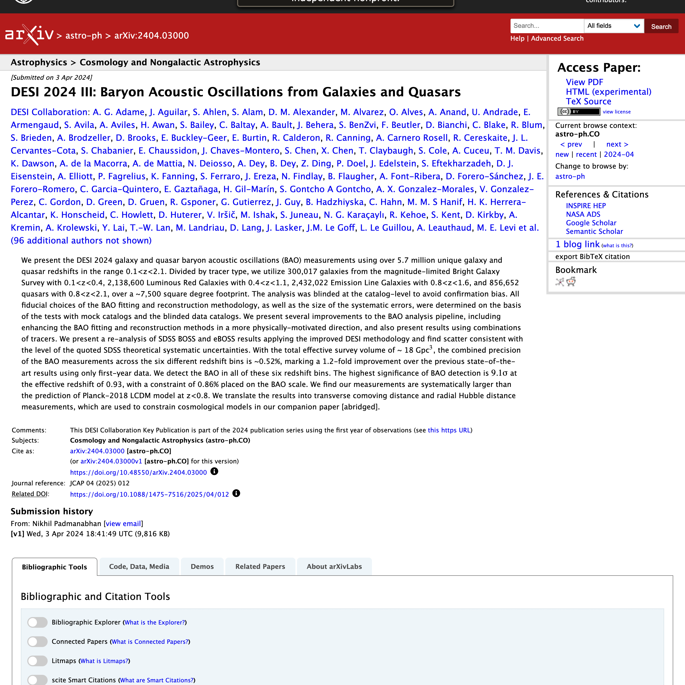
  </div>
</div>

---
class: blanc

# Hubble diagram

.left-column[
.eyebrow[Lightcone]

.img-col[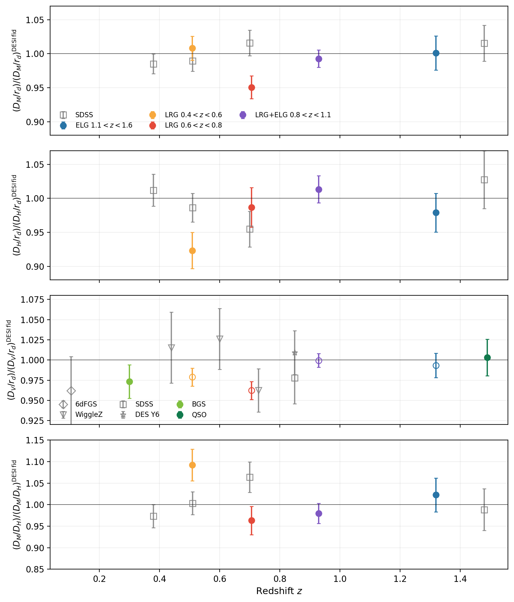]
]

.right-column[
.eyebrow[DESI 2024 III]

.img-col[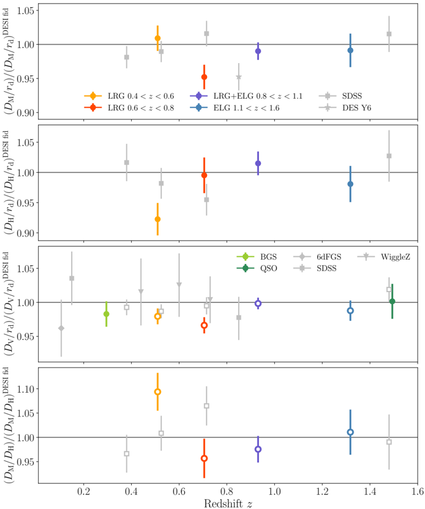]
]

.reset-column[]

---

# Analysis DAG

.center.muted[From raw catalogs to the Hubble diagram.]

<div style="display: flex; flex-direction: column; height: 100%; align-items: center;">

  <div style="flex: 1; min-height: 0; width: 100%; display: flex; align-items: center; justify-content: center;">
<svg viewBox="0 0 1280 470" preserveAspectRatio="xMidYMid meet" style="width: 100%; height: 100%; display: block;">

<defs>
  <marker id="dag-ah" viewBox="0 0 10 10" refX="9" refY="5" markerWidth="6" markerHeight="6" orient="auto-start-reverse">
    <path d="M 0 0 L 10 5 L 0 10 z" fill="var(--lc-muted)"/>
  </marker>
  <clipPath id="dag-hubble-clip">
    <rect x="1070" y="232" width="164" height="104" rx="4" ry="4"/>
  </clipPath>
</defs>

  <g>
    <!-- arrows (revealed at fragment 1 alongside the running dots) -->
    <g class="dag-arrows">
      <path d="M 206 112.0 L 228 170.0" stroke="var(--lc-muted)" stroke-width="1.4" fill="none" marker-end="url(#dag-ah)" class="dag-flow"/>
      <path d="M 206 170.0 L 228 170.0" stroke="var(--lc-muted)" stroke-width="1.4" fill="none" marker-end="url(#dag-ah)" class="dag-flow"/>
      <path d="M 206 220.0 L 228 170.0" stroke="var(--lc-muted)" stroke-width="1.4" fill="none" marker-end="url(#dag-ah)" class="dag-flow"/>
      <path d="M 228 170.0 L 244 170.0" stroke="var(--lc-muted)" stroke-width="1.4" fill="none" marker-end="url(#dag-ah)" class="dag-flow"/>
      <path d="M 412 170.0 L 450 170.0" stroke="var(--lc-muted)" stroke-width="1.4" fill="none" marker-end="url(#dag-ah)" class="dag-flow"/>
      <path d="M 618 170.0 L 656 170.0" stroke="var(--lc-muted)" stroke-width="1.4" fill="none" marker-end="url(#dag-ah)" class="dag-flow"/>
      <path d="M 824 170.0 L 862 170.0" stroke="var(--lc-muted)" stroke-width="1.4" fill="none" marker-end="url(#dag-ah)" class="dag-flow"/>
      <path d="M 1030 170.0 L 1068 170.0" stroke="var(--lc-muted)" stroke-width="1.4" fill="none" marker-end="url(#dag-ah)" class="dag-flow"/>
    </g>
    <!-- input tiles -->
    <rect x="38" y="91" width="168" height="42" rx="6" ry="6" fill="rgba(78, 90, 112, 0.06)" stroke="var(--lc-muted)" stroke-width="1"/>
    <text x="122.0" y="109.0" text-anchor="middle" font-family="var(--lc-font-ui)" font-size="11" font-weight="500" fill="var(--lc-text)">DESI DR1 LSS catalogs</text>
    <text x="122.0" y="125.0" text-anchor="middle" font-family="var(--lc-font-ui)" font-size="9" fill="var(--lc-muted)">data + 18 randoms</text>
    <rect x="38" y="149" width="168" height="42" rx="6" ry="6" fill="rgba(78, 90, 112, 0.06)" stroke="var(--lc-muted)" stroke-width="1"/>
    <text x="122.0" y="167.0" text-anchor="middle" font-family="var(--lc-font-ui)" font-size="11" font-weight="500" fill="var(--lc-text)">fiducial cosmology</text>
    <text x="122.0" y="183.0" text-anchor="middle" font-family="var(--lc-font-ui)" font-size="9" fill="var(--lc-muted)">tabulated z → r(z)</text>
    <rect x="38" y="199" width="168" height="42" rx="6" ry="6" fill="rgba(78, 90, 112, 0.06)" stroke="var(--lc-muted)" stroke-width="1"/>
    <text x="122.0" y="217.0" text-anchor="middle" font-family="var(--lc-font-ui)" font-size="11" font-weight="500" fill="var(--lc-text)">RascalC covariances</text>
    <text x="122.0" y="233.0" text-anchor="middle" font-family="var(--lc-font-ui)" font-size="9" fill="var(--lc-muted)">post-recon</text>
    <!-- script tiles -->
    <rect x="244" y="142" width="168" height="56" rx="6" ry="6" fill="rgba(255, 255, 255, 0.95)" stroke="var(--lc-text)" stroke-width="1.2"/>
    <text x="328.0" y="167.0" text-anchor="middle" font-family="var(--lc-font-mono)" font-size="11" font-weight="500" fill="var(--lc-text)">run_reconstruction.py</text>
    <text x="328.0" y="183.0" text-anchor="middle" font-family="var(--lc-font-ui)" font-size="9" fill="var(--lc-muted)">× 4 parents</text>
    <rect x="450" y="142" width="168" height="56" rx="6" ry="6" fill="rgba(255, 255, 255, 0.95)" stroke="var(--lc-text)" stroke-width="1.2"/>
    <text x="534.0" y="167.0" text-anchor="middle" font-family="var(--lc-font-mono)" font-size="11" font-weight="500" fill="var(--lc-text)">compute_xi.py</text>
    <text x="534.0" y="183.0" text-anchor="middle" font-family="var(--lc-font-ui)" font-size="9" fill="var(--lc-muted)">post-recon ξ × 8</text>
    <rect x="656" y="142" width="168" height="56" rx="6" ry="6" fill="rgba(78, 90, 112, 0.08)" stroke="var(--lc-text)" stroke-width="1.6"/>
    <text x="740.0" y="167.0" text-anchor="middle" font-family="var(--lc-font-mono)" font-size="11" font-weight="600" fill="var(--lc-text)">fit_bao_post.py</text>
    <text x="740.0" y="183.0" text-anchor="middle" font-family="var(--lc-font-ui)" font-size="9" fill="var(--lc-muted)">× 8 MCMC chains</text>
    <rect x="862" y="142" width="168" height="56" rx="6" ry="6" fill="rgba(255, 255, 255, 0.95)" stroke="var(--lc-text)" stroke-width="1.2"/>
    <text x="946.0" y="167.0" text-anchor="middle" font-family="var(--lc-font-mono)" font-size="11" font-weight="500" fill="var(--lc-text)">make_distance_table.py</text>
    <text x="946.0" y="183.0" text-anchor="middle" font-family="var(--lc-font-ui)" font-size="9" fill="var(--lc-muted)">D_M/r_d, D_H/r_d, D_V/r_d</text>
    <rect x="1068" y="142" width="168" height="56" rx="6" ry="6" fill="rgba(231, 137, 64, 0.10)" stroke="var(--lc-warm)" stroke-width="2.2"/>
    <text x="1152.0" y="167.0" text-anchor="middle" font-family="var(--lc-font-mono)" font-size="11" font-weight="600" fill="var(--lc-warm)">plot_hubble_diagram.py</text>
    <text x="1152.0" y="183.0" text-anchor="middle" font-family="var(--lc-font-ui)" font-size="9" fill="var(--lc-muted)">Fig 15</text>

  <!-- ============================================================== -->
  <!-- FRAGMENT 1 — scripts running (pulsing amber rings on each tile) -->
  <!-- ============================================================== -->
  <g class="dag-running">
    <g><circle cx="400" cy="153" r="3.5" fill="var(--lc-warm)"><animate attributeName="r" values="3.2;7.5;3.2" dur="1.4s" repeatCount="indefinite"/><animate attributeName="opacity" values="0.95;0.15;0.95" dur="1.4s" repeatCount="indefinite"/></circle><circle cx="400" cy="153" r="2.2" fill="var(--lc-warm)" opacity="0.95"/></g>
    <g><circle cx="606" cy="153" r="3.5" fill="var(--lc-warm)"><animate attributeName="r" values="3.2;7.5;3.2" dur="1.4s" begin="0.18s" repeatCount="indefinite"/><animate attributeName="opacity" values="0.95;0.15;0.95" dur="1.4s" begin="0.18s" repeatCount="indefinite"/></circle><circle cx="606" cy="153" r="2.2" fill="var(--lc-warm)" opacity="0.95"/></g>
    <g><circle cx="812" cy="153" r="3.5" fill="var(--lc-warm)"><animate attributeName="r" values="3.2;7.5;3.2" dur="1.4s" begin="0.36s" repeatCount="indefinite"/><animate attributeName="opacity" values="0.95;0.15;0.95" dur="1.4s" begin="0.36s" repeatCount="indefinite"/></circle><circle cx="812" cy="153" r="2.2" fill="var(--lc-warm)" opacity="0.95"/></g>
    <g><circle cx="1018" cy="153" r="3.5" fill="var(--lc-warm)"><animate attributeName="r" values="3.2;7.5;3.2" dur="1.4s" begin="0.54s" repeatCount="indefinite"/><animate attributeName="opacity" values="0.95;0.15;0.95" dur="1.4s" begin="0.54s" repeatCount="indefinite"/></circle><circle cx="1018" cy="153" r="2.2" fill="var(--lc-warm)" opacity="0.95"/></g>
    <g><circle cx="1224" cy="153" r="3.5" fill="var(--lc-warm)"><animate attributeName="r" values="3.2;7.5;3.2" dur="1.4s" begin="0.72s" repeatCount="indefinite"/><animate attributeName="opacity" values="0.95;0.15;0.95" dur="1.4s" begin="0.72s" repeatCount="indefinite"/></circle><circle cx="1224" cy="153" r="2.2" fill="var(--lc-warm)" opacity="0.95"/></g>
  </g>

  <!-- ============================================================== -->
  <!-- FRAGMENT 2 — Hubble diagram cut-out below plot_hubble_diagram   -->
  <!-- ============================================================== -->
  <g class="dag-hubble">
    <rect x="1068" y="230" width="168" height="108" rx="5" ry="5" fill="rgba(255,255,255,0.98)" stroke="var(--lc-warm)" stroke-width="1.3"/>
    <image href="./img/lc_hubble_diagram.png" x="1070" y="232" width="164" height="104" preserveAspectRatio="xMidYMid slice" clip-path="url(#dag-hubble-clip)"/>
    <text x="1152" y="352" text-anchor="middle" font-family="var(--lc-font-ui)" font-size="8" fill="var(--lc-warm)" letter-spacing="0.16em" text-transform="uppercase">Fig 15 reproduced</text>
  </g>

  <!-- ============================================================== -->
  <!-- FRAGMENT 3 — checkmarks + commit hashes + verified-by-Snakemake -->
  <!-- ============================================================== -->
  <g class="dag-verified">
    <!-- check badges -->
    <g>
      <circle cx="400" cy="153" r="6" fill="var(--lc-accent)" opacity="0.92"/>
      <path d="M 397 153 L 399.5 155.5 L 403.2 150.5" stroke="white" stroke-width="1.3" fill="none" stroke-linecap="round" stroke-linejoin="round"/>
      <circle cx="606" cy="153" r="6" fill="var(--lc-accent)" opacity="0.92"/>
      <path d="M 603 153 L 605.5 155.5 L 609.2 150.5" stroke="white" stroke-width="1.3" fill="none" stroke-linecap="round" stroke-linejoin="round"/>
      <circle cx="812" cy="153" r="6" fill="var(--lc-accent)" opacity="0.92"/>
      <path d="M 809 153 L 811.5 155.5 L 815.2 150.5" stroke="white" stroke-width="1.3" fill="none" stroke-linecap="round" stroke-linejoin="round"/>
      <circle cx="1018" cy="153" r="6" fill="var(--lc-accent)" opacity="0.92"/>
      <path d="M 1015 153 L 1017.5 155.5 L 1021.2 150.5" stroke="white" stroke-width="1.3" fill="none" stroke-linecap="round" stroke-linejoin="round"/>
      <circle cx="1224" cy="153" r="6" fill="var(--lc-accent)" opacity="0.92"/>
      <path d="M 1221 153 L 1223.5 155.5 L 1227.2 150.5" stroke="white" stroke-width="1.3" fill="none" stroke-linecap="round" stroke-linejoin="round"/>
    </g>
    <!-- commit hashes -->
    <text x="328.0" y="216" text-anchor="middle" font-family="var(--lc-font-mono)" font-size="8.5" fill="var(--lc-muted)" letter-spacing="0.04em"><tspan fill="var(--lc-accent)">●</tspan>  840b954</text>
    <text x="534.0" y="216" text-anchor="middle" font-family="var(--lc-font-mono)" font-size="8.5" fill="var(--lc-muted)" letter-spacing="0.04em"><tspan fill="var(--lc-accent)">●</tspan>  c7bd74a</text>
    <text x="740.0" y="216" text-anchor="middle" font-family="var(--lc-font-mono)" font-size="8.5" fill="var(--lc-muted)" letter-spacing="0.04em"><tspan fill="var(--lc-accent)">●</tspan>  cdc334a</text>
    <text x="946.0" y="216" text-anchor="middle" font-family="var(--lc-font-mono)" font-size="8.5" fill="var(--lc-muted)" letter-spacing="0.04em"><tspan fill="var(--lc-accent)">●</tspan>  8069d11</text>
    <text x="1152.0" y="216" text-anchor="middle" font-family="var(--lc-font-mono)" font-size="8.5" fill="var(--lc-muted)" letter-spacing="0.04em"><tspan fill="var(--lc-accent)">●</tspan>  1bb61f2</text>
    <!-- workflow-run-verified line -->
    <g transform="translate(1256, 432)">
      <text x="0" y="0" text-anchor="end" font-family="var(--lc-font-ui)" font-size="14" letter-spacing="0.16em" fill="var(--lc-muted)" text-transform="uppercase"><tspan fill="var(--lc-accent)" font-size="15">●</tspan>  <tspan font-weight="500">Workflow run verified by Snakemake</tspan></text>
      <text x="0" y="22" text-anchor="end" font-family="var(--lc-font-mono)" font-size="12" fill="var(--lc-muted)">sha256:b19558d0d64e2333…  ·  reproduced 2026-05-12</text>
    </g>
  </g>

  <!-- ============================================================== -->
  <!-- FRAGMENT 4 — decisions list under each script (staggered)       -->
  <!-- ============================================================== -->
  <g class="dag-decisions" font-family="var(--lc-font-mono)" font-size="11.5">
    <!-- column 1: run_reconstruction.py -->
    <g class="dag-dec-col">
      <text x="328" y="232" text-anchor="middle" font-family="var(--lc-font-ui)" font-size="9.5" letter-spacing="0.18em" fill="var(--lc-muted)" text-transform="uppercase">decisions</text>
      <text x="328" y="252" text-anchor="middle" fill="var(--lc-text)"><tspan fill="var(--lc-warm)">◆</tspan>  smoothing_radius</text>
      <text x="328" y="270" text-anchor="middle" fill="var(--lc-text)"><tspan fill="var(--lc-warm)">◆</tspan>  smoothing_radius_qso</text>
      <text x="328" y="288" text-anchor="middle" fill="var(--lc-text)"><tspan fill="var(--lc-warm)">◆</tspan>  recon_method</text>
    </g>
    <!-- column 2: compute_xi.py -->
    <g class="dag-dec-col">
      <text x="534" y="232" text-anchor="middle" font-family="var(--lc-font-ui)" font-size="9.5" letter-spacing="0.18em" fill="var(--lc-muted)" text-transform="uppercase">decisions</text>
      <text x="534" y="252" text-anchor="middle" fill="var(--lc-text)"><tspan fill="var(--lc-warm)">◆</tspan>  s-binning</text>
      <text x="534" y="270" text-anchor="middle" fill="var(--lc-text)"><tspan fill="var(--lc-warm)">◆</tspan>  ells</text>
    </g>
    <!-- column 3: fit_bao_post.py (headline) -->
    <g class="dag-dec-col">
      <text x="740" y="232" text-anchor="middle" font-family="var(--lc-font-ui)" font-size="9.5" letter-spacing="0.18em" fill="var(--lc-muted)" text-transform="uppercase">decisions</text>
      <text x="740" y="252" text-anchor="middle" fill="var(--lc-text)"><tspan fill="var(--lc-warm)">◆</tspan>  broadband</text>
      <g class="dag-decision-link" data-dag-decision="damping_prior">
        <rect class="dag-decision-halo" x="640" y="256" width="200" height="22" rx="4" ry="4" fill="var(--lc-primary)"/>
        <text x="740" y="270" text-anchor="middle" fill="var(--lc-text)" class="dag-decision-link__text"><tspan fill="var(--lc-warm)">◆</tspan>  damping_prior</text>
      </g>
      <text x="740" y="288" text-anchor="middle" fill="var(--lc-text)"><tspan fill="var(--lc-warm)">◆</tspan>  damping_centers</text>
      <text x="740" y="306" text-anchor="middle" fill="var(--lc-text)"><tspan fill="var(--lc-warm)">◆</tspan>  fit_range</text>
      <text x="740" y="324" text-anchor="middle" fill="var(--lc-text)"><tspan fill="var(--lc-warm)">◆</tspan>  template_cosmology</text>
      <text x="740" y="342" text-anchor="middle" fill="var(--lc-text)"><tspan fill="var(--lc-warm)">◆</tspan>  fitting_method</text>
    </g>
    <!-- column 4: make_distance_table.py -->
    <g class="dag-dec-col">
      <text x="946" y="232" text-anchor="middle" font-family="var(--lc-font-ui)" font-size="9.5" letter-spacing="0.18em" fill="var(--lc-muted)" text-transform="uppercase">decisions</text>
      <text x="946" y="252" text-anchor="middle" fill="var(--lc-text)" font-size="10"><tspan fill="var(--lc-warm)">◆</tspan>  systematic_error_treatment</text>
    </g>
    <!-- column 5: plot_hubble_diagram.py — no decisions; hubble inset already lives here -->
    <g class="dag-dec-col"></g>
  </g>
  </g>
</svg>
          </div>

<!-- Invisible fragment markers — drive .dag-step-* on the section -->
<span class="fragment walk-step" data-dag-step="running"           aria-hidden="true"></span>
<span class="fragment walk-step" data-dag-step="hubble"            aria-hidden="true"></span>
<span class="fragment walk-step" data-dag-step="verified"          aria-hidden="true"></span>
<span class="fragment walk-step" data-dag-step="decisions"         aria-hidden="true"></span>
<span class="fragment walk-step" data-dag-step="card-damping_prior" aria-hidden="true"></span>
<span class="fragment walk-step" data-dag-step="paper-damping_prior_gaussian_fiducial" aria-hidden="true"></span>

<!-- ============================================================== -->
<!-- Decision detail card — opened by clicking damping_prior         -->
<!-- ============================================================== -->
<div class="dag-card" id="dag-card-damping_prior" role="dialog" aria-modal="true" aria-labelledby="dag-card-damping_prior-title">
  <button class="dag-card__close" type="button" aria-label="Close decision card">&times;</button>
  <p class="dag-card__breadcrumb">Decision &middot; BAO fit &middot; priors</p>
  <h3 class="dag-card__title" id="dag-card-damping_prior-title">damping_prior</h3>

  <div class="dag-card__choices">
    <!-- Option 1: Gaussian (fiducial) -->
    <div class="dag-card__choice dag-card__choice--default">
      <span class="dag-card__choice-tag">Fiducial &middot; selected</span>
      <h4 class="dag-card__choice-name">gaussian</h4>
      <div class="dag-card__insight dag-card__insight--clickable" data-insight-id="damping_prior_gaussian_fiducial">
        <p class="dag-card__insight-id">
          damping_prior_gaussian_fiducial
          <span class="dag-card__insight-open" aria-hidden="true">open paper &rarr;</span>
        </p>
        <p class="dag-card__insight-claim">Tight Gaussian priors (width 1&ndash;2 h<sup>&minus;1</sup> Mpc) on the BAO damping parameters centred on theory values are recommended; fully fixing them risks biases and flat priors can also bias &alpha; and weaken constraints on noisy data.</p>
      </div>
      <div class="dag-card__insight">
        <p class="dag-card__insight-id">damping_prior_width_justification</p>
        <p class="dag-card__insight-claim">Biases of order 0.1% in &alpha;<sub>iso</sub> and 0.2% in &alpha;<sub>AP</sub> appear when the damping parameters are misspecified by more than &sim;2 h<sup>&minus;1</sup> Mpc from their fiducial values &mdash; justifying Gaussian priors of width 1&ndash;2 h<sup>&minus;1</sup> Mpc.</p>
      </div>
      <div class="dag-card__insight">
        <p class="dag-card__insight-id">sigma_perp_parallel_formula</p>
        <p class="dag-card__insight-claim">&Sigma;<sub>&perp;</sub> and &Sigma;<sub>&parallel;</sub> follow &Sigma;<sub>&perp;</sub>&nbsp;=&nbsp;&Sigma;<sub>0</sub>&middot;G, &Sigma;<sub>&parallel;</sub>&nbsp;=&nbsp;&Sigma;<sub>0</sub>&middot;G&middot;(1+f), with &Sigma;<sub>0</sub>&nbsp;=&nbsp;12.4 h<sup>&minus;1</sup> Mpc for &sigma;<sub>8</sub>&nbsp;=&nbsp;0.9 at z&nbsp;=&nbsp;0 &mdash; the theoretical prediction that anchors the Gaussian prior centres.</p>
      </div>
    </div>
    <!-- Option 2: Flat -->
    <div class="dag-card__choice">
      <span class="dag-card__choice-tag">Alternative</span>
      <h4 class="dag-card__choice-name">flat</h4>
      <div class="dag-card__insight">
        <p class="dag-card__insight-id">damping_prior_gaussian_fiducial</p>
        <p class="dag-card__insight-claim">Flat priors can bias &alpha; and weaken constraints on noisy data; the same Chen+&nbsp;2024 analysis that motivates the Gaussian fiducial also rules flat priors out as the headline choice.</p>
      </div>
      <div class="dag-card__insight">
        <p class="dag-card__insight-id">bias_weak_effect_on_sigma</p>
        <p class="dag-card__insight-claim">Because Lagrangian displacements are dominated by bulk flows, galaxy bias has only a small effect on &Sigma;<sub>&perp;</sub>/&Sigma;<sub>&parallel;</sub>. With a flat prior the fit has no anchor against this near-degenerate direction.</p>
      </div>
    </div>

  </div>
</div>

<!-- ============================================================== -->
<!-- Paper viewer — opens from a clickable insight on the card       -->
<!-- ============================================================== -->
<div class="dag-paper" id="dag-paper-damping_prior_gaussian_fiducial" role="dialog" aria-modal="true">
<button class="dag-paper__close" type="button" aria-label="Close paper viewer">&times;</button>
<p class="dag-paper__breadcrumb">
  Insight &middot; <b>damping_prior</b> &middot; gaussian &middot; source paper
</p>
<h3 class="dag-paper__title">
  Likelihoods and Systematic Errors for the DESI 2024 BAO Cosmological Analysis &mdash; Chen et&nbsp;al. 2024
</h3>

<div class="dag-paper__layout">

  <!-- Left: rendered PDF page with highlight overlay -->
  <div class="dag-paper__canvas">
    <div class="dag-paper__page-wrap">
      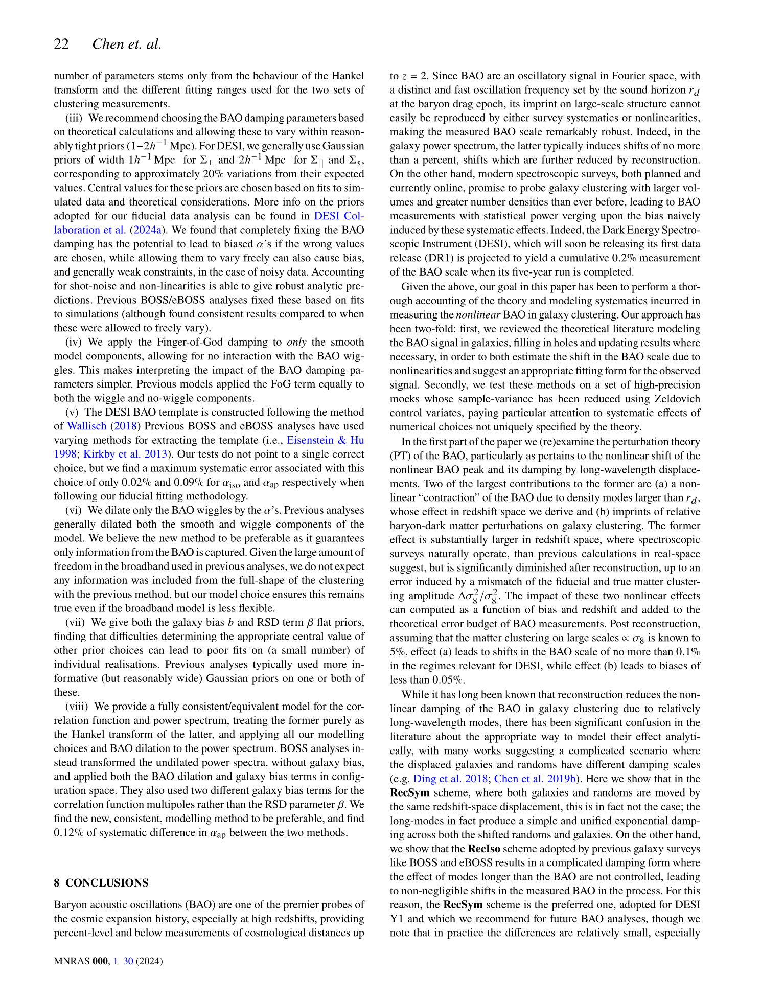
      <div class="dag-paper__highlight" aria-hidden="true"></div>
    </div>
  </div>

  <!-- Right: insight + quote panel -->
  <div class="dag-paper__panel">
    <div class="dag-paper__panel-section">
      <p class="dag-paper__section-label">Insight</p>
      <p class="dag-paper__insight-id">damping_prior_gaussian_fiducial</p>
      <p class="dag-paper__claim">
        Tight Gaussian priors (width 1&ndash;2 h<sup>&minus;1</sup> Mpc) on the BAO damping parameters
        centred on theory values are recommended; fully fixing them risks biases and
        flat priors can also bias &alpha; and weaken constraints on noisy data.
      </p>
    </div>
    <div class="dag-paper__panel-section">
      <p class="dag-paper__section-label"><span style="color: var(--lc-warm);">&#9679;</span>&nbsp;&nbsp;Evidence&nbsp;1 &middot; verbatim quote</p>
      <div class="dag-paper__quote-block">
        <p class="dag-paper__quote-text">We recommend choosing the BAO damping parameters based on theoretical calculations and allowing these to vary within reasonably tight priors (1&minus;2 h<sup>&minus;1</sup> Mpc).</p>
        <p class="dag-paper__quote-loc">page&nbsp;22 &middot; right column &middot; bullet&nbsp;(iii)</p>
      </div>
    </div>
    <div class="dag-paper__panel-section">
      <p class="dag-paper__section-label">Reference</p>
      <p class="dag-paper__meta">
        Chen et&nbsp;al. 2024<br>
        Monthly Notices of the Royal Astronomical Society<br>
        DOI: 10.48550/arXiv.2402.14070
      </p>
    </div>
  </div>

</div>
</div>

</div>
</section>


---

.img-full[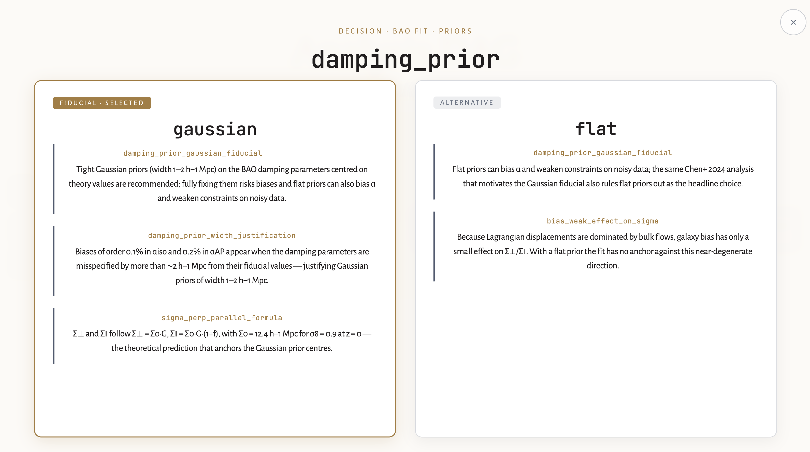]

---

.img-full[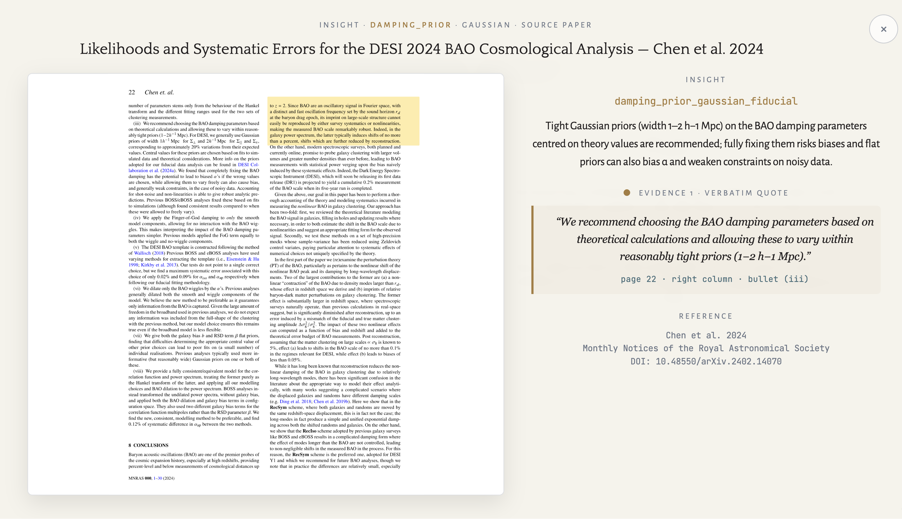]

---

# Visual interface (preliminary) 

.center.muted[Constructing an interactive inferface from the complete analysis `astra.yml` using [MyST Markdown](https://mystmd.org/)]

<video autoplay muted loop playsinline width=900 style="display: block; margin: 0 auto;">
  <source src="./img/desi-paper-repro.webm" type="video/webm">
  <source src="./img/desi-paper-repro.mp4" type="video/mp4">
</video>

---
class: cover

<div style="display:flex;flex-direction:column;align-items:center;justify-content:center;height:100%;gap:0;">

  <p style="font-family:var(--lc-font-ui);font-size:9pt;font-weight:600;letter-spacing:0.22em;text-transform:uppercase;color:var(--lc-secondary);margin:0 0 10pt;">Stay informed</p>

  <h1 style="font-family:var(--lc-font-heading);font-size:28pt;color:var(--lc-warm);margin:0 0 6pt;text-align:center;">Follow our progress</h1>

  <p style="font-family:var(--lc-font-body);font-size:13pt;color:var(--lc-muted);font-style:italic;margin:0 0 22pt;text-align:center;max-width:560px;line-height:1.5;">
    Want to stay in touch or share your expertise<br>on open-source&nbsp;&amp;&nbsp;reproducible science best practices and workflows.
  </p>

  <div style="background:#fff;border-radius:12pt;padding:14pt;box-shadow:0 2px 16px rgba(78,90,112,0.12);display:inline-block;margin-bottom:16pt;">
    
  </div>

<p style="font-family: var(--lc-font-ui); font-size: 11pt; color: var(--lc-muted); margin: 18pt 0 0 0; letter-spacing: 0.06em;">
  <i class="fa-solid fa-globe" style="color: var(--lc-primary); margin-right: 6pt;"></i>
  <a href="https://lightconeresearch.org" style="color: var(--lc-text); text-decoration: none;">lightconeresearch.org</a>
  &nbsp;&middot;&nbsp;
  <i class="fa-brands fa-github" style="color: var(--lc-primary); margin-right: 4pt;"></i>
  <a href="https://github.com/LightconeResearch" style="color: var(--lc-text); text-decoration: none;">github.com/LightconeResearch</a>
</p>


</div>
